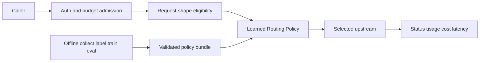

# Metrum AI Router

Agent workloads often make dozens of model calls per task. Paying frontier
price for each call is the default path, and token spend shows up after the
monthly budget is gone. In one committed Harbor run, Codex on `big-coder` used
48,470 Harbor input tokens in a single deterministic job
([docs/harbor-case-study.md](docs/harbor-case-study.md)).

A model group is a quality and cost contract you define. Routing picks the
cheapest eligible candidate with evidence of meeting that contract. Evidence
expires through the group `contract` field `max_eval_age_days`, so stale
validation drops targets from eligibility. Learned Routing Policy abstains when
uncertainty is high. Token budgets and quotas are admitted before any
cache-miss upstream call.
See [Model Group Contracts](#model-group-contracts) and
[docs/MODEL_GROUP_CONTRACTS.md](docs/MODEL_GROUP_CONTRACTS.md).



**Who this is for**

- Platform teams that own caller keys, model groups, and monthly token budgets
  across many engineers (illustrative: 5,000 engineers sharing routed groups).
- Teams that mix private OpenAI-compatible targets with hosted providers under
  one group contract.
- Operators willing to spend an afternoon on local bootstrap, then a longer
  shadow window before enforce.

**Who this is not for**

- Teams that want a hosted service operated by someone else.
- Teams with a single provider and no private models.
- Teams that need the project to guarantee provider uptime, model quality, or
  compliance outcomes
  ([architecture-limitations](docs-site/docs/reference/architecture-limitations.md)).

Community participation is governed by [CONTRIBUTING.md](CONTRIBUTING.md), the
[Code of Conduct](CODE_OF_CONDUCT.md), and [GOVERNANCE.md](GOVERNANCE.md).
Questions and bugs follow [SUPPORT.md](SUPPORT.md); suspected vulnerabilities
must use the private reporting path in [SECURITY.md](SECURITY.md).
Trademark use is governed by [TRADEMARKS.md](TRADEMARKS.md).

Hosted docs: [overview](https://llm-api.apps.metrum.ai/docs/overview) and `/docs/`
on a running router. Technical brief: [docs/solution-brief.md](docs/solution-brief.md).
Doc ownership map: [docs/DOCS_MAINTENANCE.md](docs/DOCS_MAINTENANCE.md).

## Quick Start From Source

Hosted product docs: [overview](https://llm-api.apps.metrum.ai/docs/overview)
(also served from a running router at `/docs/`).

Prerequisites are Go as declared in `go.mod` and Python 3 for the local
bootstrap. An OpenAI API key is enough for one Chat completion. Building and
starting the router require no private repository access.

```bash
git clone https://github.com/metrum-ai/router.git
cd router
python3 scripts/local_dev_bootstrap.py --out-dir tmp/local-dev
# Set OPENAI_API_KEY in tmp/local-dev/env.json.
go run ./cmd/metrum-ai-router --config tmp/local-dev/config.yaml
```

The bootstrap prepares a local config, env template, and one caller token.
Confirm `/readyz`, then `GET /v1/models` and one Chat request as in
[Local Quickstart](docs-site/docs/getting-started/local-quickstart.md).

`config.example.yaml` remains the full catalog reference. Do not copy it for a
first local trial.

For packaged installs, use the public [installation
guide](docs-site/docs/installation/index.md). The documented deployment modes
are Linux binary, Docker Compose, and Kubernetes. See [Architecture, Platforms,
And Limitations](docs-site/docs/reference/architecture-limitations.md) for the
operator-owned boundaries and explicit non-goals.

## Learned Routing Policy

Static weights go stale when models and prices change. Generic learned routers
often lack a quality floor, abstention, and operator-owned labels. Without those
controls, cheap targets under-shoot acceptance tests and spend stays locked to
the expensive anchor for weeks. Learned Routing Policy (LRP) trains offline on
your outcome data. It selects only among router-eligible targets, abstains under
uncertainty, and ships behind `strategy: external` with an explicit
`external_policy.mode` promotion path you own. The operator runbook is
[docs/LEARNED_ROUTING_POLICY.md](docs/LEARNED_ROUTING_POLICY.md). The service
README is [services/learned-routing-policy/README.md](services/learned-routing-policy/README.md).

### A worked example

Synthetic holdout comparison (anchor vs routed) from
[docs/evidence/learned-routing-policy/public-training.json](docs/evidence/learned-routing-policy/public-training.json)
(seed 42, 800 requests, n=113 holdout). Abstention rate is not in that JSON.

**Synthetic holdout: anchor vs routed (n=113)**

| Policy | Cost USD | Quality mean | Floor violations | Abstention rate | n |
|---|---|---|---|---|---|
| always_anchor | 0.151829 | 1.0 | 0.0 | not measured | 113 |
| lrp | 0.1507895 | 1.0 | 0.0 | not measured | 113 |
| always_cheapest | 0.0151829 | 0.48672566371681414 | 0.5132743362831859 | not measured | 113 |
| bt_only | 0.151829 | 1.0 | 0.0 | not measured | 113 |
| oracle | 0.1507895 | 1.0 | 0.0 | not measured | 113 |

`promotable` is false. Failed gates `cost_vs_anchor` and `real_data_and_embedding`
show promotion gates working as designed on synthetic data. A real run needs
real embeddings and real outcomes before any live enforce decision.
See [learned-routing-case-study](docs-site/docs/evaluation/learned-routing-case-study.md)
and [public-training.json](docs/evidence/learned-routing-policy/public-training.json).

### What an operator does

1. Define acceptance tests and a quality floor for the model group.
2. Collect approved traffic with `lrp collect`.
3. Label outcomes with `lrp fanout` and `lrp judge`.
4. Train and gate with `lrp featurize`, `lrp train`, `lrp eval`, and `lrp validate`.
5. Run `lrp serve` with `external_policy.mode: shadow` for at least the
   documented 24-hour staging shadow window; treat 7-day staging enforce as a
   separate later gate
   ([docs/LEARNED_ROUTING_POLICY.md](docs/LEARNED_ROUTING_POLICY.md),
   [lrp-train-and-serve](docs-site/docs/routing/lrp-train-and-serve.md)).
6. Read shadow vs served comparison from decision telemetry and usage reports.
7. Flip staging to `external_policy.mode: enforce`; rollback is one config
   change to `mode: baseline`.

### What it predicts

Without per-target quality and length models, selection guesses from prices or
static weights and under-shoots the floor. LRP trains per-target quality and
output-token models offline with LightGBM. Quality scores are
isotonic-calibrated. Train and serve share the same feature definitions and
embedding artifacts.
See [docs/LEARNED_ROUTING_POLICY.md](docs/LEARNED_ROUTING_POLICY.md).

### How it decides

Cheapest-first without a floor sends 0.513 of the synthetic holdout under the
quality floor (`always_cheapest` at n=113). Among targets the router already
marked eligible, LRP picks the cheapest predicted to meet the operator quality
floor. If none meet the floor, it picks the highest predicted quality. Unknown
prices are not treated as free. Optional per-project floors, upstream latency
gates, and cache-aware cost estimates apply at selection. Cache savings are
used only when trustworthy cache metadata and a catalog cached-input price are
present.
See [docs/LRP_SELECTION_CONSTRAINTS.md](docs/LRP_SELECTION_CONSTRAINTS.md).

### Safety rails

A confident wrong prediction sends a hard request to a weak model.
Abstention and ensemble uncertainty cut that path. `lrp train --ensemble-size 5`
fits a bootstrap ensemble. With `uncertainty_abstention: true`, high calibrated
quality standard deviation abstains to `abstention_anchor` (or first fallback)
and labels `lrp:uncertain`. Thompson exploration
(`exploration_strategy: thompson`) is restricted to `exploration_projects`. PSI
and embedding-centroid drift can recommend shadow; the router
`external_policy.mode` remains the activation authority. Bradley-Terry cold
start injects baseline predictions only for targets already eligible.
See [docs/LRP_UNCERTAINTY.md](docs/LRP_UNCERTAINTY.md).

### How outcomes are labeled

Mixing host-side execution with LLM scores collapses pass/fail meaning and
pollutes training. Deterministic verifiers run only inside the isolated judge
worker. LLM judging and human audit are separate outcome classes with different
meanings.
See [docs/LRP_VERIFIERS.md](docs/LRP_VERIFIERS.md) and
[docs/LRP_HUMAN_JUDGE.md](docs/LRP_HUMAN_JUDGE.md).

### How it ships

Flipping learned influence without a reversible mode burns a weekend of
incident rollback. Router `external_policy.mode` values
([internal/router/external_strategy.go](internal/router/external_strategy.go)):

- `baseline`: no policy call; first eligible configured target.
- `shadow`: policy is called and recorded; first eligible configured target is served.
- `enforce`: the policy recommendation is served (default when `mode` is omitted).

Rollback of learned influence is `mode: baseline` or restoring prior group
config. Operators may require Ed25519-signed bundles before load.
See [docs/LRP_SIGNED_BUNDLES.md](docs/LRP_SIGNED_BUNDLES.md).

Post-completion `external_policy.feedback` posts request ID, status, usage,
cost, latency, TTFB, and selected target. It does not retrain quality models.
See [internal/router/external_policy_feedback.go](internal/router/external_policy_feedback.go)
and [docs/EXTERNAL_POLICY_CONTEXT.md](docs/EXTERNAL_POLICY_CONTEXT.md).

### Minimal group config

Field names match [config.example.yaml](config.example.yaml) and
[internal/router/config.go](internal/router/config.go). Catalog-only LRP groups
stay commented until exact-shape validation and protected evaluation pass.

```yaml
models:
  workload-staging:
    strategy: external
    external_policy:
      url: http://127.0.0.1:18093/route
      allow_hosts: [127.0.0.1]
      mode: shadow
      timeout_ms: 500
      max_response_bytes: 65536
      include_request: true
      on_error: fail_closed
      headers:
        X-LRP-Auth: ${LRP_POLICY_AUTH_HEADER}
      feedback:
        enabled: true
    targets:
      - { provider: example_chat, model_ref: example-model, weight: 1 }
```

`include_request: true` belongs only in trusted infrastructure. Enable
model-group `pii_filter` before sending request content. Loopback URL matches
current router egress rules for the LRP sidecar.

### Try it

```bash
uv sync --project services/learned-routing-policy --locked
make lrp-test
make lrp-synthetic-demo
```

Synthetic results do not authorize live promotion.

### Evidence status

Evidence means checked-in artifacts with dates, gates, and reproducible
commands. Synthetic results are published so gates and wiring can be inspected
before anyone spends on real embeddings. Figures below do not authorize live
promotion.

| Claim | Evidence | Source | Date |
|---|---|---|---|
| Synthetic holdout LRP quality mean 1.0, floor violation 0, cost USD 0.1507895 (n=113) | Single synthetic run, seed 42, 800 requests | [docs/evidence/learned-routing-policy/public-training.json](docs/evidence/learned-routing-policy/public-training.json) | 2026-09-09 |
| `promotable` is false; gates `cost_vs_anchor` and `real_data_and_embedding` failed | Same snapshot | [public-training.json](docs/evidence/learned-routing-policy/public-training.json) | 2026-09-09 |
| Synthetic embeddings, mock outcomes; real LightGBM and router wiring | Operator and public case study | [docs/LEARNED_ROUTING_POLICY.md](docs/LEARNED_ROUTING_POLICY.md), [learned-routing-case-study](docs-site/docs/evaluation/learned-routing-case-study.md) | 2026-09-09 |
| Native shadow: LRP recommended `strong`; router served configured-first `cheap` | Single synthetic inference snapshot | [docs-site/docs/routing/lrp-train-and-serve.md](docs-site/docs/routing/lrp-train-and-serve.md) | 2026-09-09 |
| Harbor Codex reward 1, Claude Code reward 0 on `big-coder` | One deterministic weighted-group run; not LRP | [docs/harbor-case-study.md](docs/harbor-case-study.md) | 2026-06-29 |

## What sets this router apart

### Budget enforcement before the upstream call

Counting spend after completion lets concurrent large-cap requests overshoot a
monthly cap before anyone sees the invoice. Token-budget admission reserves
estimated input tokens, tool/schema payload size, and the requested output cap
before a cache-miss upstream call. TPM, daily token, monthly token, and lifetime
key budgets include in-flight reservations. Completed requests reconcile to
reported usage; failed or canceled requests release the reservation; cache hits
do not consume persisted token quota.
([API Key Flow](#api-key-flow), `internal/router/service.go`, `internal/router/quota.go`)

Illustrative: 5,000 engineers share one caller project with a $1,500/month
token-budget cap. When remaining monthly tokens map to $12 of headroom and the
next request reserves an estimated $18 of input-plus-output cap, admission
fails with `429` / `quota-exhausted` (or `403` / `key-exhausted` when the
lifetime key is done) before any provider call. Usage reports show the
rejection without an upstream attempt. Arithmetic: $1,500/month ÷ 5,000
engineers ≈ $0.30/engineer/month of shared headroom if the cap is fully used.

```yaml
callers:
  - id: example-standard-dev
    rate: { rpm: 120, tpm: 200000, concurrent: 8 }
    quota:
      day: { requests: 5000, tokens: 20000000 }
      month: { tokens: 400000000 }
    key: { lifetime_tokens: 2000000000, soft_pct: 90, on_exhaust: disable }
```

### Request-shape eligibility before selection

Forwarding first and waiting for a provider `400` spends a billed call on an
ineligible shape. Illustrative: one 8,000-token tool request rejected locally
at $2.50 per million input tokens avoids about $0.02 of upstream spend
(8000 / 1e6 × 2.50). The router filters dialect, per-skin tool support,
modalities, structured outputs, reasoning controls, max-token honoring, and
payload size before strategy selection. If none remain, it returns
`502 no-eligible-target` with no upstream attempt.
(`internal/router/service.go`, `internal/router/request_shape_eligibility.go`)

### Quality contracts with expiry

Static routing weights do not expire when an eval ages out. After
`max_eval_age_days: 30`, a target whose `validated_at` is older than 30 days
drops from eligibility even if its weight is still positive. An optional
model-group `contract` applies `require_tags`, `min_eval_quality_score`,
`min_eval_pass_rate`, `max_eval_age_days`, and `allowed_validation_status`.
([Model Group Contracts](#model-group-contracts), `internal/router/contract.go`)

```yaml
models:
  support-chat:
    strategy: weighted
    contract:
      quality_floor:
        require_tags: [validated]
        min_eval_quality_score: 0.90
        min_eval_pass_rate: 0.95
        max_eval_age_days: 30
        allowed_validation_status: [passed]
```

### Request-time cost capture

Provider list prices change; historical reports that reprice old rows rewrite
past months. Illustrative: a 20% mid-month list-price cut would rescale 15 prior
days of USD if rows were not frozen at request time. Each usage row stores
input/output price per million, pricing source and date, computed USD, plus
routing/policy/pricing fingerprints. Savings baselines are source-dated
operator comparisons.
([Usage Reports](#usage-reports), `internal/router/usage_db.go`)

### Private and mixed hardware routing

Separate gateways for private GPUs and hosted APIs force callers to pick a
model name per request. vLLM, SGLang, and any OpenAI-compatible service register
as catalog targets with the same activation rules. One group can weight a
private target with a hosted fallback after exact-shape validation, for example
80/20 in the snippet below.
([docs/SELF_HOSTED_UPSTREAMS.md](docs/SELF_HOSTED_UPSTREAMS.md))

```yaml
models:
  mixed-hardware:
    strategy: weighted
    targets:
      - { provider: private_vllm, model_ref: small-local, weight: 80 }
      - { provider: hosted_chat, model_ref: fallback, weight: 20 }
```

### Capacity pooling and upstream protection

A single account rate limit turns one 429 into a fleet outage for that model.
Illustrative: three provider accounts pooled 1:1:1 absorb three times the
per-account RPM before the group is empty. A group can pool the same model
across provider accounts or endpoints. Optional provider/model/target shaping
can start bounded adaptive cooldowns after classified 429 or quota exhaustion
when those knobs are enabled. Fallback runs on retryable classes. Ordinary
non-retryable 4xx is not replayed to another provider.
([API Key Flow](#api-key-flow), `internal/router/upstream_shape.go`)

### Secrets and content never leak into policy

Shipping provider keys or raw prompts into a routing script creates a second
secret surface. Illustrative: one leaked key forces rotation across every
caller that shared it, often a multi-day outage window. Scripts and external
policies receive safe identifiers only. Provider keys are injected server-side.
Optional `pii_filter` runs before cache key, routing input, and upstream call
(`redact_only`, `redact_and_restore`, `fail_on_match`). Content capture is
opt-in, redacted, and AES-256-GCM encrypted.
([TypeScript Routing](#typescript-routing), [PII Filtering](#pii-filtering),
`internal/router/content_capture.go`)

### Every decision is evidence

A routing dispute without a joinable `request_id` becomes a week of log spelunking.
When usage persistence, diagnostics, and optional decision telemetry are
enabled, attempts, traces, traffic-shape events, request shapes, translation
shapes, sanitized upstream errors, and terminal errors join by `request_id`.
`/admin/reports/api/request-evidence` returns a completeness-scored bundle.
Decision telemetry stores scalar buckets only. Pre-selection failures may have
no routing-decision row.
([Usage Reports](#usage-reports), `internal/router/decision_telemetry.go`)

### Sovereignty by default

Hosted gateways keep prompts and keys on someone else's control plane. This
core is Apache-2.0. No license key required. Prompts and responses are not
retained by default (zero-day retention unless you enable capture). The
documented policy is not to train on traffic. Linux binary, Compose, and
Kubernetes are the documented runtimes. Operators can run on-premises or
air-gapped infrastructure.
([Editions](#editions),
[architecture-limitations](docs-site/docs/reference/architecture-limitations.md))

### Agent CLI support as a first-class path

Pointing Claude Code or Codex at a generic OpenAI proxy still fails tool and
catalog startup checks. Keep the two smoke commands in
[CLI Smoke Tests](#cli-smoke-tests); Harbor already showed Codex and Claude Code
against the same `big-coder` group in one deterministic pair of jobs
([docs/harbor-case-study.md](docs/harbor-case-study.md)). Claude Code uses
`ANTHROPIC_BASE_URL` and `ANTHROPIC_AUTH_TOKEN`. Codex uses
`/v1/codex/models.json` as a caller-filtered Responses catalog. Tool-bearing
requests bypass the response cache. Containerized tool variants:
[coding-agent-clients](docs-site/docs/getting-started/coding-agent-clients.md#containerized-tool-smokes).

### What it does not do

From [Explicit Limitations And Non-Goals](docs-site/docs/reference/architecture-limitations.md#explicit-limitations-and-non-goals):

- Model-group names and provider availability are deployment-defined; the
  project does not guarantee access to any provider or model.
- Catalog metadata is not capability proof. Tools, images, API bridges, and
  large request shapes require direct upstream and router-level validation.
- The in-process response cache is per process and is cleared by restart.
- After the first native SSE event, the HTTP response is committed. A later
  failure cannot change the caller's `200`, append a reliable error envelope,
  or fall back to another target; clients must detect a missing terminal event.
- SQLite is not a shared multi-writer database and must not back horizontally
  scaled router replicas.
- The project does not provide provider uptime, model-quality, legal,
  compliance, or support-service guarantees.

Remaining bullets live on that page.

## Frequently asked

**Does LRP see my prompts?**
By default the external-policy payload uses derived scalars such as token and
tool counts, not prompt text. `external_policy.include_request: true` sends
request content only to a trusted sidecar; enable `pii_filter` first.
([External Routing Policy Service](#external-routing-policy-service))

**What happens when the LRP sidecar is down?**
Default `on_error: fail_closed` returns `502 routing-policy-error` and no
upstream call. Optional `on_error: fallback` serves the first eligible
configured target instead.
([docs/LEARNED_ROUTING_POLICY.md](docs/LEARNED_ROUTING_POLICY.md))

**Can I run without LRP?**
Yes. Use `static`, `weighted`, `failover`, `dynamic_score`, or TypeScript
`script` strategies. LRP is optional behind `strategy: external`.

**How is this different from LiteLLM?**
LiteLLM Server manages a unified interface to 100+ LLMs in OpenAI
ChatCompletions/Completions format, plus cost tracking, auth, spend, budgets,
and load balancing ([https://docs.litellm.ai/docs/proxy/quick_start](https://docs.litellm.ai/docs/proxy/quick_start)).

**Does it learn online?**
No. `external_policy.feedback` posts status, usage, cost, and latency for
offline pipelines. It does not retrain quality models
([internal/router/external_policy_feedback.go](internal/router/external_policy_feedback.go)).

**What do I need to run on GPU?**
Measured CPU BGE embedding stage latency is published for the LRP case study.
There is no universal GPU requirement for the router or LRP sidecar. Private
GPUs remain optional as routing targets
([learned-routing-case-study](docs-site/docs/evaluation/learned-routing-case-study.md),
[docs/SELF_HOSTED_UPSTREAMS.md](docs/SELF_HOSTED_UPSTREAMS.md)).

**What does Enterprise edition add?**
Enterprise is a separate distribution with production validation, named
support, signed releases, and related commercial entitlements
([Editions](#editions)).

**How do I roll back learned routing?**
Set `external_policy.mode: baseline` (or restore prior group config). That
stops policy influence without redeploying binaries
([internal/router/external_strategy.go](internal/router/external_strategy.go)).

**Where does data live?**
State, usage, and optional content capture stay on operator-controlled storage.
Upstream provider calls and approved judging can still transfer prompts and
responses outside your network boundary when you configure those paths.

## Proof: same group, different upstream

One caller-facing model group can select different upstream models for different
request shapes. The committed offline proof seeds observations, disables
affinity/cache, posts `testdata/proof/trivial.json` and
`testdata/proof/complex.json` through `dynamic_score`, then projects
`/admin/reports/api/request-evidence` fields:

```bash
make proof-routing
```

Expected output (generated by the mock harness, not hand-written):

```json
[
  {
    "modelGroup": "proof-routing",
    "requestedModel": "proof-routing",
    "selectedCandidateIndex": 0,
    "selectedModel": "cheap-summarizer",
    "selectedProvider": "mock",
    "strategy": "dynamic_score",
    "termNames": ["summarize_cheap"]
  },
  {
    "modelGroup": "proof-routing",
    "requestedModel": "proof-routing",
    "selectedCandidateIndex": 1,
    "selectedModel": "validated-coder",
    "selectedProvider": "mock",
    "strategy": "dynamic_score",
    "termNames": ["code_validated"]
  }
]
```

Illustrative curl against a **pre-warmed** router with decision telemetry and
admin drilldown enabled (cold-start weights and default affinity can pin both
requests to one target; use `make proof-routing` as the reproducible gate):

```bash
for f in testdata/proof/trivial.json testdata/proof/complex.json; do
  RID=$(curl -sS "$ROUTER/v1/chat/completions" \
        -H "Authorization: Bearer $ROUTER_TOKEN" \
        -H 'Content-Type: application/json' -d @"$f" \
        -D - -o /dev/null | awk -F': ' '/[Xx]-Request-Id/{print $2}' | tr -d '\r')
  curl -sS "$ROUTER/admin/reports/api/request-evidence?request_id=$RID" \
       -u "$ADMIN_USER:$ADMIN_PASS" | jq '{
         requestedModel: .request.requestedModel,
         modelGroup: .request.modelGroup,
         selectedProvider: .request.provider,
         selectedModel: .request.model,
         strategy: .decisionTelemetry.routingDecisions[0].strategy,
         selectedCandidateIndex: .decisionTelemetry.routingDecisions[0].selectedCandidateIndex,
         termNames: [.decisionTelemetry.dynamicScoreTerms[] | select(.selected==true) | .termName]
       }'
done
```

## Reference

Former README headings remain reachable below or from this index.

- [Frequently asked](#frequently-asked)
- [Cache Behavior](#cache-behavior)
- [Editions](#editions)
- [Known limitations](#known-limitations)
- [Software License And Notices](#software-license-and-notices)
- [Routing](#routing)
- [Gateway and governance](#gateway-and-governance)
- [Proof: same group, different upstream](#proof-same-group-different-upstream)
- [Quick Start From Source](#quick-start-from-source)
- [Learned Routing Policy](#learned-routing-policy)
- [Evidence status](#evidence-status)
- [What sets this router apart](#what-sets-this-router-apart)
- [Proof: same group, different upstream](#proof-same-group-different-upstream)
- [Build And Package](#build-and-package)
- [Documentation Map](#documentation-map)
- [Run From Source](#run-from-source)
- [API Key Flow](#api-key-flow)
- [Provider Model Catalogs](#provider-model-catalogs)
- [Dynamic Score Routing](#dynamic-score-routing)
- [Model Group Contracts](#model-group-contracts)
- [TypeScript Routing](#typescript-routing)
- [External Routing Policy Service](#external-routing-policy-service)
- [PII Filtering](#pii-filtering)
- [Usage Reports](#usage-reports)
- [Make Targets](#make-targets)
- [CLI Smoke Tests](#cli-smoke-tests)
- [Claude Code](#claude-code)
- [Codex CLI](#codex-cli)
- [Test](#test)

## Cache Behavior

The response cache is in-process and not persistent. Configure it with:

```yaml
server:
  cache:
    enabled: true
    max_bytes: 134217728
    default_ttl: 15m
```

`default_ttl` is the maximum duration for an entry. `max_bytes` is the total LRU byte budget. Entries are evicted when expired or when the cache exceeds `max_bytes`.

The cache key is based on normalized request semantics, caller/project scope, and selected target: caller id, project, model group, system/input/messages, max tokens, temperature, stop sequences, selected sampling fields (`top_p`, `seed`, `frequency_penalty`, `presence_penalty`, `logit_bias`, reasoning/thinking, previous response id), provider, and target model. It does not use the raw request body, caller request IDs, router request IDs, caller tokens, or provider response IDs. Unknown behavior-changing request fields bypass the cache.

Cached payloads are sanitized before storage. The router caches text, model, stop reason, usage, and warnings, but not upstream `id`, raw provider payloads, or provider-specific metadata. Every caller-facing response gets a fresh router-owned `resp_...` ID, including cache hits.

Cache hits are logged with `cache=hit` and cached usage for telemetry. They do not call providers and do not increment persisted quota/lifetime token counters. Each request also records a cache snapshot with enabled state, item count, occupied bytes, max bytes, and occupancy percentage so usage reports can show cache hit rate and occupancy over time.

## Build And Package

The deployment artifact is a binary package. Operators should not need this source tree on the deployment host.

```bash
make build        # build Docusaurus docs, then local router/tool binaries with embedded docs
make build-go-only # local router/tool binaries without rebuilding docs
make package      # linux amd64 and linux arm64 tarballs
make package-all  # same as package
make package-docker # linux amd64 and linux arm64 Docker packages
make package-docker-all # same as package-docker
```

Release package targets require a clean git tree and reject `-dirty` versions. Use `ALLOW_DIRTY_PACKAGE=1` only for local development artifacts that will not be shipped. Package tar creation runs with `COPYFILE_DISABLE=1`, and package validation rejects macOS AppleDouble metadata, unexpected package files, missing package-safe docs, internal/private markers, raw secrets, local state, and wrong binary architecture.

Each tarball contains:

```text
bin/metrum-ai-router
bin/metrum-ai-router-token-gen
bin/metrum-ai-router-usage-report
bin/metrum-ai-router-migrate
bin/metrum-ai-routerctl
config/config.example.yaml
config/env.example.json
config/scripts/router.ts
docs/PACKAGE_README.md
docs/BINARY_INSTALL.md
docs/DOCKER_COMPOSE_INSTALL.md
docs/KUBERNETES_INSTALL.md
docs/PACKAGE_VALIDATION.md
docs/solution-brief.md
docs/LICENSE.md
LICENSE
NOTICE
THIRD_PARTY_NOTICES.md
MODEL_LICENSES.md
caddy/Caddyfile
```
`metrum-ai-routerctl` provides customer-local safe config, caller-token-file,
model, and aggregate-usage operations and is included in Docker images.
The default deployment is SQLite state with one Router container and one
replica; it neither provisions nor binds RDS.
Packages ship canonical `metrum-ai-router*` binaries only; older CLI names are
source-only exit-2 notices under `cmd/` and are not packaged.


Packaged Markdown is copied only from `scripts/package_docs_allowlist.txt`. That allowlist is limited to package-safe offline bootstrap docs such as `docs/PACKAGE_README.md`, quick install notes, validation notes, and the package-safe solution brief. Full customer/admin docs are built from `docs-site/` and served by the router under `/docs/`. Internal source-checkout runbooks such as `docs/DOCS_MAINTENANCE.md`, production runbooks, private host procedures, source-maintenance notes, and security-review working notes are intentionally not packaged. Private production runbooks, private host details, SSH paths, live compose config paths, raw token/provider-key patterns, AppleDouble `._*` metadata, and unexpected source/local-state files are blocked by package validation.

The `router` binary embeds the Docusaurus build output. At runtime, browser access to `/` redirects to `/docs/`; API and operations routes such as `/v1/*`, `/metrics`, `/admin/*`, `/healthz`, and `/readyz` keep precedence. Authenticated admin report assets, when enabled, are embedded separately under `/admin/reports/` and are not part of public Docusaurus docs.

## Documentation Map

Public product docs live under `docs-site/docs/` and are organized as an
operator journey: overview, getting started, installation, configuration,
routing, providers and models, API compatibility,
agents/tools/vision, usage and reports, security and governance, operations,
troubleshooting, evaluation, reference, and release/upgrade guidance.

Internal operator and maintainer docs live under `docs/`. Use [docs/DOCS_MAINTENANCE.md](docs/DOCS_MAINTENANCE.md) to decide which internal runbook owns each public section and which verification commands to run. Behavior changes affecting routing, auth, models, CLI/API usage, telemetry, deployment, licensing, security, or production operations normally require both public Docusaurus updates and matching internal/operator doc updates.

Docker packages contain prebuilt image tarballs plus compose deployment assets:

```text
images/metrum-ai-router-<version>-linux-<arch>.tar
compose/docker-compose.yml
compose/docker-compose.postgres-localhost.yml
compose/Caddyfile.compose
compose/.env
compose/.env.example
config/config.example.yaml
config/env.example.json
config/scripts/router.ts
docs/PACKAGE_README.md
docs/BINARY_INSTALL.md
docs/DOCKER_COMPOSE_INSTALL.md
docs/KUBERNETES_INSTALL.md
docs/PACKAGE_VALIDATION.md
docs/solution-brief.md
```

The packaged config expects the routing script at `config/scripts/router.ts`, so the standard packaged run command is:

```bash
bin/metrum-ai-router --config config/config.yaml
```

See `docs/DEPLOYMENT.md` for binary deployment guidance with Caddy TLS termination.

For Docker Compose deployments on AWS/EC2-style hosts, use `make package-docker` and follow `docs/DOCKER_DEPLOYMENT.md`. Docker packages include prebuilt image tarballs for linux/amd64 and linux/arm64, `docker-compose.yml`, an optional localhost-only Postgres override, Caddy config, router config templates, and docs; the target host does not need this source tree or a registry pull. Upgrades of an existing Compose install use `scripts/compose_package_upgrade.py` as documented in that runbook; do not unpack with a handwritten remote glob-move. A deliberate empty Compose Postgres usage store (keep config and caller keys; discard usage after restic) uses `scripts/compose_clean_cutover.py`.

## Run From Source

Create a config from the example:

```bash
cp config.example.yaml config.yaml
go run ./cmd/metrum-ai-router-token-gen generate \
  --owner-user alice \
  --project example-project \
  --env dev \
  --allow <allowed-model-group>[,<allowed-model-group>...]
```

Save the printed `token` value as the caller's bearer token, add the owner to `users`, add the project to `projects`, add an active `project_memberships` row, and copy the generated `callers:` key entry into `config.yaml`. Tokens use a traceable public prefix plus a random secret suffix, while the router stores only `token_sha256` and logs/exports only `token_id`. Identity and authorization come from the explicit account sections and the key's `owner_user`/`project` references, not from parsing the token prefix. Each user id, project id, caller `id`, `token_sha256`, and non-empty `token_id` must be unique after normalization; token hashes are checked case-insensitively. User, project, and membership statuses support `active`, `disabled`, `suspended`, `removed`, and `archived`; caller key statuses also support `expired` and `rotated`.

Provider keys are read from `env.json` in this project before `${VAR}` references in `config.yaml` are expanded. Real `env.json` is gitignored; use `env.example.json` as the placeholder-only template. Do not paste production or personal provider keys into tracked examples; store real values in ignored `env.json`, the shell environment, or your deployment secret manager. Run `make secret-check` before publishing changes that touch tracked env examples.

Restic/backup secrets belong in ignored `ops.env.json` (see `ops.env.example.json`). Do not mix those into instance `env.json`; every deployment uses the same provider-only shape for instance secrets. Copy the example file locally (`cp ops.env.example.json ops.env.json`) and fill values; never commit the ignored runtime file.

```bash
go run ./cmd/metrum-ai-router --config config.yaml
```

If a variable is already set in the shell, the shell value wins over `env.json`. This lets CI or one-off live tests override local secrets without editing files.

In a packaged deployment, put provider keys in `config/env.json` beside `config/config.yaml`. The same loading rule applies: shell environment values win over `env.json`.

Provider credential variables referenced by the current `config.example.yaml`:

```bash
ANTHROPIC_API_KEY
OPENAI_API_KEY
MOONSHOT_API_KEY
MINIMAX_API_KEY
OPENROUTER_API_KEY
XAI_API_KEY
BASETEN_API_KEY
CRUSOE_API_KEY
FIREWORKS_API_KEY
```

`env.example.json` may contain additional empty placeholders for optional or
deployment-specific providers. An empty placeholder does not activate a
provider, prove account entitlement, or make a model eligible for routing.
Metrum-local CTO package archival keys (`BACKUP_USER`, `BACKUP_PASS`,
`RESTIC_PASSWORD`) belong only in ignored `ops.env.json` for
`make dist-backup` / `make package-dist-backup`; leave the example values empty.

Provider adapter notes:

- `anthropic` targets call Anthropic Messages-compatible upstreams.
- `openai-chat` and `openai-responses` targets call their respective
  OpenAI-compatible API shapes. A model passing one shape is not evidence for
  the other.
- Anthropic-compatible, Responses-compatible, and Chat-compatible skins for
  the same upstream belong in separate provider entries when their endpoints or
  request contracts differ.
- `replicate` targets call Replicate Predictions and use an upstream
  `owner/model-name` identifier.
- Enterprise-owned vLLM and SGLang services use the same OpenAI-compatible
  catalog shape and require direct plus router-level validation.

Active provider/model status, capability evidence, and routing weights change
more frequently than this overview. Use `config.example.yaml` for the current
reference catalog, authenticated `/v1/models` for a caller's allowed
deployment-defined groups, and deployment-owned validation records for live
activation status.

## API Key Flow

The router uses two different classes of keys:

- Caller tokens authenticate clients that call this router. A caller sends `Authorization: Bearer <router-token>` or `X-API-Key: <router-token>`. The router hashes the presented token with SHA-256, compares it to configured `callers[].token_sha256`, checks `allow`, rate limits, traffic shaping, quotas, and lifetime token budget, then logs/exports only caller metadata and `token_id`. Config validation rejects duplicate caller `id`, duplicate `token_sha256` values case-insensitively, and duplicate non-empty `token_id` values.
- Provider API keys authenticate the router to upstream LLM providers. They come from `providers.<name>.api_key`, usually via `${OPENAI_API_KEY}`, `${OPENROUTER_API_KEY}`, `${GROQ_API_KEY}`, `${MOONSHOT_API_KEY}`, and similar values loaded from `env.json` or the shell. The router injects the selected provider key only when calling the selected upstream target.

`callers[].allow` is the per-key allow list for internal router model group names. Model group names are deployment-defined; names such as `default`, `fast`, `small`, `medium`, `high`, `big-coder`, and `vision` are examples from the reference or hosted deployment, not product-required names. Disallowed model requests return `403 model-not-allowed` before provider routing and before any provider API key is used. The authenticated `/v1/models` response is filtered to the caller token's allowed groups.

Token-budget admission reserves the estimated input tokens, tool/schema payload size, structured-output schema payload size, and the caller's requested output cap before an upstream call. Chat Completions uses `max_tokens` or `max_completion_tokens`, Responses uses `max_output_tokens`, and Messages uses `max_tokens`; Anthropic Messages requests without a caller cap reserve the router's injected default output cap. TPM, daily token, monthly token, and lifetime key budgets include in-flight reservations so concurrent large-cap or large-schema requests cannot overshoot the configured budget. Completed requests reconcile the reservation to actual reported usage, failed or canceled requests release it, and cache hits do not consume persisted token quota.

Optional caller traffic shaping smooths short bursts separately from hard RPM/TPM/concurrency and quota checks. `server.traffic_shape.default_caller` can define inherited defaults, and `callers[].traffic_shape` can override or disable shaping for one key. Shaping can limit request starts, estimated input-token throughput, output reservations, and total reserved-token throughput before upstream calls. Deployments can enable bounded queueing with finite `max_wait_ms` and `max_depth` so brief bursts wait for bucket refill while oversized bursts still fail safely. Rejections return safe `429 traffic-shaped` responses with `Retry-After` and a bucket label; usage rows and `request_traffic_shape_events` store only scalar telemetry.

Provider-side limits are pooled only through validated targets. A model group can spread compatible traffic across providers or private upstreams that have separate RPM, TPM, concurrency, quota, or serving envelopes, increasing effective usable capacity compared with a single hard-coded provider. Caller limits still run first, request-shape eligibility decides which targets count for each request, provider traffic shaping protects shared upstream accounts, and fallback is limited to retryable upstream failures.

Admin reports and `router-usage-report --traffic-tuning-advisor` can turn those safe shaping, upstream attempt, fallback, latency, and cancellation fields into conservative operator recommendations such as enabling queueing, increasing a specific burst/depth, slowing a client, tuning provider shared capacity, or routing around an incompatible upstream target. The advisor uses grouped SQL feature rows instead of report-side raw request-row scans; it is report-only and never modifies config.

Set realistic output caps for each client workflow. Very large caps can be rejected near a token budget even when the prompt is small, because the router admits based on the maximum output the caller asked the upstream to generate. Request-count quotas are unchanged and still count admitted requests independently from token usage.

Raw caller tokens, caller token hashes, and raw provider API keys are not exposed to TypeScript routing scripts, logs, metrics, or responses. Scripts get safe identifiers only: caller `id`, legacy-compatible `user`, canonical `ownerUser`/`username`, `project`, `environment`, public `tokenId`, membership role, key status, and target `keyId`, `apiKeyEnv`, and `keyConfigured`. This is enough to route by validated owner/project metadata or by the configured provider key name without making secrets available to script code.

## Provider Model Catalogs

`config.example.yaml` is the canonical, validated provider/model catalog. Public
configuration guidance lives in
[`docs-site/docs/configuration/provider-catalog.md`](docs-site/docs/configuration/provider-catalog.md),
and the activation procedure lives in
[`docs/onboard-model.md`](docs/onboard-model.md). Keep provider-specific model
IDs, capability evidence, prices, and source dates there instead of copying a
second catalog into this README.

A provider entry describes one upstream API skin and its reusable model
metadata. A model-group target selects a catalog entry and owns the routing
weight:

```yaml
providers:
  example_chat:
    base_url: https://provider.example.com/v1
    dialect: openai-chat
    auth_scheme: bearer
    api_key: ${PROVIDER_API_KEY}
    api_key_env: PROVIDER_API_KEY
    key_id: example-chat-default
    models:
      example-model:
        model: provider/example-model
        input_modalities: [text]
        output_modalities: [text]
        tool_support:
          openai_chat: [tools, tool_choice]

models:
  example-agent:
    strategy: weighted
    targets:
      - provider: example_chat
        model_ref: example-model
        weight: 100
```

The example names are illustrative; model-group names are deployment-defined.
`model_ref` is local to its provider. Catalogs contain metadata only—routing
weights belong under `models.<group>.targets[]`.

The router loads `env.json` beside the selected config file before expanding
`${VAR}` references. An already-set process environment variable wins over the
same key in `env.json`. `api_key_env` and `key_id` are safe identifiers used for
eligibility and diagnostics; raw provider credentials remain server-side and
must not appear in config metadata, logs, reports, or docs.

Model metadata controls eligibility:

- `input_modalities` and `output_modalities` describe validated I/O.
- `tool_support.openai_chat`, `tool_support.openai_responses`, and
  `tool_support.anthropic_messages` are independent per-skin claims.
- `structured_outputs`, reasoning controls, output-cap behavior, and bridge
  support must be declared only for the exact provider/model/dialect surface
  that passed direct and router-level smokes.
- pricing and modality metadata are copied into request-time usage records;
  historical reports use stored request-time costs rather than current prices.
- `tool_only: true` on a target keeps it out of ordinary text routing. Tool
  requests use only targets that preserve the caller's tool protocol and bypass
  response caching.

Cataloging a model does not activate it. Add a target to a restricted smoke
group first, validate the exact Chat, Responses, Messages, streaming, tool,
image, structured-output, output-cap, and large-payload shapes it will serve,
then promote it through the deployment's quality/cost contract. On a partial
failure, remove or narrow the failed capability metadata instead of treating a
pass on one API skin as evidence for another.

Self-hosted vLLM and SGLang services use the same catalog and activation rules.
Confirm the served `/v1/models` ID, parser/chat-template settings, direct
completion and tool behavior, and the equivalent router requests before adding
them to a caller-facing group. See
[`docs/SELF_HOSTED_UPSTREAMS.md`](docs/SELF_HOSTED_UPSTREAMS.md).

For agent traffic, a group can mix ordinary and tool-only targets:

```yaml
models:
  example-coding:
    strategy: weighted
    targets:
      - { provider: example_chat, model_ref: example-model, weight: 100 }
      - provider: example_messages
        model_ref: example-model
        weight: 100
        tool_only: true
```

Non-tool requests ignore `tool_only` targets. Tool-bearing requests still pass
request-shape eligibility, so the router fails with `no-eligible-target` rather
than sending a tool payload through an unvalidated dialect or bridge.

## Dynamic Score Routing

Use `strategy: dynamic_score` when a deployment wants one configurable per-group policy instead of separate hardcoded strategies for cheap-fast routing, latency-aware routing, workload complexity, budget pressure, or evaluation-backed quality preferences. Callers still request a model group they are allowed to use. The router authenticates the caller, validates that group access, filters only that group's `targets[]` for API dialect, tool support, modalities, and explicit max-token safety, then scores only the remaining targets in that same group.

```yaml
models:
  adaptive-agent:
    strategy: dynamic_score
    targets:
      - { provider: baseten, model_ref: gpt-oss-120b, weight: 60, tags: [validated, coding, tool_capable] }
      - { provider: minimax, model_ref: m3, weight: 25, tags: [validated, low_cost, tool_capable] }
      - { provider: openai, model_ref: gpt-5.4-nano, weight: 5, tags: [fallback] }
    routing_policy:
      dynamic_score:
        cold_start_policy: configured_weight
        min_observations: 20
        observation_window_seconds: 600
        max_score_adjustment_percent: 70
        hard_filters:
          require_requested_api_skin: true
          require_input_modalities: true
          require_tool_support_when_tools_present: true
          require_honors_max_tokens_when_caller_capped: true
        signals:
          request_shape: { enabled: true }
          prompt_features:
            enabled: true
            max_scan_bytes: 16384
            features: [code, diff, stack_trace, summarize, extract, security_review, tool_agent]
          complexity: { enabled: true }
          observed_performance: { enabled: true }
          cost: { enabled: true }
          evaluation_metadata: { enabled: true }
        score_terms:
          - name: cheapest_fast_enough
            when: { complexity_lte: standard }
            expression: "0.45 * cost_score + 0.25 * latency_score + 0.20 * throughput_score + 0.10 * reliability_score"
          - name: complex_quality_floor
            when: { complexity_gte: complex }
            require_tags: [validated]
            expression: "0.45 * eval_quality_score + 0.25 * reliability_score + 0.20 * latency_score + 0.10 * cost_score"
        thresholds:
          max_error_rate: 0.03
          max_timeout_rate: 0.02
          max_p95_latency_ms: 10000
```

Cold start is deterministic: until `min_observations` is reached, targets are ordered by configured group-local weight. After that, the router uses in-memory rolling observations for latency, throughput, error rate, timeout rate, and fallback rate; it does not read the usage database on the hot path. Decision traces contain only safe scalar metadata such as enabled signal names, request-shape buckets, candidate count, selected provider/model, score bucket, observation count, and cold-start mode. They must not contain raw prompts, images, tool outputs, router tokens, token hashes, provider keys, or full upstream headers.

When decision telemetry is enabled, usage/admin reports expose safe dynamic-score, policy, fallback, and admission buckets for operations: enabled signal names, score/value/final-score buckets, threshold/filter buckets, policy outcomes/error classes, fallback transition reasons, max-token cap filtering, max-token buckets, input-token buckets, and quota/admission reasons. Request usage rows also store non-secret routing/model-group/policy/pricing fingerprints for reproducibility after config or pricing changes. Daily rollups preserve report-critical buckets in normalized scalar rows so commercial reports can outlive raw request-level detail retention.

Rollout should start on a deployment-defined test group with interchangeable validated targets. Use mock or local router smokes for simple text, code/debug prompts, tool calls, forced tool calls, image requests when supported, structured-output requests when supported, and low output caps for each caller API. Roll back by switching the group strategy to `weighted` or by removing score terms and thresholds that are too strict for the workload.

For structured-output rollout, smoke both Chat Completions `response_format` and Responses `text.format` if both dialects are configured. Also run a negative router smoke against a group with no structured-output-capable target and expect `502 no-eligible-target` with no upstream attempt. If a target claims both tools and structured outputs, include a combined request in rollout validation. Same-dialect Chat, Responses, and Anthropic streaming proxy upstream SSE incrementally. Enabled Chat→Responses bridges also translate Responses SSE into Chat SSE incrementally; Responses→Chat bridges require `responses_to_chat.streaming: true`. Set `server.streaming.translator: synthesized` to use unary upstream calls with synthesized caller SSE. Schema-constrained incremental chunks remain provider-specific.

For reasoning routing, see the Docusaurus [Reasoning Routing](docs-site/docs/configuration/reasoning-routing.md) guide and the operator [Smoke Test Matrix](docs/SMOKE_TEST_MATRIX.md). Explicit OpenAI Chat `reasoning_effort`, OpenAI Responses `reasoning`, and Anthropic Messages `thinking` requests must use targets with validated reasoning metadata inside the requested group; ordinary traffic can still use the group's ordinary eligible weighted mix.

For OpenAI Chat tool clients, for example Warp Agent, configure the client with:

```text
Base URL: https://your-router.example.com/v1
API key: <router caller token>
Model: <allowed-model-group>
```

Use whichever deployment-defined model group the caller token allows. If a request includes `tools`, structured-output fields, images, or explicit output caps and no eligible target in that group declares the required support, the router returns `502 no-eligible-target` with a hint to enable an upstream target that supports the requested dialect, tools, structured outputs, modalities, and cap behavior.

### Model Group Contracts

Model groups may declare an optional `contract` that makes the group’s workload, API surfaces, hard capability requirements, validation quality floor, and operational thresholds first-class config. Existing groups without a contract behave as before. Contract enforcement is strictly group-local: after authentication and caller allow-list checks, the router filters only the requested group’s already eligible targets, then runs `static`, `weighted`, `failover`, `dynamic_score`, `script`, or `external` on the remaining targets.

```yaml
models:
  support-chat:
    strategy: weighted
    contract:
      display_name: Support chat
      caller_visible_notes: Deployment-defined low-latency support group.
      intended_workloads: [support_chat]
      supported_api_shapes: [openai_chat]
      required_capabilities:
        input_modalities: [text]
        output_modalities: [text]
        honors_max_tokens_when_caller_capped: true
      quality_floor:
        require_tags: [validated]
        min_eval_quality_score: 0.90
        min_eval_pass_rate: 0.95
        max_eval_age_days: 30
        allowed_validation_status: [passed]
      operational_targets:
        max_p95_latency_ms: 10000
        max_error_rate: 0.03
        max_timeout_rate: 0.02
      reporting:
        expose_workload_labels: true
        expose_quality_floor_bucket: true
    targets:
      - provider: private-gpu
        model_ref: support-balanced
        weight: 70
        tags: [validated, low_latency]
        validation:
          status: passed
          workload: support_chat
          validated_at: "2026-06-25"
          quality_score: 0.94
          pass_rate: 0.98
          harness: golden-support-set
      - provider: hosted
        model_ref: support-fallback
        weight: 30
        tags: [validated, fallback]
        validation:
          status: passed
          workload: support_chat
          validated_at: "2026-06-25"
          quality_score: 0.92
          pass_rate: 0.96
          harness: golden-support-set
```

Startup validation rejects unsupported API shapes, invalid modalities, impossible validation status values, bad dates, out-of-range quality scores/pass rates, negative thresholds, required tags that no target has, declared API shapes that no target serves, and contracts no target can satisfy. Runtime contract failures return the existing `502 no-eligible-target` style response with safe buckets such as `contract-required-api-shape`, `contract-required-modality`, `contract-quality-floor`, `contract-validation-expired`, or `contract-no-validated-target`.

`dynamic_score` can use target `tags` and `validation.quality_score`/`validation.pass_rate` as evaluation hints. TypeScript and external policy strategies receive the same safe contract and target validation metadata after contract filtering, and returned decisions are validated against the filtered target list. Usage rows store only scalar contract buckets, optional workload labels, and target validation status/workload/age buckets.

Roll out contracts on a deployment-defined test group first. Add validation metadata to each intended target, run text/tool/image/structured-output smokes that match the declared contract, confirm no-eligible failures use safe reason buckets, and verify reports show only safe scalar buckets. Roll back by removing or relaxing the `contract` block, removing a too-strict quality floor, or switching the group back to its previous strategy/weights.

For providers that use Anthropic Messages shape but bearer-token authentication, set `auth_scheme: bearer`:

```yaml
providers:
  minimax_anthropic:
    base_url: https://api.minimax.io/anthropic
    dialect: anthropic
    auth_scheme: bearer
    api_key: ${MINIMAX_API_KEY}
    api_key_env: MINIMAX_API_KEY
    models:
      m3: { model: MiniMax-M3, tier: heavy }
  kimi_anthropic:
    base_url: https://api.moonshot.ai/anthropic
    dialect: anthropic
    auth_scheme: bearer
    api_key: ${MOONSHOT_API_KEY}
    api_key_env: MOONSHOT_API_KEY
    models:
      kimi-k2.7-code: { model: kimi-k2.7-code, tier: heavy }
  openrouter_anthropic:
    base_url: https://openrouter.ai/api
    dialect: anthropic
    auth_scheme: bearer
    api_key: ${OPENROUTER_API_KEY}
    api_key_env: OPENROUTER_API_KEY
    models:
```

## TypeScript Routing

Use `strategy: script` on a model group and point `script` at a TypeScript file:

```yaml
models:
  default:
    strategy: script
    script: scripts/router.ts
    targets:
      - { provider: baseten, model_ref: gpt-oss-120b, weight: 60 }
      - { provider: minimax, model_ref: m3, weight: 30 }
      - { provider: kimi, model_ref: kimi-k2.7-code, weight: 10 }
```

The script must export `route(ctx)` and return one configured target by index or by `{ provider, model }`. Proxy users still request a deployment-defined model group name; the script chooses one backing target from that group's configured `targets`.

The script context uses top-level `ctx.text` for normalized request text, plus `ctx.group`, `ctx.request`, `ctx.caller`, and `ctx.targets`. Caller metadata includes `id`, legacy-compatible `user`, canonical `ownerUser`/`username`, `project`, `environment`, public `tokenId`, `membershipRole`, `keyStatus`, and the key allow list. Target metadata includes provider, model, modelRef, baseUrl, dialect, weight, keyId, apiKeyEnv, and keyConfigured. For groups with `pii_filter`, `ctx.text`, normalized request fields, and `ctx.request.raw` are redacted before the script runs, and placeholder mappings are not exposed. Raw provider API keys, raw caller tokens, and caller token hashes are never passed to scripts; returned targets are validated against the configured list. Scripts run synchronously inside the router process, so keep policy local and fast; unrestricted network calls and file access are not part of the script runtime.

Relative TypeScript imports are bundled at router startup, so a script can use local helpers such as `import { scorePrompt } from "./policy"`. Keep deployment-owned helpers next to the script, for example `config/scripts/router.ts`, `config/scripts/policy.ts`, and `config/scripts/scoring.ts`.

Third-party dependencies must be installed, locked, and packaged before deployment. The router bundles from the deployment filesystem at startup; it does not run `npm install`, download packages, or resolve network dependencies at runtime. For npm-based policy helpers, manage dependencies under the script directory, package `package.json`, the lockfile, and the resolved dependency tree or a pre-bundled script artifact, and keep that tree free of provider keys, router tokens, and private host credentials. For large dependencies or native modules, prefer pre-bundling during release and deploying the generated entrypoint.

External policy calls are opt-in per model group through deployment config:

```yaml
models:
  default:
    strategy: script
    script: scripts/router.ts
    script_http:
      enabled: true
      allow_hosts: [routing-policy.internal.example]
      timeout_ms: 200
      max_response_bytes: 65536
      headers:
        Authorization: ${ROUTING_POLICY_AUTH_HEADER}
    targets:
      - { provider: baseten, model_ref: gpt-oss-120b, tier: cheap, weight: 70 }
      - { provider: minimax, model_ref: m3, tier: heavy, weight: 30 }
```

Scripts call external policy with `router.fetchJSON(url, options)`, not browser `fetch`. The helper supports `GET` and `POST`, JSON request bodies, JSON responses, script-supplied headers limited to `Accept`, `Content-Type`, and `X-*`, and only hosts in the model group's `script_http.allow_hosts`. HTTPS is required by default. Plain HTTP is accepted only for loopback hosts such as `localhost`, `127.0.0.1`, and `::1`, or when `script_http.allow_http: true` is set for a trusted non-local policy service. Redirects are followed only when each hop keeps an allowed `http`/`https` scheme and an exact allowlisted hostname. Put policy-service auth in deployment config with `script_http.headers`, for example `Authorization: ${ROUTING_POLICY_AUTH_HEADER}`, rather than in script source. `timeout_ms` is capped at `5000`; use smaller values for routing policy because it runs before the upstream model request.

A demo PII-aware routing policy lives in `examples/typescript-pii-policy/`. It detects common PII-like patterns in `ctx.text`, sends matching requests only to configured targets marked `sensitive` or `private`, restricts retry fallbacks to those same sensitive/private targets, sends non-matching requests to a normal target, and returns only safe class labels such as `pii-detected:sensitive-route` or `pii-detected:none`. If PII is detected and no sensitive/private target is eligible, the demo fails closed with `pii-detected:no-sensitive-target`. This is routing only: TypeScript scripts do not redact outbound request content. Use model-group `pii_filter` when the router must redact, restore, or fail requests before upstream calls.

## External Routing Policy Service

See [Learned Routing Policy](#learned-routing-policy) for the outcome-trained
service. Use `strategy: external` when routing policy should live in a standalone web service instead of in TypeScript. The router sends safe derived request context, safe caller metadata, safe contract metadata when configured, eligible target metadata, validation metadata, pricing, tool capability metadata, and modalities to the configured policy URL, then validates the returned target against the model group's eligible targets. By default the policy payload does not include prompt text, message bodies, image URLs/data, tool schemas, tool outputs, or `request.raw`; route on fields such as `context.textChars`, `context.estimatedTokens`, `context.imageCount`, and `context.toolCount`. Set `external_policy.include_request: true` only for a trusted policy service that is allowed to receive request content. With `pii_filter`, that opt-in request mirror is redacted before dispatch and placeholder mappings are not sent. Raw router tokens, token hashes, and provider API keys are never sent.

```yaml
models:
  adaptive:
    strategy: external
    external_policy:
      url: https://routing-policy.internal.example/route
      allow_hosts: [routing-policy.internal.example]
      timeout_ms: 500
      max_response_bytes: 65536
      headers:
        Authorization: ${ROUTING_POLICY_AUTH_HEADER}
      on_error: fail_closed
      include_request: false
    targets:
      - { provider: baseten, model_ref: gpt-oss-120b, tier: cheap, weight: 70 }
      - { provider: minimax, model_ref: m3, tier: heavy, weight: 30 }
```

Policy responses use the same selector shape as TypeScript: `targetIndex` or `target`, optional `fallbackIndexes`/`fallbacks`, and optional `classLabel`. Class labels are telemetry labels, not content fields: keep them to short tokens using letters, numbers, `_`, `-`, `.`, and `:`. Unsafe, long, or content-like labels are stored as `unsafe_class_label` before logs or usage rows are written. When a TypeScript script omits `fallbackIndexes` and `fallbacks`, remaining eligible targets are used as retries; when either field is present, the supplied entries are the complete retry set. The default `on_error` behavior is `fail_closed`, returning `502 routing-policy-error`; `fallback` can be configured when the target order is an acceptable default. A runnable demo service lives at `examples/external-routing-policy/prompt_size_policy.py`.

`examples/external-routing-policy/outcome_calibrated_policy.py` is a separate
tested reference for outcome-calibrated routing. It uses deployment-owned
exemplar classes, an OpenAI-compatible embedding endpoint, and reviewed outcome
records to emit a reviewable external-policy profile and target-weight patch.
It never changes active configuration automatically; unmatched work uses a
deployment-designated strong default. The reference requires
`external_policy.include_request: true` and therefore belongs only in trusted
infrastructure, with redacted input when the model group uses `pii_filter`.

External policy URLs use the same egress rules as `router.fetchJSON`: HTTPS by default, plaintext HTTP only for loopback hosts or with `external_policy.allow_http: true`, exact-host allowlisting, and redirect revalidation on every hop. A redirect to a host outside `allow_hosts`, including a loopback address that was not explicitly allowed, fails before the redirected service is reached.

Non-loopback private/link-local IPs and nondefault nonlocal ports are also denied.
Private policy sidecars use loopback in the router's network namespace.

The default `scripts/router.ts` does three things:

- Removes targets whose provider key is not configured or whose target weight is zero.
- Applies named regex rules against safe caller-key metadata and safe target-key metadata.
- Falls back to weighted random routing across eligible targets, using group target weights as relative probabilities.

For checked-in request-shape routing (prompt size, tools, images, structured
outputs, and reasoning signals), use
`examples/typescript-request-shape/router.ts` instead of assuming
`scripts/router.ts` implements that policy.

## PII Filtering

Model groups can configure `pii_filter` rules to replace matched text with typed placeholders before target selection, cache-key generation, routing-policy inputs, and upstream provider calls. The redacted request object is the source of truth for TypeScript script `ctx.request.raw` and for external policy `request`/`text` only when `external_policy.include_request: true` is explicitly enabled; external policy services otherwise receive safe derived context without raw request mirrors. Modes support `redact_only`, `redact_and_restore`, and `fail_on_match`. Response restoration applies to buffered responses; same-dialect native Chat and Anthropic streams preserve placeholders because safely restoring mappings that may span arbitrary SSE chunks would require buffering and defeat native streaming. If a request exceeds `max_replacements_per_request`, the router fails closed with `pii-filter-blocked` before any upstream call. Usage logs and the usage database store only safe scalar metadata such as applied flag, mode, replacement count, and matched-rule count; raw matched values and placeholder mappings remain in memory for the request lifecycle by default.

See `docs/PII_FILTERING.md` and the Docusaurus PII Filtering page for configuration examples and smoke-test guidance.

Prompt-size / request-shape routing example (`examples/typescript-request-shape/router.ts`):

```ts
type Target = {
  provider: string;
  model: string;
  tier?: string;
  weight: number;
  keyConfigured: boolean;
};

type RouteContext = {
  text: string;
  targets: Target[];
};

export function route(ctx: RouteContext) {
  const eligible = ctx.targets
    .map((target, index) => ({ target, index }))
    .filter((entry) => entry.target.keyConfigured && entry.target.weight > 0);

  if (eligible.length === 0) {
    return { targetIndex: 0, classLabel: "prompt-size:no-eligible-targets" };
  }

  const preferredTier = ctx.text.length > 8000 ? "heavy" : "cheap";
  const preferred = eligible.find((entry) => entry.target.tier === preferredTier) || eligible[0];

  return {
    targetIndex: preferred.index,
    fallbackIndexes: eligible
      .filter((entry) => entry.index !== preferred.index)
      .map((entry) => entry.index),
    classLabel: `prompt-size:${preferredTier}`,
  };
}
```

Caller metadata enables owner-, project-, environment-, or key-class routing without exposing secrets. Target metadata also lets the script route to targets backed by a specific configured provider key identifier or environment variable name:

```ts
export function route(ctx) {
  if (
    /^alice$/.test(ctx.caller?.ownerUser || ctx.caller?.username || "") &&
    /^example-project$/.test(ctx.caller?.project || "")
  ) {
    const heavyIndex = ctx.targets.findIndex((target) =>
      target.tier === "heavy" &&
      (
        (/^openrouter-default$/.test(target.keyId || "") &&
          /^OPENROUTER_API_KEY$/.test(target.apiKeyEnv || "")) ||
        (/^openai-default$/.test(target.keyId || "") &&
          /^OPENAI_API_KEY$/.test(target.apiKeyEnv || ""))
      ) &&
      target.keyConfigured
    );
    if (heavyIndex >= 0) {
      return { targetIndex: heavyIndex, classLabel: "key-regex:prod-heavy" };
    }
  }
  return { targetIndex: 0, classLabel: "default" };
}
```

`ctx.caller.ownerUser` and `ctx.caller.project` come from validated config references. `ctx.caller.tokenId` is the generated public token id without the secret suffix, for example `rtr_metrum_alice_example-project_prod_key1`; use it for traceable key classes, not identity. Do not route on raw token secrets; the router never passes them to scripts.

Check which names are present without printing secret values:

```bash
env | grep -E '^(ANTHROPIC|OPENAI|MOONSHOT|KIMI|QWEN|MINIMAX|OPENROUTER|REPLICATE|XAI)_.*=' | sed 's/=.*/=***REDACTED***/'
```

Health checks:

```bash
curl http://127.0.0.1:8080/healthz
curl http://127.0.0.1:8080/readyz
curl -H "Authorization: Bearer $METRICS_ADMIN_ROUTER_TOKEN" http://127.0.0.1:8080/metrics
```

`/metrics` is intentionally restricted to caller subjects authorized for `metrics` `read`; existing caller entries with `metrics_admin: true` receive equivalent Casbin grants at startup. Normal application keys receive `403 metrics-forbidden`. Rejected or unknown model names are reported under bounded labels such as `rejected_model` rather than caller-supplied model text. A temporary migration-status lookup failure keeps authorized scrapes available and emits `smart_llmrouter_migration_status_available{scope="usage"} 0`; it never emits database error text or connection details. Use `/v1/usage` and durable usage reports for caller-scoped usage views.

Browser-admin HTTP Basic authentication is configured under `server.admin_auth.basic` and is disabled by default. When enabled, `GET /admin/auth/check` validates the first admin identity path: missing or invalid Basic credentials receive `401`, valid credentials without the stub permission receive `403 admin-forbidden`, and valid credentials with `admin:auth:read` receive safe subject metadata. Basic Auth establishes identity such as `basic:admin`; it does not grant broader admin permissions by itself. See [docs/ADMIN_AUTH.md](docs/ADMIN_AUTH.md).

Administrator browser reports can be enabled under `server.admin_reports` and are served under `/admin/reports/`. They require browser-admin identity plus Casbin policy under `server.admin_auth.authorization`, expose safe usage/performance/cost/savings/cache/fallback/routing/capability/anomaly/troubleshooting/request-drilldown data through a Metrum-branded dark dashboard with a two-row admin header, filters for caller ID, caller IP, requested model, provider/model/dialect, status, cache, project, group, and client, plus shared search, sorting, URL state, spreadsheet-safe CSV export, and a safe version chip populated from `/admin/reports/api/version`. Dedicated troubleshooting tabs include Upstream failures, Shape failures, Fallback health, and User impact, using sanitized upstream error details plus safe request-shape and translation buckets so operators can identify failing provider/model/dialect/status combinations, incompatible request shapes, fallback recovery rate, and affected users or clients without SQL. Request evidence is available through `/admin/reports/api/request-evidence?request_id=<request_id>` and path-style request drilldown; it joins safe normalized rows and reports diagnostic completeness for present, not-applicable, and missing sections. Request and security-event APIs return cursor pagination metadata with stable ordering and filtered totals; aggregate report APIs explicitly return top-N metadata when they intentionally serve bounded ranked summaries. Report data is scoped to the admin's Casbin domain unless an explicit `*` policy domain grants deployment-wide visibility. The browser also includes safe provider catalog/validation status and retention/rollup status tabs, and keeps HTML/Markdown-escaped Markdown export available at `/admin/reports/export.md`; the default detail mode is bounded to recent matching request rows, while `/admin/reports/export.md?mode=summary` renders SQL-backed full-window totals with bounded top-N aggregate sections and no raw request rows. Optional security access reports under `server.admin_reports.security` persist safe scalar access events and require separate `admin:security_reports` policy. Savings baselines under `server.admin_reports.baselines` are source-dated hypothetical comparison prices; actual cost is summed from stored request-time usage rows. See [docs/AUTHORIZATION.md](docs/AUTHORIZATION.md) for metrics, content-capture maintenance, security report, and report policy examples. Ordinary router caller tokens receive `403 reports-forbidden`.

Authorization policy can come from a deployment-owned file/inline config with `server.admin_auth.authorization.source: static`, or from a validated active policy set in the usage DB with `source: db`. DB-backed policy mode fails closed when no single valid active policy set exists, keeps static policy support intact, and records create, activation, rollback, and validation-failure audit events with safe scalar fields only.

Version checks:

```bash
./router --version
./router-token-gen --version
./router-usage-report --version
curl http://127.0.0.1:8080/version
```

`/healthz`, `/readyz`, and `/version` include the router version, commit, and full UTC build timestamp. Metrics-admin `/metrics` exports `smart_llmrouter_build_info`. Browser docs show the running docs package version and build timestamp in the in-page banner, while public docs HTTP responses deliberately omit `X-Smart-LLMRouter-*` build-identity headers. OpenAI-compatible `/v1/*` response bodies do not include router-specific version fields.

## Usage Reports

Usage is written to both JSONL and a GORM-backed relational database. SQLite is the default for local and new generic Docker Compose/Kubernetes installations; it is created with private `0600` file modes, including sidecars when present. The generic container path is one writer using `/app/state/usage.sqlite`; PostgreSQL is an explicit multi-replica or externally managed database choice. The schema is scalar and relational only: no JSONB, JSON, array, or packed multi-value DB columns.

When license enforcement is enabled, request logs and `request_usage` store only safe scalar license metadata such as status, reason, license ID, customer ID, SKU, key ID, expiry, and grace-active flag. They do not store the license payload, detached signature, public/private key bytes, or signing material.

Safe request-shape and provider-translation rows are written with usage when usage DB persistence is enabled; they do not depend on optional decision telemetry. Additional diagnostics such as attempt, trace, upstream-shaping, sanitized upstream-error detail, and terminal-error rows are written when `server.diagnostics.enabled` is true. Each request can have child rows in `request_attempts`, `request_trace_events`, `request_traffic_shape_events`, `request_upstream_shape_events`, `request_shapes`, `request_translation_shapes`, `request_translation_field_events`, `request_upstream_error_details`, and `request_errors`, all keyed by `request_id`. Use the `X-Request-Id` response header or the `request_id` in an error body to join these rows during incident response or query `/admin/reports/api/request-evidence?request_id=<request_id>` with a drilldown-authorized admin for a safe completeness-scored bundle. Diagnostic rows store provider/model/status/timing/error-class data, safe caller and upstream shaping bucket decisions, inbound request-shape counts/buckets/fingerprints, translated upstream attempt-shape counts/buckets, bridge direction (`chat_to_responses` or `responses_to_chat`), translated reasoning-control field, and bounded provider 4xx/5xx fields such as `code`, `type`, `param`, request ID, and categorized provider message when `store_sanitized_upstream_errors` is not explicitly disabled. This setting defaults to true with diagnostics and can be set false to suppress provider detail rows. Chat-to-Responses stateful session activity is recorded with bounded trace event names such as `bridge_session_lookup_hit`, `bridge_session_lookup_miss`, `bridge_session_set`, `bridge_session_delete`, `bridge_session_backend_error`, `bridge_session_previous_response_stale_purged`, and `bridge_session_stateless_retry`. Diagnostics do not store raw prompts, images, image URLs, tool schemas, tool outputs, bearer tokens, provider keys, token hashes, Redis credentials, full upstream headers, raw upstream response bodies, raw session headers, or free-form provider prose. `store_sanitized_upstream_errors` is not content capture: arbitrary upstream bodies are collapsed to a redaction marker, and prompt-like fields, nested upstream bodies, free-form messages, and secret-shaped values are redacted or categorized before JSONL or usage DB persistence.

Governed content capture is a separate opt-in feature under `server.content_capture`. It is disabled by default and writes redacted request, response, and upstream-error content to `request_content_captures` plus allowlisted headers in `request_content_headers`, both joinable to `request_usage` by `request_id`. Admin delete and retention purge write `request_content_audit_events` and require a caller subject authorized for `content:capture` `delete|purge`; delete-by-request also requires delete authorization in the captured row's caller project/environment domain before rows are removed. Existing caller entries with `content_admin: true` receive equivalent Casbin grants at startup for their own domain. Metrics-admin tokens do not grant content maintenance access. The first slice always requires `redact_before_storage: true`, rejects forbidden header names such as authorization/API-key/token headers, and requires `encryption.enabled: true` with a configured `local_key_id` plus `CONTENT_CAPTURE_LOCAL_KEY` (32-byte hex/base64 local AES key material) when capture is enabled.

Commercial retention policy is configured under `server.retention`. Defaults are conservative with `dry_run: true`; status jobs store active policy versions and rules, legal-hold rows, retention jobs, and per-table counts for `usage_diagnostics`, `decision_telemetry`, `security_access_events`, `content_capture`, and `usage_detail`. Legal holds match by `data_class`, optional `request_id`, and timestamp range. When a reviewed config sets `dry_run: false`, `router-usage-report --retention-run` deletes at most one configured batch per supported table for `usage_diagnostics` and `usage_detail`; other data classes are counted and recorded as blocked. `usage_detail` deletion is blocked unless finalized daily usage rollups continuously cover the candidate window, preserving immutable #122 rollup history. Archive/export, scheduler, admin UI/API workflows, and broader data-class purge execution remain future slices.

Upstream timing is configurable with `server.upstream.timeout_ms`, `server.upstream.default_attempt_timeout_ms`, model-group `attempt_timeout_ms`, and per-target `timeout_ms`. A target timeout overrides a group timeout, and a group timeout overrides the global default attempt timeout. `0` disables the per-attempt cap while preserving the global HTTP client timeout. Successful upstream response bodies are bounded by `server.upstream.max_response_bytes` before decode, cache, or synthesized streaming. Upstream redirects are not followed by the router, so a provider cannot replay request bodies to a different `Location`. If all eligible attempts fail, exhausted upstream timeouts return `504 upstream-timeout`, provider rate limits return `503 upstream-rate-limited`, provider balance/credit/quota/billing exhaustion returns `503 upstream-quota-exhausted`, provider/model/target shared-capacity shaping returns `503 upstream-capacity-throttled`, and other exhausted upstream failures return `502 upstream-failed`. Fallbacks are attempted only after retryable upstream failures such as timeout, network error, rate limit, provider quota/billing exhaustion, or 5xx. Ordinary non-retryable 4xx upstream policy or malformed-request errors stop fallback to avoid replaying the same caller payload to another provider.

Each request row stores the configured input/output price per million tokens for the selected upstream model, the pricing source/update date, and calculated input/output/total USD cost. These values are logged at request time instead of recalculated during reporting, so historical cost reports remain stable after upstream providers change pricing.

The JSONL file is useful for raw audit/debugging. The relational DB is the source for periodic reports. In container deployments using SQLite, use `/app/logs/requests.jsonl` and `/app/state/usage.sqlite`. In Postgres deployments, the report tool reads from the configured DSN.

`router-usage-report` CLI Markdown instants use UTC RFC3339 with fixed milliseconds (`YYYY-MM-DDTHH:mm:ss.SSSZ`) in the `Period UTC` bounds and `Per-Request Throughput` time column. Hour and day summary labels remain reporting buckets (`YYYY-MM-DD HH:00` and `YYYY-MM-DD`); JSONL, database, browser Markdown exports, browser JSON APIs, and CSV exports retain their existing precision.

For routine browser inspection, deployments may enable `/admin/reports/`. The browser report UI is disabled by default, embedded in the router binary, uses local Metrum logo/font/chart assets, shows authenticated build metadata from `/admin/reports/api/version`, and calls bounded JSON APIs over the same relational usage DB. The CLI remains the supported path for automation, incident exports, and headless workflows.

`router-usage-report` flags:

```text
--driver NAME   Usage DB driver: sqlite or postgres; defaults to sqlite.
--db PATH       SQLite usage DB path; defaults to usage.sqlite.
--dsn DSN       Postgres DSN when --driver=postgres.
--log PATH      Optional JSONL request log to import before reporting.
--since DUR     Relative period when --from is omitted, such as 24h, 7d, or 30d.
--from TIME     Start time, RFC3339, YYYY-MM-DD HH:MM:SS, or YYYY-MM-DD.
--to TIME       End time; defaults to now.
--out PATH      Markdown output path; defaults to stdout.
--token-id ID   Filter to one public router token id.
--token-id-prefix PREFIX
                Filter to public router token ids with this prefix.
--caller-user USER
                Filter to one caller owner user.
--caller-project PROJECT
                Filter to one caller project.
--caller-environment ENV
                Filter to one caller environment.
--resolved-group GROUP
                Filter to one resolved router model group.
--client CLIENT Filter to one client, such as codex or claude-code.
--rollup        Generate relational rollup rows for the selected period instead of markdown.
--rollup-type TYPE
                Rollup granularity: hourly, daily, or monthly. Defaults to daily.
--rollup-finalize
                Mark the selected rollup window immutable after generation.
--baseline-id ID
                Optional savings baseline id to store on rollup rows.
--baseline-name NAME
                Optional savings baseline name to store on rollup rows.
--baseline-version VERSION
                Optional savings baseline version/source date to store on rollup rows.
--baseline-input-price-per-million-usd USD
                Optional baseline input price in USD per million tokens.
--baseline-output-price-per-million-usd USD
                Optional baseline output price in USD per million tokens.
--retention-status
                Record a dry-run retention status job from --config.
--retention-run Run retention from --config; deletes one batch per supported table only when config dry_run=false.
--config PATH   Router config path for --retention-status or --retention-run.
```

Generate a markdown report for the last 24 hours:

```bash
./router-usage-report --driver sqlite --db /app/state/usage.sqlite --since 24h --out usage-24h.md
```

Generate a report from Postgres:

```bash
./router-usage-report \
  --driver postgres \
  --dsn "$ROUTER_USAGE_DB_DSN" \
  --since 24h \
  --out usage-24h.md
```

Generate a report for an explicit period and import existing JSONL first. Imports are duplicate-safe by router `request_id`:

```bash
./router-usage-report \
  --driver sqlite --db /app/state/usage.sqlite \
  --log requests.jsonl \
  --from 2026-06-14T00:00:00Z \
  --to 2026-06-15T00:00:00Z \
  --out usage-2026-06-14.md
```

Generate a report from the default Docker Compose SQLite deployment:

```bash
docker compose run --rm --no-deps --entrypoint /app/bin/metrum-ai-router-usage-report router \
  --driver sqlite \
  --db /app/state/usage.sqlite \
  --since 24h \
  --out /app/logs/usage-24h.md
```

For an explicitly configured PostgreSQL deployment, substitute `--driver postgres --dsn "$ROUTER_USAGE_DB_DSN"`.

Generate a report for one benchmark or case study by caller project/environment:

```bash
./router-usage-report \
  --driver postgres \
  --dsn "$ROUTER_USAGE_DB_DSN" \
  --caller-project harbor-algotune-pca \
  --caller-environment case-current-policy-20260615t004637z \
  --out harbor-agentic-usage.md
```

Record a dry-run retention status job from reviewed router config:

```bash
./router-usage-report --retention-status --config config.example.yaml
```

Run one reviewed retention batch after finalized rollups and legal holds have been checked:

```bash
./router-usage-report --retention-run --config config.production.yaml
```

Reports include totals, external provider/model usage, internal router API key usage by `token_id`/owner user/project/environment, caller IP usage, hourly usage by caller IP, client usage, status codes, cache hit/miss/bypass, attempts, fallbacks, token totals, latency, downstream user performance, upstream provider/model/dialect performance, per-request upstream/downstream output-token/sec, per-request upstream/downstream total-token/sec, contract pass/fail buckets, optional contract workload labels, target validation buckets, and cache occupancy snapshots. Raw router tokens and provider API keys are never written to the report.

Durability:

- Durable across container restarts when volumes are preserved: JSONL request logs, relational usage DB rows, per-request throughput fields, and per-request cache snapshots.
- Not durable across container restarts: in-memory response cache contents and in-process Prometheus counters/gauges.

## Make Targets

```bash
make test       # safe default suite: Go, policy, and offline API compatibility tests
make docs-build # build customer-facing Docusaurus docs into the Go embed directory
make docs-dev   # run the Docusaurus development server
make build      # build docs, then ./router, ./router-token-gen, ./router-usage-report, and ./router-migrate
make build-go-only # build Go binaries without refreshing embedded docs
make build-all  # build docs, then linux amd64 and linux arm64 binaries under dist/build
make package    # build linux amd64 and linux arm64 tarballs
make package-all # same as package
make docker-image # build one metrum-ai-router image for GOOS/GOARCH with docker buildx
make package-docker # build linux amd64 and linux arm64 Docker packages
make package-docker-all # same as package-docker
make e2e-mock   # local mock Claude/Codex C harness
make e2e-live-c # live OpenRouter :nitro C-generation e2e through Claude Code and Codex
make e2e-live-full # live provider HTTP cache checks plus live CLI C e2e
make e2e-compose-live # live provider + Claude/Codex checks through docker compose and Caddy
```

The Harbor agentic coding case-study example in `examples/harbor-algotune-pca/` uses `uv tool install harbor`, runs Harbor's `aider/polyglot_python_two-bucket` task through Codex CLI and Claude Code, and emits a markdown usage comparison report. Current production Harbor runs use one reusable Harbor caller token with access to the deployed model groups, then separate results by run matrix, client, model group, timestamps, and usage-report filters. The older per-`{agent, model_group}` token generator remains available only for isolated local or one-off investigations. The current production run is checked in at `docs/harbor-case-study.md`.

`make e2e-live-c` starts the router once per OpenRouter sample target, runs both local CLIs, extracts the generated C source, compiles it with `cc -std=c11 -Wall -Wextra -Werror`, and runs the binary. It reads the project `env.json` before invoking the router. To keep logs and generated C files:

```bash
KEEP_LIVE_E2E_WORKDIR=1 make e2e-live-c
```

To run one live case:

```bash
LIVE_E2E_CASE_REGEX=baseten-gpt-oss-120b make e2e-live-c
```

## CLI Smoke Tests

The following commands were tested locally with `Claude Code 2.1.177`, `codex-cli 0.139.0`, router port `18081`, and deployment-defined model groups. Provider-backed smokes require the relevant provider keys in the project `env.json`.

CLI install/update references:

```bash
# Codex CLI, official standalone installer/update path:
curl -fsSL https://chatgpt.com/codex/install.sh | sh

# Codex CLI, npm install/update path:
npm install -g @openai/codex@latest

# Claude Code, npm install/update path:
npm install -g @anthropic-ai/claude-code@latest
```

On 2026-06-14, the local installs matched the latest npm registry versions: `@openai/codex` `0.139.0` and `@anthropic-ai/claude-code` `2.1.177`.

Create a temporary router config and caller token:

```bash
make build

export WORK=/tmp/smart-llmrouter-readme-smoke
rm -rf "$WORK"
mkdir -p "$WORK"

./router-token-gen generate \
  --owner-user readme \
  --project example-project \
  --env dev \
  --allow cli-smoke \
  --format json > "$WORK/token.json"

python3 - <<'PY'
import json
import os
import shlex
from pathlib import Path

work = Path(os.environ["WORK"])
generated = json.loads((work / "token.json").read_text())
(work / "token.env").write_text(
    f"ROUTER_TOKEN={shlex.quote(generated['token'])}\n"
    f"ROUTER_MODEL=cli-smoke\n"
)
(work / "config.yaml").write_text(f"""server:
  listen: ":18081"
  cache: {{ enabled: false }}
  logging:
    path: {work}/requests.jsonl
state_path: {work}/state.json
providers:
  baseten:
    base_url: https://inference.baseten.co/v1
    dialect: openai-chat
    api_key: ${{BASETEN_API_KEY}}
    api_key_env: BASETEN_API_KEY
    key_id: baseten-readme-smoke
models:
  cli-smoke:
    strategy: static
    targets:
      - {{ provider: baseten, model: "openai/gpt-oss-120b" }}
users:
  - id: readme
    name: README Smoke
    type: service_account
    status: active
projects:
  - id: example-project
    name: Example Project
    status: active
project_memberships:
  - user_id: readme
    project: example-project
    role: developer
    status: active
callers:
  - id: readme-example-project-dev
    owner_user: readme
    project: example-project
    environment: dev
    status: active
    token_sha256: "{generated['token_sha256']}"
    token_id: "{generated['token_id']}"
    allow: ["cli-smoke"]
    rate: {{ rpm: 120, tpm: 200000, concurrent: 4 }}
    quota:
      day: {{ requests: 1000, tokens: 2000000 }}
      month: {{ tokens: 10000000 }}
      soft_pct: 80
    key: {{ lifetime_tokens: 10000000, soft_pct: 90, on_exhaust: disable }}
""")
PY
```

Start the router in one terminal. This form intentionally reads the project `env.json` for the smoke test, so a stale shell variable does not override the tested provider key:

```bash
export WORK=/tmp/smart-llmrouter-readme-smoke

OPENROUTER_API_KEY=$(python3 - <<'PY'
import json
from pathlib import Path
print(json.loads(Path("env.json").read_text())["OPENROUTER_API_KEY"])
PY
) ./router --config "$WORK/config.yaml"
```

Then run the CLI checks in another terminal:

```bash
export WORK=/tmp/smart-llmrouter-readme-smoke

set -a
. "$WORK/token.env"
set +a
```

Example hosted deployment model groups:

```text
small      Baseten GPT OSS 120B 58%, MiniMax-M3 28%, Gemma 4%, Kimi 4%, Baseten Nemotron 3%, Baseten GLM 2%, OpenAI GPT-5.4 Nano 1% non-tool.
medium     Baseten GPT OSS 120B 51%, MiniMax-M3 25%, Gemma 7%, Kimi 8%, Baseten Nemotron 3%, Baseten GLM 5%, OpenAI GPT-5.4 Nano 1% non-tool.
high       Baseten GPT OSS 120B 45%, MiniMax-M3 26%, Gemma 9%, Kimi 10%, Baseten Nemotron 3%, Baseten GLM 6%, OpenAI GPT-5.4 Nano 1% non-tool; ordinary non-MiniMax targets are request-shape capped at 1 MiB until gt-1mb OpenAI Chat tool payloads pass target-specific validation.
default    Baseten GPT OSS 120B 51%, MiniMax-M3 27%, Gemma 7%, Kimi 6%, Baseten Nemotron 3%, Baseten GLM 5%, OpenAI GPT-5.4 Nano 1% non-tool.
fast       Baseten GPT OSS 120B 56%, MiniMax-M3 26%, Gemma 4%, Kimi 5%, Baseten Nemotron 3%, Baseten GLM 5%, OpenAI GPT-5.4 Nano 1% non-tool.
big-coder  Reasoning-capable code-heavy route: Fireworks GPT OSS 20B 25%, MiniMax M3 Responses 25%, xAI Grok 4.5 15%, Fireworks DeepSeek-V4-Flash 15%, MiniMax M3 Chat 5%, Kimi K2.7 Code 5%, Crusoe GLM 5.2 5%, and OpenAI GPT-5.4 Nano 5% for ordinary text and compatible Chat/Responses traffic; Fireworks GPT OSS 20B and xAI Grok 4.5 handle Chat reasoning and Anthropic-thinking translation, MiniMax M3 Responses handles Responses reasoning, Fireworks Responses Kimi K2.7 Code remains available for Codex/Responses tool traffic, and MiniMax/Kimi Anthropic-compatible targets remain available for Claude Code-style tool traffic. Request-shape metadata can further filter those weights; production-derived opencode/AI SDK Chat `stream_options` requests are gated away from incident-backed Chat targets until exact smokes pass.
```

The key used in `ROUTER_TOKEN` must allow the selected `ROUTER_MODEL`. The group names shown above are example hosted deployment names; your deployment can expose different names and access tiers.

### Claude Code

Claude Code uses Anthropic-style requests. For this router, set `ANTHROPIC_BASE_URL` to the Anthropic-compatible namespace and set `ANTHROPIC_AUTH_TOKEN`. Do not set `ANTHROPIC_API_KEY` for router traffic; Claude Code uses that variable for direct Anthropic Console API keys via `X-Api-Key`, while this router expects a bearer token.

```bash
unset ANTHROPIC_API_KEY
export ANTHROPIC_BASE_URL="http://127.0.0.1:18081/anthropic"
export ANTHROPIC_AUTH_TOKEN="$ROUTER_TOKEN"
export ANTHROPIC_MODEL="$ROUTER_MODEL"

claude --bare --print --model "$ROUTER_MODEL" \
  "Reply with exactly: router claude ok"
```

Expected output:

```text
router claude ok
```

Expected log fields include `client=claude-code`, `inbound_dialect=anthropic`, `requested_model=cli-smoke`, and a concrete target provider/model. Provider keys must not appear in output or logs.

Containerized tool smokes:
[Coding-Agent Client Matrix](docs-site/docs/getting-started/coding-agent-clients.md#containerized-tool-smokes).

### Codex CLI

Codex is configured with ephemeral provider settings and the OpenAI Responses wire API:

`/v1/codex/models.json` is a Responses-specific, caller-filtered catalog. A model group appears only when it has an ordinary text target eligible for OpenAI Responses, either natively or through a validated `responses_to_chat` bridge. Its advertised tools and reasoning are limited to that same surface. Image metadata is emitted only when the exact group also has an eligible mixed text/image Responses path; a bridge must explicitly validate and enable images, and request-shape image exclusions suppress the claim. A Chat-only or Anthropic-only target is still available to its matching API surface but is not advertised to Codex.

```bash
export METRUM_ROUTER_KEY="$ROUTER_TOKEN"
umask 077
curl -fsS "http://127.0.0.1:18081/v1/codex/models.json" \
  -H "Authorization: Bearer $METRUM_ROUTER_KEY" \
  -o "$WORK/metrum-models.json"
mkdir -p "$WORK/codex-work"

codex exec --ignore-user-config --ephemeral \
  --ignore-rules \
  --skip-git-repo-check \
  -C "$WORK/codex-work" \
  -c "model=\"$ROUTER_MODEL\"" \
  -c 'model_provider="metrum-ai-router"' \
  -c "model_catalog_json=\"$WORK/metrum-models.json\"" \
  -c 'model_providers.metrum-ai-router.name="Metrum AI Router"' \
  -c 'model_providers.metrum-ai-router.base_url="http://127.0.0.1:18081/v1"' \
  -c 'model_providers.metrum-ai-router.env_key="METRUM_ROUTER_KEY"' \
  -c 'model_providers.metrum-ai-router.wire_api="responses"' \
  "Reply with exactly: router codex ok" </dev/null
```

The `exec` subcommand is required for `--ignore-user-config`, `--ephemeral`, `--ignore-rules`, and `--skip-git-repo-check`; those flags are not accepted by the top-level interactive `codex` command.

For interactive Codex, omit the `exec`-only flags and run top-level `codex` with the same provider settings:

```bash
export METRUM_ROUTER_KEY="$ROUTER_TOKEN"

codex \
  -c "model=\"$ROUTER_MODEL\"" \
  -c 'model_provider="metrum-ai-router"' \
  -c "model_catalog_json=\"$WORK/metrum-models.json\"" \
  -c 'model_providers.metrum-ai-router.name="Metrum AI Router"' \
  -c 'model_providers.metrum-ai-router.base_url="http://127.0.0.1:18081/v1"' \
  -c 'model_providers.metrum-ai-router.env_key="METRUM_ROUTER_KEY"' \
  -c 'model_providers.metrum-ai-router.wire_api="responses"'
```

Expected final assistant output:

```text
router codex ok
```

Expected log fields include `client=codex`, `inbound_dialect=openai-responses`, `requested_model=cli-smoke`, and no leaked credentials. A local Codex installation may print a bubblewrap/user-namespace warning; that is separate from the router request and does not indicate provider failure.

Containerized Codex tool smoke:
[Coding-Agent Client Matrix](docs-site/docs/getting-started/coding-agent-clients.md#containerized-tool-smokes).

Tool-bearing requests bypass the router response cache. They are intentionally routed to the provider every time because tool calls depend on external filesystem, shell, and agent state.

## Test

```bash
go test ./...
go build ./cmd/metrum-ai-router
```

The automated suite uses deterministic mock upstreams. The Claude Code and Codex commands above are the live provider acceptance gates.

Full release validation is live and credit-consuming:

```bash
make e2e-live-full
make e2e-compose-live
```

These require live provider keys in `env.json` or the shell plus locally installed `claude`, `codex`, Docker, and Docker Compose.


## Editions

- **Community**: this Apache-2.0 repository. No license key is required. You
  may use, modify, and distribute the software under Apache-2.0 without
  payment; Enterprise offerings never condition those Apache rights on payment.
- **Enterprise**: a separate distribution with production validation, named
  support, signed releases, and related commercial entitlements.

Privacy defaults for this software: do not retain prompts or responses by
default; do not train on traffic; provider keys stay in your deployment.

## Known limitations

See [Architecture, Platforms, And Limitations](docs-site/docs/reference/architecture-limitations.md)
for the full operator-owned boundary list. Streaming accuracy in brief: native
incremental SSE applies to same-dialect Chat Completions and Anthropic
Messages; OpenAI Responses and cross-dialect bridges synthesize SSE after a
unary upstream response.

## Software License And Notices

Copyright 2026 Metrum AI. The repository-root [LICENSE](LICENSE) contains the
Apache License 2.0 terms for Metrum AI Router first-party content. Keep it together with
[NOTICE](NOTICE), the dependency and asset inventory in
[THIRD_PARTY_NOTICES.md](THIRD_PARTY_NOTICES.md), and the model-term boundaries
in [MODEL_LICENSES.md](MODEL_LICENSES.md) when copying or redistributing a
release. Third-party components, assets, and models remain governed by their
own applicable terms; the Apache-2.0 license does not replace them. See
[TRADEMARKS.md](TRADEMARKS.md) for mark usage.

Runtime licensing was removed in 3.0.0. Existing `license.json` files are
inert and are never read. `server.license` is rejected at startup in 4.0.0;
remove the block. See [docs/LICENSE.md](docs/LICENSE.md) for the
complete scope map and Apache terms.

Current MVP capabilities:

### Routing

- Config-driven model groups with decision-making strategies first: `dynamic_score`, TypeScript `script`, and `external` policy services (including Learned Routing Policy). Optional model-group `contract` gates and request-shape eligibility filtering run before strategy selection. Fallback stays inside the requested group.
- External policy `shadow`, `enforce`, and `baseline` modes provide explicit promotion and rollback while selection remains limited to post-eligibility targets.
- Dynamic-score conversation affinity is enabled by default, caller-isolated,
  process-local, TTL-bounded, and subordinate to current eligibility.
- TypeScript routing scripts for custom model-selection logic inside the Go
  router, with fresh per-decision VMs, a bounded per-group concurrency cap, and
  cancellation-aware admission.
- External routing policy services for standalone web-service target selection
  with safe request, caller, target, pricing, tool, and modality context,
  connection reuse, bounded timeouts, and reversible baseline/shadow/enforce
  modes.
- Conservative traffic-mix strategies remain available: `static`, `weighted`, and `failover`.
- `strategy: intelligent` is an experimental baseline-only LLM-selector scaffold (shadow/simulate only; it does not alter target selection). Legacy `latency`, `cost`, and `semantic` are compatibility-only stubs. See [Deprecated Selectors](docs-site/docs/reference/deprecated-selectors.md).

### Gateway and governance

- Anthropic Messages, OpenAI Chat Completions, and OpenAI Responses ingress.
- Anthropic token-count estimate endpoint for Claude Code startup.
- Bearer-token auth using configured SHA-256 token hashes.
- Separate caller dialects from upstream provider adapters: callers can use
  Anthropic/OpenAI wire formats while targets route to Anthropic,
  OpenAI-compatible, Replicate, or evidence-gated unary-text Gemini
  `generateContent` adapters.
- Optional bounded `targets[].region` metadata for selected-target diagnostics;
  deployments remain responsible for residency enforcement and provider
  validation.
- Server-side provider key injection.
- Same-dialect OpenAI Chat and Anthropic Messages native SSE proxying with incremental delivery, plus unary upstream proxying and caller-dialect response encoding for OpenAI Responses and cross-dialect bridges.
- Committed native streams never fall back after the first event; caller cancellation stops the upstream request.
- In-process LRU+TTL cache for eligible unary responses.
- Per-caller RPM, TPM, concurrency, traffic shaping, rolling quota, and lifetime key budget enforcement.
- Disk-persisted quota/key state.
- JSONL request logs using the SRS schema.
- Metrics-admin-only Prometheus-compatible `/metrics` with caller/user/project labels.
- Usage reports, admin browser reports, and optional signed runtime-policy licensing.

