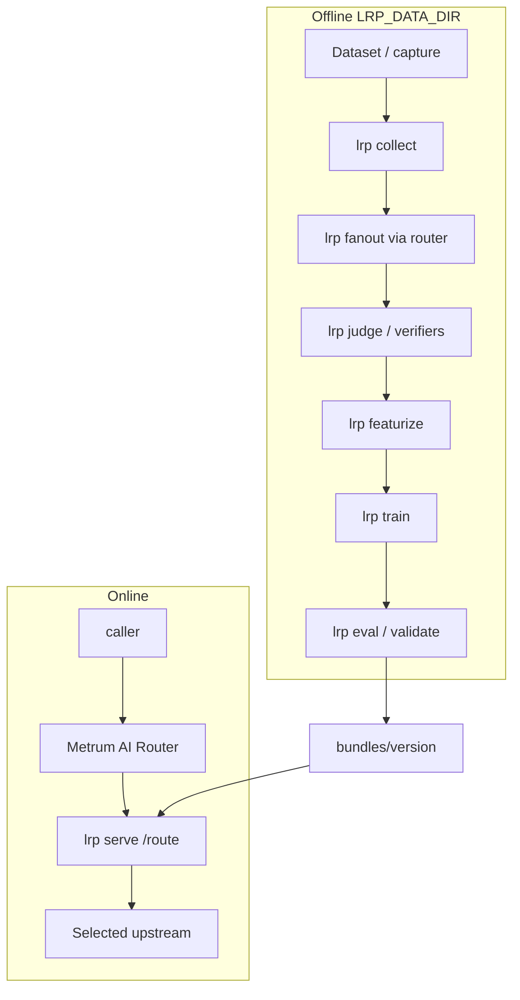

# Train LRP on a coding mix

This is a **repeatable operator example**, not a marketing one-pager. Someone
should be able to copy the path into their own environment: dataset pin, fanout
CLI, GPU train, `lrp serve`, router `external_policy`, and absolute-USD
reporting.

**Full offline article (Markdown only):**
[`docs/share/lrp-coding-mix-example.md`](https://github.com/metrum-ai/router/blob/main/docs/share/lrp-coding-mix-example.md)
— deeper tables, Astra target YAML, adapt checklist, and share blurbs.

Related: [Learned Routing Policy](../routing/learned-routing-policy),
[Train and evaluate](../routing/lrp-train-and-evaluate),
[Harbor case study](./harbor-case-study).

## Problem

A single coding group that always hits a frontier model is simple and expensive.
Static weights do not learn from your outcomes. LRP answers:

> For each request, which eligible upstream is the **cheapest target predicted
> to clear our quality floor**?

List prices alone do not establish sufficiency. You need multi-target outcomes
on your workload shape, joined to request-time prices, then a versioned bundle
beside the router.

## Architecture



LRP does **not** fine-tune upstream LLMs. It trains per-target quality +
output-token models and recommends among **already eligible** router targets.
The router still owns the upstream call, usage, latency, and fallback.

## Dataset (this example)

| Field | Value |
| --- | --- |
| Hugging Face | `nebius/SWE-rebench-openhands-trajectories` |
| Revision | `35455389ab51bf5e2306bfd436ef72d0f98bf882` |
| Constants | `services/learned-routing-policy/lrp/seed/__init__.py` |
| `EXAMPLE_MAX_TRACES` / `SAMPLE_N` | 100 / 100 |
| Sample seed | 42 |
| Extracted turns → sample | 6605 → stratified 100 |
| Split | train 76 / valid 19 / test 5 (session-disjoint) |
| Prompt tokens (cl100k meta) | mean ~21377 / min 3954 / max 83535 |
| Spend abort | `SPEND_ABORT_USD=100` |

**Semantics:** teacher-forced continuation (history ends at last tool/user turn).
A plausible next assistant action is **not** end-to-end task success. For your
data: export authorized content with stable `request_id` / `session_key`; do not
reconstruct prompts from metadata-only router logs.

## Portfolio

### Executed (paid fanout)

| target_id | Provider | Model | $/1M in / out (dated in `targets.py`) |
| --- | --- | --- | --- |
| openrouter-qwen3.5-9b | OpenRouter | `qwen/qwen3.5-9b` | 0.10 / 0.15 |
| openrouter-qwen3.8-27b | OpenRouter | `qwen/qwen3.8-27b` | 0.214 / 2.55 |
| openrouter-minimax-m3 | OpenRouter | `minimax/minimax-m3` | 0.30 / 1.20 |
| fireworks-kimi-k2p7-code | Fireworks | `kimi-k2p7-code` | 0.95 / 4.00 |
| baseten-glm-5-2 | Baseten | `GLM-5.2` | 1.50 / 4.50 |

Absolute-USD baseline for this mix: **Baseten GLM-5.2**. Keys:
`OPENROUTER_API_KEY`, `FIREWORKS_API_KEY`, `BASETEN_API_KEY` (never committed).

### Optional: GPT-6 Astra (not executed here)

You can add OpenAI `gpt-6-astra` as a frontier / absolute-USD baseline. **This
run did not call it.** Prices from OpenAI primary docs checked **2026-09-14**:

- Model card: https://developers.openai.com/api/docs/models/gpt-6-astra
- Pricing: https://developers.openai.com/api/docs/pricing

**Standard, input ≤ 272K (per 1M tokens USD):** input **10** / cached **1** /
cache write **12.50** / output **50**. Above 272K input, long-context rates apply
to the **entire** request (20 / 2 / 25 / 75). Context 1,050,000; max output
128K; Batch/Flex ≈ 50%; Fast ≈ 2×. Use `max_completion_tokens` for chat caps.

Back-of-envelope on this sample’s mean prompt (~21.4k) + 512 out ≈ **0.24 USD
per turn** at short-context Standard → ~**24 USD** for an Astra-only N=100
slice (vs GLM ok-row spend ~1.58 USD). Refresh prices before any paid estimate.
Full target YAML: see the [share article](https://github.com/metrum-ai/router/blob/main/docs/share/lrp-coding-mix-example.md).

## Environment

- **Orchestration host:** git / `gh` / SSH / secrets only — no HF download or ONNX train.
- **Heavy path:** remote GPU (this example: Shadeform `L40Sx2`, work root `/var/tmp/lrp-retake`). See [LRP GPU training](https://github.com/metrum-ai/router/blob/main/docs/LRP_GPU_TRAINING.md).
- Default embedder: local int8 ONNX BGE-small under `$LRP_DATA_DIR/embed/` (operator-owned; no serve-time download). Prefer `--device cuda:0 --strict-device`.

```bash
uv sync --project services/learned-routing-policy --locked
alias lrp='uv run --project services/learned-routing-policy --locked lrp'
export LRP_DATA_DIR=/var/tmp/lrp-coding-mix
mkdir -p "$LRP_DATA_DIR" && chmod 700 "$LRP_DATA_DIR"
```

## CLI (copy/adapt)

One **single-target** router group per candidate. Non-synthetic collect / fanout /
judge require `--approved-content`. Print spend estimate before paid fanout.

```bash
lrp collect \
  --dataset "$LRP_DATA_DIR/seed.ndjson" \
  --approved-content \
  --out "$LRP_DATA_DIR/requests.ndjson"

lrp fanout \
  --requests "$LRP_DATA_DIR/requests.ndjson" \
  --targets "$LRP_DATA_DIR/targets.yaml" \
  --via router --base-url http://127.0.0.1:8080/v1 \
  --refresh-pricing --approved-content \
  --concurrency 1 --max-total-cost-usd 100 \
  --out "$LRP_DATA_DIR/responses.ndjson"

lrp judge \
  --requests "$LRP_DATA_DIR/requests.ndjson" \
  --responses "$LRP_DATA_DIR/responses.ndjson" \
  --approved-content \
  --sandbox-rootfs "$LRP_VERIFIER_ROOTFS" \
  --out "$LRP_DATA_DIR/judgments.ndjson"

lrp featurize \
  --requests "$LRP_DATA_DIR/requests.ndjson" \
  --embedding-backend onnxruntime \
  --embedding-model "$LRP_DATA_DIR/embed/model.onnx" \
  --tokenizer "$LRP_DATA_DIR/embed/tokenizer.json" \
  --device cuda:0 --strict-device --seed 42 \
  --out "$LRP_DATA_DIR/features.parquet"

lrp train \
  --features "$LRP_DATA_DIR/features.parquet" \
  --judgments "$LRP_DATA_DIR/judgments.ndjson" \
  --responses "$LRP_DATA_DIR/responses.ndjson" \
  --embedding-backend onnxruntime \
  --embedding-model "$LRP_DATA_DIR/embed/model.onnx" \
  --tokenizer "$LRP_DATA_DIR/embed/tokenizer.json" \
  --device cuda:0 --strict-device \
  --anchor-provider baseten --anchor zai-org/GLM-5.2 \
  --ensemble-size 5 --seed 42 \
  --out "$LRP_DATA_DIR/bundles"

# For an Astra-anchored experiment:
#   --anchor-provider openai --anchor gpt-6-astra

lrp eval \
  --bundle "$LRP_BUNDLE_DIR" \
  --features "$LRP_DATA_DIR/features.parquet" \
  --judgments "$LRP_DATA_DIR/judgments.ndjson" \
  --responses "$LRP_DATA_DIR/responses.ndjson" \
  --config "$LRP_DATA_DIR/lrp.yaml" \
  --out "$LRP_DATA_DIR/eval_report.json"

lrp validate --bundle "$LRP_BUNDLE_DIR"
```

Synthetic smoke only (not this portfolio):

```bash
uv run --project services/learned-routing-policy --locked \
  python scripts/run_lrp_synthetic_demo.py --out-dir /var/tmp/lrp-worked-example
```

## Deploy

`lrp.yaml` (from `lrp.example.yaml`): group `quality_floor`, `deadline_ms`,
embedding paths, `compute.device: cuda:0` / `strict_device: true`.

```bash
export LRP_POLICY_AUTH_HEADER='...'
lrp serve \
  --bundle "$LRP_BUNDLE_DIR" \
  --config "$LRP_DATA_DIR/lrp.yaml" \
  --port 18093 --admin-port 18094 \
  --deadline-ms 500
```

Router group (start **shadow**, then **enforce**):

```yaml
strategy: external
include_request: true
external_policy:
  url: http://127.0.0.1:18093/route
  allow_hosts: [127.0.0.1]
  headers:
    X-LRP-Auth: ${LRP_POLICY_AUTH_HEADER}
  timeout_ms: 750   # > LRP deadline_ms
  mode: shadow
```

## Measured results (this run)

| Metric | Value |
| --- | --- |
| Spend estimate | 7.105 USD |
| Actual complete spend | **3.262 USD** |
| Rows | 500 (100 × 5); ok 349 / `http_429` 151 |

| Target | ok / 100 | Spend USD |
| --- | ---: | ---: |
| Qwen 3.5-9b | 75 | 0.149 |
| Qwen 3.8-27b | 73 | 0.283 |
| MiniMax-M3 | 67 | 0.241 |
| Fireworks kimi | 67 | 1.009 |
| Baseten GLM-5.2 | 67 | 1.579 |

Absolute gap (ok-row spend): GLM **1.579** − Qwen 3.5 **0.149** = **1.430 USD**.
Report absolute USD and token categories — **no savings percentages**.

Sidecar (synthetic_upstream sink): ~10 decisions/s enforce; GPU sidecar p50
single-digit ms. Machine-readable:
`docs/evidence/learned-routing-policy/seed-example-corpus.json`,
`docs/evidence/learned-routing-policy/routing-benchmark.json`.

## Adapt checklist

1. Define acceptance tests for **your** jobs (not only teacher-forced match).
2. One router group per candidate; smokes for dialect/tools/caps.
3. Private `LRP_DATA_DIR`; approve content transfer; print spend estimate.
4. Optional: add `gpt-6-astra` (refresh OpenAI pricing the day you run).
5. GPU featurize/train with `--device` + `--strict-device`.
6. `lrp eval` six baselines; failed gates stay failed.
7. Shadow → enforce; keep prior bundle for rollback.
8. Tear down ephemeral GPUs; rotate auth / signing keys.

## Limits

- N=100 ≠ production sufficiency.
- Teacher-forced ≠ end-to-end agent success.
- `http_429` rows are failures, not free wins.
- Astra prices above are illustrative; this run did not call Astra.
- Model / price / workload changes need fresh fanout (often retrain).

## Share blurbs

See the [offline article](https://github.com/metrum-ai/router/blob/main/docs/share/lrp-coding-mix-example.md)
§12 for LinkedIn / X / Reddit copy. Point the link at this page once the docs
site is published, or at the Markdown file on GitHub.
