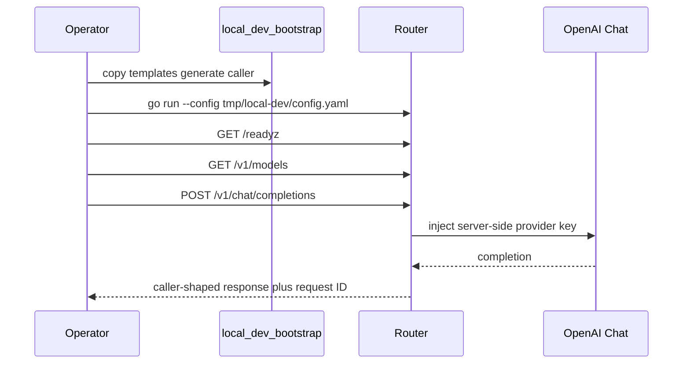

# Local Quickstart

Run Metrum AI Router on a laptop or workstation in about ten minutes. This
path is for local development: one OpenAI Chat upstream, one `static` model
group named `local`, and SQLite with `auto-safe` migrations. Packaged
production installs use [Installation](../installation/) and
`config.example.yaml`.

The software is Apache-2.0. Runtime licensing is not required.



## Prerequisites

- Go as declared in `go.mod`
- Python 3 for the bootstrap script
- An OpenAI API key for one Chat completion (or change the starter provider later)

## Bootstrap

From a clone of
[metrum-ai/router](https://github.com/metrum-ai/router):

```bash
python3 scripts/local_dev_bootstrap.py --out-dir tmp/local-dev
```

The script copies `config.minimal.example.yaml` and
`env.minimal.example.json`, omits any legacy `server.license` block, and
merges one hashed caller with
`metrum-ai-routerctl callers generate --write`. It does not print the raw
caller token. The token is in `tmp/local-dev/router.token` (mode `0600`).

Fill the provider key. `env.json` next to the config is loaded automatically:

```bash
# edit tmp/local-dev/env.json and set OPENAI_API_KEY
```

Keep `tmp/local-dev/` out of git. `tmp/` is gitignored.

## Start And Smoke

```bash
go run ./cmd/metrum-ai-router --config tmp/local-dev/config.yaml
```

In another terminal:

```bash
export ROUTER_BASE_URL="http://127.0.0.1:8080"
export ROUTER_TOKEN="$(tr -d '\n' < tmp/local-dev/router.token)"

curl -fsS "$ROUTER_BASE_URL/readyz"
curl -fsS -H "Authorization: Bearer $ROUTER_TOKEN" \
  "$ROUTER_BASE_URL/v1/models"
curl -fsS -H "Authorization: Bearer $ROUTER_TOKEN" \
  -H "Content-Type: application/json" \
  -d '{
    "model": "local",
    "messages": [{"role": "user", "content": "Reply with exactly: router ok"}],
    "max_tokens": 16
  }' \
  "$ROUTER_BASE_URL/v1/chat/completions"
```

`/v1/models` is the source of truth for the `model` value. The starter group is
`local`. Do not echo `$ROUTER_TOKEN` into tickets or chat.

Client-only examples against an **already running** deployment:
[API Quickstart](./hosted-quickstart). Codex and Claude Code:
[Codex CLI](./codex-cli) and [Claude Code CLI](./claude-code-cli).

## Hybrid And Production Next Steps

The same governance model (caller tokens, model groups, server-side keys,
usage rows) applies on-prem, in a cloud VPC, or hybrid: private vLLM/SGLang
plus commercial APIs. See the [overview](../overview) hybrid diagram and
[Self-Hosted Upstreams](../configuration/self-hosted-upstreams). For
learned cheapest-sufficient routing, see
[Train And Serve Learned Routing Policy](../routing/lrp-train-and-serve).
