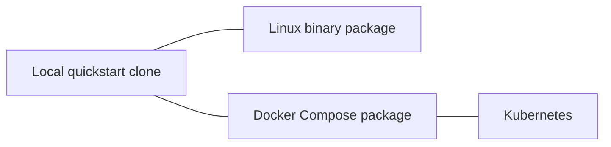

# Installation

Metrum AI Router is self-managed software. Choose the release artifact that
matches the host architecture and the operating model your team can secure,
back up, upgrade, and troubleshoot.

| Shape | Best fit | State boundary | Canonical guide |
|---|---|---|---|
| Linux binary | Existing process supervision and reverse proxy | Host files plus SQLite or PostgreSQL | [Binary](/docs/installation/binary) |
| Docker Compose | One-host container deployment | Bind-mounted config/state plus SQLite by default | [Docker Compose](/docs/installation/docker-compose) |
| Kubernetes | Cluster-owned ingress, Secrets, and storage | One-writer SQLite PVC or explicit PostgreSQL design | [Kubernetes](/docs/installation/kubernetes) |

Release packages support Linux `amd64` and `arm64`. Use immutable versioned
artifacts; do not deploy `latest`.

For a laptop or workstation trial, use the
[Local Quickstart](/docs/getting-started/local-quickstart) instead of a release
package.

## Required Inputs

- `config.yaml`, based on `config.minimal.example.yaml` for local trials or
  the shipped `config.example.yaml` for production-shaped catalogs;
- protected `env.json` or equivalent secret injection for provider keys;
- at least one caller token and allowed deployment-defined model group;
- persistent state and usage storage;
- a TLS and network-access plan.

Never commit or publish provider keys, caller tokens, token hashes, signing
keys, full production configs, or customer data.

## Installation Flow

1. Verify the package checksum, architecture, notices, and expected contents.
2. Back up any existing config, state, and usage database.
3. Install the immutable binary or image and protected runtime files.
4. Run the release's non-serving database migration gate when required.
5. Start one router writer when using SQLite.
6. Verify `/healthz`, `/readyz`, `/version`, `/docs/`, authenticated
   `/v1/models`, and one representative request.
7. Verify ordinary callers receive `403 metrics-forbidden` from `/metrics`.
8. Record the deployed version and retain the previous artifact for rollback.

## Rollback Planning

Before changing production, know whether the release permits package rollback
against the current database or requires restoration of the pre-migration
backup. Restore the previous artifact, reviewed config,
and database snapshot as one coherent release state, then repeat the same
smokes. See the [Upgrade Guide](/docs/release-notes/upgrade-guide).
