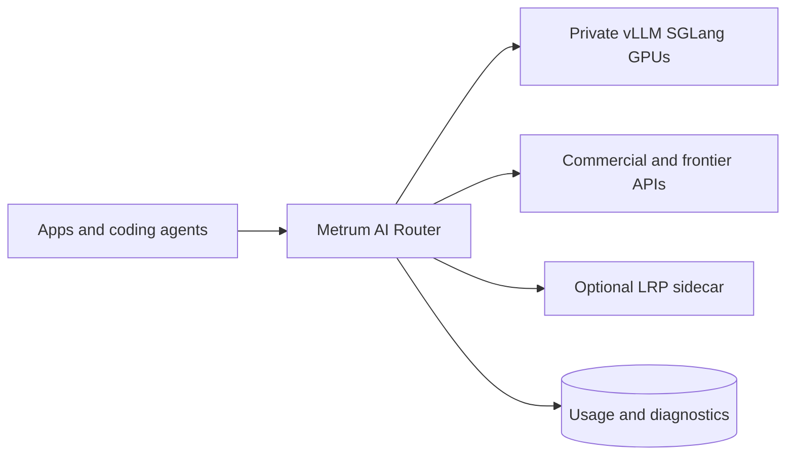
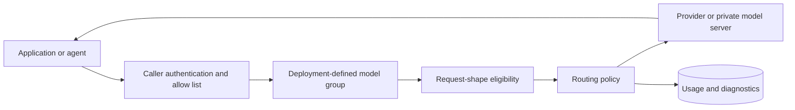

# Metrum AI Router

Metrum AI Router is a self-managed LLM smart router for OpenAI Chat, OpenAI
Responses, Anthropic Messages, VLM, and tool-capable agent traffic. It selects
an eligible upstream model per request from a deployment-owned policy, then
records why. Applications call one stable endpoint while operators control
provider credentials, model-group access, request-shape eligibility, quotas,
routing policy, and usage accounting. Gateway functions underneath routing make
those decisions enforceable and auditable.

## Why Use It

- Keep provider credentials server-side and give callers revocable scoped
  router tokens.
- Change validated provider/model mixes behind deployment-defined model groups
  without rewriting every client.
- Filter tool, image, dialect, context, and output-cap requests to targets
  validated for those shapes.
- Enforce RPM, TPM, concurrency, and request/token budgets (and per-request
  estimated cost ceilings where configured) before upstream calls. These are
  not cumulative dollar spend limits or multi-replica atomic spend accounting.
- Preserve sanitized request IDs, attempts, latency, token, fallback, and
  request-time cost evidence for operations.
- Combine private OpenAI-compatible servers (vLLM, SGLang, on-prem GPUs)
  with commercial and frontier APIs behind one caller token, model-group
  contract, runtime license, and usage database.

## Where It Runs

Operators run the router on-prem, in a customer cloud or VPC, or hybrid. The
product is self-managed: you keep keys, licenses, and traces. Applications
do not call providers directly.

## Request Flow

The router does not guarantee model quality or provider availability. Operators
must validate each active provider/model/API combination and retain a rollback
path. See [Architecture, Platforms, And
Limitations](/docs/reference/architecture-limitations).

## Start Here

1. Follow the [Local Quickstart](/docs/getting-started/local-quickstart) for a
   ten-minute laptop path (bootstrap, license, caller, one Chat request).
2. Choose [Docker Compose, binary, or Kubernetes](/docs/installation/) for a
   durable deployment.
3. Generate or renew the self-managed runtime-policy license as in
4. Discover allowed groups with [`/v1/models`](/docs/getting-started/available-models).
5. Use the [API Quickstart](/docs/getting-started/hosted-quickstart) against the
   running endpoint, then the exact Chat, Responses, Messages, tool, image,
   or streaming shapes your clients use.
6. Review [security boundaries](/docs/security-governance/overview),
   [observability](/docs/operations/observability), and the [upgrade
   guide](/docs/release-notes/upgrade-guide) before production traffic.

Questions and bugs use the repository's public issue forms. Suspected
vulnerabilities must use GitHub private vulnerability reporting; do not place
secrets or customer content in public issues.

