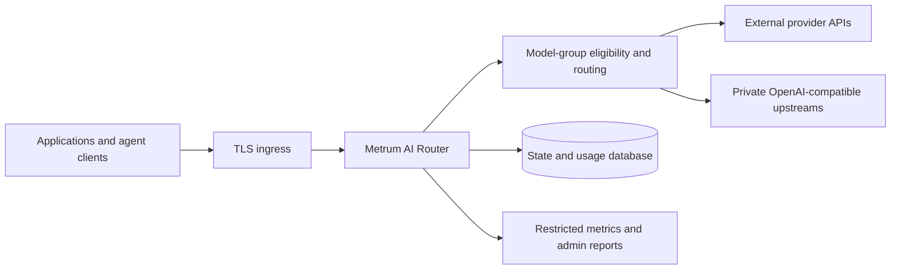

# Architecture, Platforms, And Limitations

Metrum AI Router is a self-managed reverse proxy between authenticated AI
clients and operator-configured upstream providers or private model servers.

The router authenticates callers, checks model-group access and request-shape
eligibility, selects a configured target, translates supported API dialects,
and records sanitized operational and usage data. Provider credentials stay on
the server side. Configuration remains deployment-owned.

## Supported Deployment Platforms

Release artifacts support Linux on `amd64` and `arm64`. The documented runtime
shapes are a standalone binary, Docker Compose, and Kubernetes. SQLite is the
single-writer default; PostgreSQL is the explicit choice for validated
multi-replica or externally managed database deployments. Operators provide
TLS ingress, DNS, storage, secret management, network policy, backups, and
provider accounts.

## Runtime And Lifecycle Separation

The serving router handles proxy traffic, caller policy, routing, usage, and
safe diagnostics. Customer runtime images include the router and the
customer-local `metrum-ai-routerctl`; they do not contain Fleet
lifecycle or signing binaries. Release binary packages may include
`metrum-ai-router-fleetctl` and related package-only lifecycle tools
for approved deployment workflows. This keeps cluster lifecycle authority out
of the customer request-serving image.

Validate the exact artifact before deployment. See [Deployment
Artifacts](../installation/deployment-artifacts) and [Package
Validation](../installation/package-validation).

## Security Boundaries

Caller tokens and model allow lists protect proxy traffic. Administrative
reports require configured admin authentication and authorization. `/metrics`
is restricted to callers with metrics-admin permission; ordinary application
callers receive `403 metrics-forbidden`. Provider keys, caller secrets, token
hashes, prompts, raw images, tool payloads, and full configuration must not be
placed in public logs or issue reports.

The router does not replace host, cluster, database, ingress, identity-provider,
secret-manager, provider-account, or client security. Operators must validate
those controls and the exact upstream model/API combinations they enable.

## Explicit Limitations And Non-Goals

- Model-group names and provider availability are deployment-defined; the
  project does not guarantee access to any provider or model.
- Catalog metadata is not capability proof. Tools, images, API bridges, and
  large request shapes require direct upstream and router-level validation.
- The in-process response cache is per process and is cleared by restart.
- Dynamic-score conversation affinity is caller-isolated but process-local; it
  is cleared by restart and is not automatically shared between replicas.
- Native incremental upstream streaming applies to same-dialect OpenAI Chat
  and Anthropic Messages. OpenAI Responses and cross-dialect bridges use unary
  upstream calls with router-encoded caller streaming.
- After the first native SSE event, the HTTP response is committed. A later
  failure cannot change the caller's `200`, append a reliable error envelope,
  or fall back to another target; clients must detect a missing terminal event.
- TypeScript policies run synchronously in the serving process. Per-group
  concurrency limits bound admitted VMs but do not impose a pure-JavaScript
  execution timeout or preempt an unbounded loop.
- The Gemini `generateContent` adapter is an outbound unary text codec, not a
  caller-facing Gemini endpoint. Active targets require exact-model direct and
  router evidence; tools, images, reasoning, structured output, and streaming
  are not enabled for that adapter.
- `targets[].region` is operator-declared diagnostics metadata. It does not by
  itself enforce residency, retention, transfer, jurisdiction, or provider
  training behavior and is not included in TypeScript or external-policy
  inputs.
- The licensed `intelligent` strategy is a baseline-only configuration
  foundation in the current release. It does not invoke its decision model or
  alter serving-target selection.
- SQLite is not a shared multi-writer database and must not back horizontally
  scaled router replicas.
- Kubernetes examples are starting points, not a cluster installer or a
  substitute for deployment-specific security review.
- Hierarchical routing can be assembled through supported API boundaries, but
  there is no universal topology controller.
- The project does not provide provider uptime, model-quality, legal,
  compliance, or support-service guarantees.

See [Router Configuration](../configuration/router-config), [Security And
Governance](../security-governance/overview), and the [Upgrade
Guide](../release-notes/upgrade-guide).

## Identifier transformation

`server.identifiers.mode` defaults to `rewrite`. Configure a 64-byte random
AES-256-SIV key in `transform.current.key` using hex or standard base64 (for
example `${ROUTER_ID_TRANSFORM_KEY}`). `key_id` is a printable, loggable label
(for example `idk-2026-09`); the single base62 wire epoch character is derived
from it. Caller IDs have the form `mr_` + epoch + unpadded base64url ciphertext.
Encryption is deterministic: equal IDs under the same key remain equal. Keep the
key stable across replicas and restarts.

Rotation supports only `current` and optional `previous`, with different
`key_id` values whose derived epochs must not collide.
The previous key needs an RFC3339 `valid_until` in the future, no more than 30 days
away at validation. Encoding always uses current; decoding accepts previous only
until its deadline. Remove the previous configuration when its grace period ends.
The router validates keys and performs an encode/decode self-test at startup.
The relational configuration loader accepts deployment-owned identifier settings
separately; identifier secrets are not stored in its database projection.

Native Anthropic, Responses, and Chat SSE streams rewrite only protocol ID string
fields, preserving content deltas and SSE framing. Responses function-call
`call_id` is transformed along with item IDs so tool results can round-trip.
Ingress decodes prefixed `tool_call_id`, `tool_use_id`, `call_id`, and
`previous_response_id`. Unprefixed IDs remain accepted. This change does not add
ID rewriting to unary responses or translated streams, or enable upstream
stateful Responses routing across providers.

Explicit `passthrough` skips transformation and emits a startup warning.
`pii_filter` restoration (`redact_and_restore` or `restore_response: true`) is
rejected with `F-011: pii-filter-redact-and-restore-unsupported`; use `redact_only`
or `fail_on_match`. Native streams cannot safely restore arbitrary content deltas.
