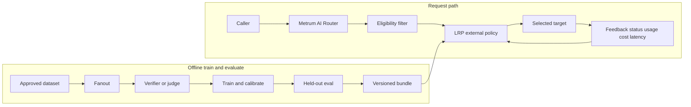

# Learned Routing Policy

Learned Routing Policy (LRP) recommends the lowest-cost eligible target predicted
to meet an operator-defined quality floor.



Quality labels are assigned offline. Feedback carries status, usage, cost, and
latency only. Different models are good at different
jobs and to different degrees. Teams establish the cheapest sufficient model mix
using objective outcomes, such as unit tests, extraction accuracy, tool-call
correctness, browser tasks or product acceptance tests.

## What it does and what evidence it produces

LRP trains per-target quality and output-token models offline, calibrates those
predictions, evaluates them on a held-out split, and serves a versioned bundle
through the router's `strategy: external` interface. For each request the router
still authenticates the caller, filters targets for request shape and contract
gates, then asks LRP only among eligible targets. The service returns a target
recommendation and bounded labels; the router records the decision as usage and
request-evidence telemetry.

Evidence operators can inspect includes:

- held-out quality, cost, floor-violation, and baseline comparisons;
- calibration and coverage gates that must pass before promotion;
- shadow-mode recommendations that do not change serving traffic;
- selected provider/model, policy labels, and request IDs on live or staging traffic.

The operator/maintainer source of truth remains
[docs/LEARNED_ROUTING_POLICY.md](https://github.com/metrum-ai/router/blob/main/docs/LEARNED_ROUTING_POLICY.md).

## What callers request

Use an allowed deployment-defined model group from
[Available Models and Access](../getting-started/available-models.mdx). The same
Chat, Responses or Anthropic client request reaches the router. Operators decide
which groups use a learned policy and validate each provider, dialect, tool mode
and request shape independently. Choosing a group does not bypass access,
capability, output-cap, budget or rate-limit checks.

The router filters targets before asking LRP for a recommendation. LRP predicts
quality and output-token count for eligible targets and compares their expected
costs. If no predicted quality meets the floor, it chooses the highest predicted
quality. Unknown pricing cannot make a target appear free. Fallbacks remain
within eligible targets. Predictions are estimates; a quality floor is an
operator's selection criterion, not a guarantee that every answer passes.

## Training, calibration, and held-out evaluation

The standalone `lrp` training CLI collects approved datasets, fans requests out to
candidate targets, verifies or judges responses, builds shared features, trains
per-target LightGBM models, calibrates predictions, and evaluates a held-out split.
Session-based splitting prevents a conversation appearing in training and test.
Optional near-duplicate embedding deduplication runs before that split so
templated prompts do not leak across partitions; operators review removed counts
and threshold sensitivity without exporting request content. See the operator
[evaluation splits note](https://github.com/metrum-ai/router/blob/main/docs/LRP_EVAL_SPLITS.md).
Small or undertrained models are excluded. Model bundles bind their embedding
artifacts and feature definitions for consistent training and serving.
The default embedding backend is local ONNX Runtime; operators may also use a
local or already-cached sentence-transformers model. Serving does not download
embedding weights. Shared `compute.device` selects CPU, CUDA, or ROCm for
embedding execution.

Protected datasets and judgments stay in operator-controlled storage. Ordinary
router request logs contain metadata and cannot reconstruct prompts. Third-party
judging requires operator approval for that content transfer.

Evaluation compares learned decisions with cheapest, anchor, weighted-random,
strength-only and oracle baselines. Operators review quality, stored cost,
coverage, floor violations, calibration and performance, including response
duration and time to first byte. When aggregator backends expose an actual
upstream serving provider, evaluation reports outcome, cost and latency variance
by that identity while preserving the exact catalog model id and marking missing
provider evidence separately. A cost saving is useful when workload outcomes
remain acceptable.

### Checked-in synthetic holdout snapshot

The following figures come from the checked-in synthetic public training snapshot
dated 2026-09-09 in
[`docs/evidence/learned-routing-policy/public-training.json`](https://github.com/metrum-ai/router/blob/main/docs/evidence/learned-routing-policy/public-training.json)
(`schema_version: lrp.public-training.v1`, seed `42`, 800 requests, splits
569 / 118 / 113, quality floor `0.8`). `promotable` is `false`. Gates
`cost_vs_anchor` and `real_data_and_embedding` failed. These numbers are wiring
and gate evidence only.

| Policy | Holdout n | Quality mean | Floor violation rate | Observed cost USD |
|---|---:|---:|---:|---:|
| LRP | 113 | 1.0 | 0.0 | 0.1507895 |
| Oracle | 113 | 1.0 | 0.0 | 0.1507895 |
| Always anchor / BT | 113 | 1.0 | 0.0 | 0.151829 |
| Weighted random | 113 | 0.7168141592920354 | 0.2831858407079646 | 0.076697 |
| Always cheapest | 113 | 0.48672566371681414 | 0.5132743362831859 | 0.0151829 |

Command blocks, router YAML, sidecar notes, and additional evidence tables:
[Train And Serve Learned Routing Policy](lrp-train-and-serve.md).
After installing the service project with uv, each command can be invoked as
`uv run --project services/learned-routing-policy --locked lrp COMMAND`
(`collect`, `fanout`, `judge`, `featurize`, `train`, `eval`, `validate`, `serve`).

## A complete workload-to-routing scenario

LRP trains a routing policy, not the upstream language models. Its Python training
tool is packaged as a uv project with locked dependencies. LightGBM learns quality
and output-token predictions; isotonic calibration adjusts the quality scores.
Training and serving share the same embedding and scalar features. Training is
offline: serving loads a versioned bundle and makes predictions without running
a training job or asking a third-party judge for each caller request.

### Choose workloads before choosing a model mix

Start with the jobs users need completed and how success will be measured. A
deployment could distinguish these workloads:

| Workload | Representative dataset | Acceptance criterion |
|---|---|---|
| Short calculations or classification | Typical and ambiguous requests with exact output constraints | Correct result or approved label |
| Structured extraction | Documents with missing fields, distractors and realistic lengths | Correct values as well as a valid schema |
| Code review or repair | Multiple files and representative tools/context | Tests pass or a reviewer records the required outcome |

Match the dataset to the intended language, session lengths, system instructions,
tool schemas, response formats, output caps and client dialects. Include difficult
and failed cases. Hold out whole conversations so the model cannot see another
turn from a test conversation during training. More examples of easy requests
cannot substitute for evidence about a different workload.

### Choose and validate upstream candidates

Choose plausible candidates at different costs and an anchor that defines the
comparison bar. Record exact provider/model/API identities, prices, context and
output limits, modalities and tool behavior. Validate each exact combination
directly and through the router before adding it to a restricted calibration
group. A cheap advertised price does not establish sufficient quality.

For router-based collection, use a separate single-target group per candidate
and one restricted calibration caller. Each request is tried against each
candidate; the outcome record includes the actual target, request ID, usage,
stored price/cost, response status, latency and time to first byte. The current
v1 fanout client replays OpenAI Chat and obtains exact-model prices from
OpenRouter. Other dialects or price sources need independently validated
collection integrations. Callers can still use other router API surfaces once
operators have separately validated their learned-policy request shapes.

Use objective verifiers when available. Verifiers run in an isolated worker;
missing isolation is missing evidence. Third-party judging requires approval
for that content transfer, preferably using a judge outside the candidate set.
Keep verifier success, relative preference and absolute rubric scores identified
because they have different meanings.

### Train, calibrate and evaluate

The operational sequence is:

```text
approved workload dataset
  → collect → fanout → verify/judge → featurize → train → evaluate
  → validated bundle → shadow → staging enforcement → workload acceptance
```

Each target needs at least 200 training rows to participate in learned selection.
This is a minimum sample count, not a guarantee of workload coverage. Inspect
held-out coverage, calibration, quality, spend and performance against all six
baselines. Review the quality-floor sweep before choosing a floor. Failed gates
remain visible and prevent promotion.

## How it plugs in as `strategy: external`

Configure the model group with `strategy: external` and point
`external_policy.url` at the loopback LRP serve endpoint in the router's network
namespace. Use `mode: shadow` first so recommendations are recorded while the
router continues serving the configured baseline order, then move a restricted
staging group to `enforce` only after workload and security acceptance.

See [External Routing Policy Service](../configuration/external-routing-policy)
for the request/response contract, allow-lists, timeouts, and fail-closed
behavior.

## Recorded case study and performance limits

For a shareable multi-provider coding walkthrough (train steps, absolute USD,
sidecar latency), see [Train LRP on a coding mix](../evaluation/lrp-coding-mix-example).

The detailed [learned-routing case study](../evaluation/learned-routing-case-study.md)
follows the complete synthetic workload, training, evaluation and real-process
inference scenario. It includes training log excerpts, safe downloadable evidence,
actual selected upstreams, per-target quality/cost explanations, the failed
synthetic cost gate, and all four real BGE stage-latency measurements.

In that shared-host benchmark, the default one-thread 512-token shape exceeded
the default 200 ms service deadline even at median feature latency. Keep
long-input enforcement behind workload/hardware validation; short-input results
do not establish whole-workload performance. See the case study for measured
values, concurrent host-load conditions and implications for BT fallback.

### Configurable wait for latency-tolerant workloads and tests

Operators can set top-level `deadline_ms` in LRP's service config from **1 to
4,500 ms**; the default remains **200 ms**. For a workload that accepts a longer
routing wait, or a controlled inference test, `deadline_ms: 500` allows more time
for the learned prediction. Set the router group's `external_policy.timeout_ms`
higher, for example **750 ms**, to allow transport overhead. The router permits
at most 5,000 ms. A router timeout that expires first uses the router's configured
policy-error behavior rather than waiting for LRP's fallback.

This increases potential caller latency and worker occupancy. It does not add
inference workers, remove admission limits, or make busy-worker fallback
impossible. Test learned/fallback label counts and caller latency at the intended
request sizes and concurrency. A 500 ms test allowance does not turn a failed
40 ms performance target into a pass. Restore the default deadline and the
previous router timeout when reverting a test. The
[operator runbook](https://github.com/metrum-ai/router/blob/main/docs/LEARNED_ROUTING_POLICY.md#choose-a-deadline-for-the-workload-or-test)
shows the configuration and validation steps.

For a temporary run, `lrp serve --bundle BUNDLE --config CONFIG --deadline-ms 500`
overrides YAML without modifying it. The override accepts the same integer range.
Omit it to use YAML, or the 200 ms default when no value is configured. The router
timeout still needs to be set separately. This makes a longer inference allowance
explicit for testing while preserving normal deployment defaults.

## Privacy and operational behavior

LRP is trusted deployment infrastructure. Request-aware routing sends normalized
content to the service only when the operator enables `include_request`.
Configured group PII filtering runs first. LRP retains no request content in
service logs; training datasets and judgments live in protected operator storage.
Third-party judging requires operator approval for the content transfer. Ordinary
router request logs contain metadata and cannot reconstruct prompts.

Optional exploration is restricted to explicitly configured calibration projects.
Optional session pins are in-memory heuristics based on group, project,
environment and first user text. Identical first prompts in a shared project can
collide; pins are disabled initially. Image-bearing requests use first eligible
order in v1; learned image-quality selection requires separate future validation.

Missing request content uses first eligible order with a degraded diagnostic.
Deadline or embedding failure uses strength-based fallback. Feature build,
primary prediction, ensemble uncertainty, and requested explanation share one
admission slot and remaining deadline. Timed-out requests do not start a second
embedding or ensemble compute. When uncertainty abstention is enabled and
ensemble evidence is missing, the service fails closed to the configured anchor
(or first eligible fallback) with `lrp:uncertain-unavailable` rather than
treating uncertainty as zero. If no bundle target is known, the service uses
first eligible order and records that condition.
Policy failures produce `502 routing-policy-error` when the operator selected
fail-closed behavior. See [Error Responses](../reference/errors.md).

## Rollout: staging, promotion, and rollback

Synthetic demonstrations prove wiring and evaluate gates; they do **not**
authorize live target promotion. Provider-backed outcomes and actual embedding
latency establish promotion evidence. The shipped sample configuration is the
source of truth for catalog pricing evidence; live experiments refresh provider
metadata before recording costs.

Native external-policy shadow mode records the learned recommendation while the
router serves first eligible configured order. This baseline differs from weighted
routing. Operators validate a restricted staging group before enforcement, then
require workload, security, client and request-shape acceptance before broad
promotion. Baseline mode bypasses LRP and preserves configured eligible order;
restoring a prior weighted strategy is a separate configuration rollback.

Operators may optionally require Ed25519-signed model bundles before load or
reload. Pass the same trust store and `--require-signed` flag to `lrp serve` so
startup and admin/SIGHUP reload enforce that policy. Signing is deployment-owned
and transparent to callers; see
[Operator-signed LRP bundles](lrp-signed-bundles.md).
Held-out evaluation shares the composed decision path with serving. When
configured project floors, latency gates, pins, or abstention cannot be
validated from the supplied evidence, promotion reports mark that configuration
unsupported rather than silently passing.

Optional selection constraints (project floors, upstream latency gates,
evidence-based cache estimates, and bounded labels) are described for callers in
[LRP selection constraints](lrp-selection-constraints.md).

Deploy the service over loopback in the router's network namespace, such as a
sidecar in the same pod. A separate private service on a custom port does not
satisfy the router's current egress rules. Step-by-step train, serve, and
evidence tables: [Train And Serve Learned Routing Policy](lrp-train-and-serve.md).
Policy requests are authenticated;
diagnostics use a separate loopback listener, with authenticated explain/reload
disabled initially. Router global metrics continue to require metrics-admin
access. See [Customer-Controlled Routing](customer-controlled-routing.md) for
the external-policy contract and contact [Metrum](mailto:contact@metrum.ai) for
deployment guidance.
