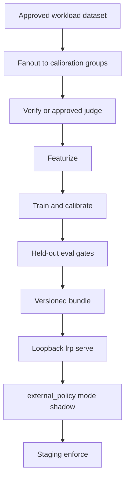

# Train And Serve Learned Routing Policy

Split public pages: [Concepts](learned-routing-policy.md),
[Train and evaluate](lrp-train-and-evaluate.md),
[Serve and promote](lrp-serve-and-promote.md). This page keeps the command
blocks and checked-in synthetic evidence tables.

Learned Routing Policy (LRP) trains a **routing policy**, not upstream language
models. Offline, LightGBM fits per-target quality and output-token models.
Online, `lrp serve` loads a versioned bundle and recommends the cheapest eligible
target predicted to meet an operator quality floor. The router still enforces
caller access, PII, budgets, and request-shape eligibility.

LRP is optional trusted infrastructure. Callers still request a
deployment-defined model group.



## Enterprise placement

The router can sit on-prem, in a customer cloud, or hybrid. LRP only ranks
targets the router already marked eligible, so a group can mix private GPUs
and frontier APIs under one token and usage plane. Current router egress
requires **same-namespace loopback** for LRP (`http://127.0.0.1:18093/route`).
A separate Kubernetes Service on that port is rejected.

Non-production Compose sketch (share the router network namespace):

```yaml
# Example only. Review image tags, secrets, and probes before any cluster use.
lrp:
  image: example.com/lrp:<immutable-tag>
  network_mode: "service:router"
  volumes:
    - ./lrp-bundle:/bundle:ro
    - ./lrp.yaml:/config/lrp.yaml:ro
```

## Offline commands

Keep datasets, responses, judgments, and bundles **outside** the public tree.
After `uv sync --project services/learned-routing-policy --locked`:

```bash
uv run --project services/learned-routing-policy --locked lrp collect ...
uv run --project services/learned-routing-policy --locked lrp fanout ...
uv run --project services/learned-routing-policy --locked lrp judge ...
uv run --project services/learned-routing-policy --locked lrp featurize ...
uv run --project services/learned-routing-policy --locked lrp train ...
uv run --project services/learned-routing-policy --locked lrp eval ...
uv run --project services/learned-routing-policy --locked lrp validate --bundle "$LRP_BUNDLE_DIR"
uv run --project services/learned-routing-policy --locked lrp serve \
  --bundle "$LRP_BUNDLE_DIR" --config "$LRP_DATA_DIR/lrp.yaml" \
  --port 18093 --admin-port 18094
```

Full flags, verifier isolation, and promotion gates:
[operator runbook](https://github.com/metrum-ai/router/blob/main/docs/LEARNED_ROUTING_POLICY.md).
v1 fanout replays **OpenAI Chat** and OpenRouter prices. Other dialects need
separate collection evidence.

Synthetic wiring (real LightGBM, mock upstreams, synthetic embeddings):

```bash
uv run --project services/learned-routing-policy --locked python scripts/run_lrp_synthetic_demo.py \
  --out-dir /var/tmp/lrp-worked-example
```

## Router group

Start in **shadow**. `include_request: true` is required for request-aware LRP
and must stay inside trusted infrastructure. Configure group PII filtering
first when prompts must not leave the router unredacted.

```yaml
models:
  workload-staging:
    strategy: external
    external_policy:
      url: http://127.0.0.1:18093/route
      allow_hosts: [127.0.0.1]
      include_request: true
      mode: shadow
      timeout_ms: 750
      headers:
        X-LRP-Auth: ${LRP_POLICY_AUTH_HEADER}
      on_error: fail_closed
```

Set LRP `deadline_ms` (default 200, max 4500) **below** `timeout_ms`. Rollback
learned influence with `mode: baseline` (configured eligible order). That is not
the same as restoring previous weighted weights.

## Checked-in synthetic evidence (not promotion)

Local snapshot **2026-09-09**. Files under
[docs/evidence/learned-routing-policy](https://github.com/metrum-ai/router/tree/main/docs/evidence/learned-routing-policy):

| Artifact | What it records |
|---|---|
| `public-training.json` | Split 569/118/113, LightGBM 4.7.0, `promotable: false` |
| `public-inference.json` | E01–E10 plus native-shadow; bundle `f10b14c5897a571372136168` |
| `public-bge-benchmark.json` | Real BGE-small QInt8 stage latency; not HTTP/router p99 |
| `public-tests.json` | 79 Python tests, 0 fail/error/skip |

Holdout (113 requests, stored synthetic cost, billed coverage 0):

| Policy | Mean quality | Floor violations | Cost USD |
|---|---:|---:|---:|
| LRP | 1.0 | 0 | 0.1507895 |
| Oracle | 1.0 | 0 | 0.1507895 |
| Always cheapest | 0.487 | 0.513 | 0.01518 |
| Always anchor | 1.0 | 0 | 0.151829 |

On this **controlled** synthetic holdout, learned matched the oracle but the
cost delta versus the expensive anchor was only ~0.68% — far short of the
promotion threshold (`cost_vs_anchor` requires ≤ 0.60 of anchor cost, so the
gate is **false**). That figure is a failed-gate benchmark artifact, not a
product or launch savings claim. `real_data_and_embedding` is also false. The
bundle is **not promotable**.

Worked inference (quality floor 0.8, `lrp:cheapest-above-floor`):

- Short (~11 input tokens): both quality 1.0; served `synthetic/cheap`.
- Long (~2535 input tokens): cheap quality ~0; served `synthetic/strong`.
- Native shadow: LRP recommended `strong`; router served configured-first `cheap`
  with `shadow_recommended`.

Real BGE 512-token **one-thread** (service default) embedding p99 ~304 ms and
full features p99 ~312 ms on a **shared** Ryzen 7 5825U host, above the default
200 ms deadline. Expect `lrp:latency-fallback` for that shape unless you raise
`deadline_ms` and re-measure on dedicated hardware. Short 26-token inputs met
the 15 ms / 40 ms stage budgets.

Provider-backed collection, ~2,000 labeled requests, 24-hour staging shadow,
and 7-day staging enforce remain **independent** before broad promotion. See the
[case study](../evaluation/learned-routing-case-study).

The issue #159 routing-benchmark harness publishes schema and empty evidence
under the operator evidence tree. It does not claim live A/B/C overhead or USD
results. Configuration D (GPU LRP) is tracked in issue #162.
