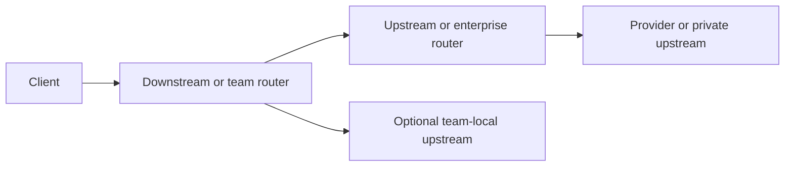

# Deployment Pattern Runbook

Use this runbook when a customer or internal team asks whether Metrum AI Router fits its deployment, governance, network, or organization structure. Keep notes privacy-safe: do not record raw provider keys, router tokens, token hashes, prompts, images, tool outputs, full configs, private hostnames, SSH paths, or customer-specific license payloads.

Public companion page: `docs-site/docs/operations/deployment-patterns.md`.

## Pattern Taxonomy

| Pattern | Fit | Primary operator |
|---|---|---|
| A. Metrum-managed evaluation endpoint | Fast client compatibility, model-group quality, report, and pilot evidence | Metrum evaluation operator |
| B. Enterprise self-hosted central gateway | One governed endpoint per enterprise environment, VPC, or trust boundary | Customer platform team |
| C. Per-environment routers | Separate dev, staging, and production promotion paths | Platform SRE or release owner |
| D. Per-team or per-business-unit routers | Separate keys, cost centers, retention, private upstreams, or release cadence | Team platform owner |
| E. Hierarchical or federated routers | Central governance with local routing strategy, regional forwarding, private GPU router upstreams, migration, blue/green, or canary | Shared platform plus local owner |
| F. Private managed dedicated deployment | One customer or contracted customer environment per dedicated managed instance | Managed-service operator |

The same product rule applies to every pattern: model groups, provider credentials, private upstreams, caller access, telemetry retention, and routing strategy are deployment-defined. The customer or operating team owns its routing destiny; the router supplies enforcement points, API compatibility, evidence, and control surfaces.

## Private Deployment Checklist Template

Fill this template with placeholders or approved customer-safe identifiers only.

| Area | Questions | Evidence |
|---|---|---|
| Deployment shape | Evaluation, self-hosted central, per-environment, per-team, hierarchical/federated, or private managed? | Architecture sketch and owner list |
| Environments | Which dev/staging/prod/region/router instances exist? | Environment matrix |
| Ingress | Who owns DNS/TLS/ingress and network allowlists? | Sanitized ingress design |
| Caller access | Which users, projects, clients, and tokens need which model groups? | `/v1/models` checks per caller class |
| Model groups | What workloads, API shapes, tools, modalities, quality targets, cost targets, and rollback criteria exist? | Model-group quality contract |
| Provider credentials | BYOK, managed keys, private upstream credentials, or mixed? | Custody summary without values |
| Private upstreams | vLLM/SGLang/private GPU endpoints or hosted OpenAI-compatible services? | Direct and router-level smokes |
| Telemetry | Usage DB, logs, metrics-admin subjects, browser reports, retention, rollups, and exports? | Report excerpt and retention summary |
| Runtime policy | Validity, features, limits, renewal, trust rotation, and recovery? | Safe license status fields |
| Rollback | Restore previous package/config/license/state, or disable target/weight/group? | Rollback command path and smoke |

## Production Readiness Checklist

- `/readyz`, `/version`, and deployment docs page load.
- `/v1/models` returns only allowed deployment-defined model groups for every caller class.
- OpenAI Chat, OpenAI Responses, Anthropic Messages, tools, images, and structured outputs pass for the clients and groups that claim them.
- Codex CLI and Claude Code smokes create or edit a disposable file when those clients are in scope.
- Usage/reporting shows caller, project, environment, model group, provider/model, status, latency, TTFB, duration, throughput, tokens, cost, attempts, and fallbacks.
- `/metrics` is available only to metrics-admin subjects; ordinary caller keys receive `403 metrics-forbidden`.
- Admin reports, if enabled, require browser-admin identity plus authorization and ordinary router tokens receive `403 reports-forbidden`.
- License status is valid for licensed deployments, and state paths survive restart.
- Backups cover config, provider env, license file, license state, router state, usage DB, and routing script artifacts according to the deployment policy.
- Rollback has been tested from the exact package/config shape being promoted.

## Rollback Checklist

- Restore the previous reviewed config or package.
- Restore the previous valid license file or state only from trusted backups when those inputs changed.
- Disable or lower the weight of the suspect target if the problem is isolated to one provider/model.
- Remove unsafe capability metadata such as tool, image, reasoning, or structured-output support when validation fails.
- Restart or reload through the deployment's normal procedure.
- Rerun the smoke that failed plus `/readyz`, `/v1/models`, and a report check for the rollback window.
- Record request IDs, safe error types, selected provider/model, and rollback timestamp.

## Hierarchical Router Smoke Procedure

Use this for app/team router to enterprise router topologies, central ingress to team router topologies, private GPU router upstreams, blue/green router pairs, or migration from a managed pilot to customer-owned production.

1. Configure the upstream router as an OpenAI-compatible provider or approved internal upstream in the downstream router. Store the upstream router token only in the downstream router's protected environment or secret manager.
2. Confirm the downstream caller token allows the local model group requested by the app.
3. Confirm the upstream router token allows the upstream model group requested by the downstream router.
4. Run `/readyz` on both routers.
5. Run `/v1/models` from the app caller to the downstream router and from the downstream router credential to the upstream router.
6. Run Chat text, Responses/Codex, Messages/Claude Code, tool, and image smokes for every API shape that should traverse both hops.
7. Record downstream request ID, upstream request ID or correlation field, selected model groups, selected provider/model, status, latency, timeout values, attempts, and fallback behavior.
8. Test negative cases: bad downstream caller token, downstream model not allowed, bad upstream router token, upstream model not allowed, upstream timeout, upstream `429`, upstream `no-eligible-target`, and provider failure.
9. Inspect reports from both routers and confirm correlation is possible without raw prompt/response capture.
10. Confirm `/metrics` isolation and no tenant data labels on unauthenticated or ordinary-caller endpoints.

Timeout guidance: the app/client timeout must exceed the downstream router budget, which must exceed the upstream router budget, which must exceed the longest intended provider attempt plus fallback overhead. Avoid letting an upstream hop consume the whole caller budget.

Privacy guidance: hierarchical routing does not require prompt, image, response, or tool-output capture. Enable governed content capture only when the customer has an explicit policy, retention plan, authorization model, and purge path.

## Separate Router Instance Versus Model Group

Prefer another model group in the same router when:

- the same platform team owns provider keys, reporting, retention, license, and release cadence;
- caller authorization and quotas are enough to separate access;
- workloads differ mainly by cost, latency, tool capability, modality, or quality contract;
- reporting can be scoped safely by caller, project, environment, and model group.

Prefer a separate router instance when:

- a team or region needs separate provider keys, private upstream network paths, or BYOK custody;
- retention, legal hold, content capture, or audit policy differs materially;
- a different license, admin boundary, report-admin domain, or metrics-admin domain is required;
- deployment cadence, rollback owner, SLO, or incident process is separate;
- data residency requires no cross-region routing for some traffic;
- a private GPU cluster should be exposed as a governed upstream to another router.

Prefer a hierarchical/federated topology when both are true: central governance must remain visible, and local teams or regions need their own routing strategy or private upstream ownership.

## Customer Triage Questions

Ask these when a customer says "not sure it will work for us":

- Which deployment shape is required: evaluation-hosted, self-hosted central, per-environment, per-team, hierarchical/federated, or private managed?
- Who must own provider credentials and private upstream tokens?
- Are there data residency, VPC, air-gap, egress, or private-upstream constraints?
- Which clients must work: OpenAI Chat, Responses/Codex, Anthropic Messages/Claude Code, tools, images, structured outputs, or browser-control agents?
- Which model groups should users see, and what outcome/cost/latency contract should each group satisfy?
- Do teams need autonomy over routing weights and fallbacks, or is central governance sufficient?
- What usage, cost, performance, security, and audit reports are required?
- What telemetry retention and content-capture policy is allowed?
- What production proof would unblock the decision: smokes, report excerpts, security assessment, backup/restore, rollback, or a hierarchical-router failure test?

## Cross-References

- Public deployment patterns: `docs-site/docs/operations/deployment-patterns.md`
- Public deployment readiness: `docs-site/docs/evaluation/deployment-readiness.md`
- Fleet customer operations: `docs/CUSTOMER_INSTANCE_OPERATIONS_RUNBOOK.md`
- Internal deployment: `docs/DEPLOYMENT.md`
- Docker deployment: `docs/DOCKER_DEPLOYMENT.md`
- Self-hosted upstreams: `docs/SELF_HOSTED_UPSTREAMS.md`
- Model group contracts: `docs/MODEL_GROUP_CONTRACTS.md`
- Smoke test matrix: `docs/SMOKE_TEST_MATRIX.md`

Historical context: GitHub issue #233 requested this taxonomy and hierarchical/federated topology guide. Issue #40 is related private managed deployment planning context; keep private operational details out of public docs.
