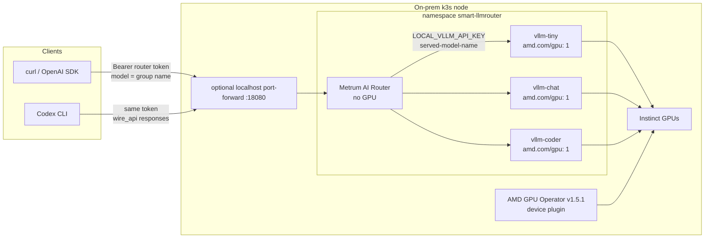

# k3s AMD Instinct local-serving: architecture, install, and usage

**Profile:** manual `k3s-amd-instinct-local-serving`  
**Issue:** #952  
**KV cache:** off — do not install or use LMCache or Mooncake.  
**Out of scope:** Shadeform, Fleet, Metrum EKS, llm-d / GAIE, cloud LLM APIs.

This document is the operator runbook **and** the architecture/usage reference for
running Metrum AI Router in front of in-cluster vLLM/ROCm on AMD Instinct.
Client applications never talk to vLLM directly in the intended workflow. They
call Metrum AI Router with a **router model-group name** and a **router caller
token**.

The current blueprint CLI does not implement an AMD profile. Serving uses
checked-in manual Kustomize manifests. The router Helm chart and
accelerator-neutral `config.yaml` are generated from the existing NVIDIA
local-serving blueprint **only as a config/chart factory**. Do **not** apply the
generated NVIDIA serving overlay or NVIDIA GPU Operator values on an AMD node.

Keep caller tokens, `env.json`, entitlements, license keys, licenses,
kubeconfigs, and registry credentials **outside Git**. Do not paste tokens into
issues, PRs, or chat.

## Architecture



### Control vs data plane

| Plane | What it does |
|---|---|
| AMD GPU Operator | Advertises `amd.com/gpu` (device-plugin mode). Does **not** serve tokens. Host-owned ROCm/amdgpu stays in place when `deviceConfig.spec.driver.enable` is `false`. |
| vLLM Deployments | One GPU each. OpenAI-compatible `/v1` on port 8000. `--served-model-name` equals the router group. |
| Metrum AI Router | Auth (SHA-256 of caller token), allow-list, static routing to in-cluster Service DNS, usage SQLite, `/readyz`. **No** `amd.com/gpu` request. |
| Helm install | Writes Secret `smart-llmrouter-secrets` (`config.yaml`, `env.json`) and installs the generated chart. Runtime licensing was removed in 3.0.0. |

### Request path

1. Client sends `POST /v1/chat/completions` to the **router** (not to vLLM).
2. Header `Authorization: Bearer <router-caller-token>`.
3. JSON field `model` is a **router group**: `local-tiny`, `local-small-chat`, or
   `local-small-coder`. It is **not** inferred from prompt text.
4. If the token is missing → HTTP **401**. If the group is not on the caller
   allow-list → HTTP **403**.
5. Router selects the static target for that group (one vLLM Service).
6. Router calls
   `http://<svc>.smart-llmrouter.svc.cluster.local:8000/v1` with
   `model` = the served name (same string as the group).
7. Client-facing `id` is a router `resp_…` id. `model` in the response is the
   **group name**.

Routing is **static**, not content-based. A coding prompt with
`model: local-small-chat` hits the chat GPU, not the coder GPU.

### Model matrix

| Router group (client `model`) | Deployment / Service | vLLM `--served-model-name` | Weights | GPUs |
|---|---|---|---|---|
| `local-tiny` | `vllm-tiny` | `local-tiny` | `Qwen/Qwen3-1.7B` | 1 |
| `local-small-chat` | `vllm-chat` | `local-small-chat` | `Qwen/Qwen3.5-4B` | 1 |
| `local-small-coder` | `vllm-coder` | `local-small-coder` | `Qwen/Qwen3-8B` | 1 |
| `local-qwen38` (optional stretch) | not in default overlay | `local-qwen38` | `Qwen/Qwen3.8-27B` or FP8 | 1 |

Default overlay = three groups (issue #952 **target** matrix). Milestone 1 may
deploy **only** `local-tiny`. `local-qwen38` is **optional stretch**, not M1.

Serving image pin: `vllm/vllm-openai-rocm:v0.25.0`. `--max-model-len 8192`.

### DNS and NetworkPolicy

| Service | In-cluster URL |
|---|---|
| Router | `http://smart-llmrouter.smart-llmrouter.svc.cluster.local` (Service port 80 → 8080) |
| Tiny | `http://vllm-tiny.smart-llmrouter.svc.cluster.local:8000/v1` |
| Chat | `http://vllm-chat.smart-llmrouter.svc.cluster.local:8000/v1` |
| Coder | `http://vllm-coder.smart-llmrouter.svc.cluster.local:8000/v1` |

Checked-in NetworkPolicies:

- Serving pods: ingress from router pods on TCP 8000; egress DNS + HTTPS (weight
  download).
- Router pods: egress DNS + TCP 8000 to `app.kubernetes.io/component: local-serving`.

Enforcement depends on CNI. Test deny/allow before treating policy as a security
boundary. A curl Pod **without** the router label may fail to reach vLLM even
when `/health` probes succeed (kubelet vs pod-to-pod).

### Repository layout

```text
deploy/kubernetes/overlays/k3s-amd-instinct-local-serving/
  kustomization.yaml
  namespace.yaml
  networkpolicies.yaml
  gpu-operator-values.yaml          # AMD operator v1.5.1, driver off, DRA off
  serving/vllm-{tiny,chat,coder}-{deployment,service}.yaml
scripts/test_k8s_amd_instinct_local_serving.sh
docs/K3S_AMD_INSTINCT_LOCAL_SERVING_E2E.md   # this file
```

Offline gate: `make test-k8s-amd-instinct-local-serving`.

There is **no** `amd-instinct-local-serving` blueprint profile. Do not add one
without a dedicated core-CLI change.

### Auth (workflow)

There are **two** different secrets:

| Secret | Who uses it | Purpose |
|---|---|---|
| Router **caller token** | curl, SDK, Codex | Downstream API key. SHA-256 is stored in `callers[]`. |
| `LOCAL_VLLM_API_KEY` | router → vLLM | Upstream placeholder. vLLM in this overlay does not require `--api-key`. |

One smoke caller is enough for validation (`amd-k3s-smoke` /
`onprem-validation` / `dev`). That is **not** a per-human user directory. Extra
people get extra `callers generate` runs, then the runtime Secret is refreshed
and the router restarted.

## Preconditions

- Ready k3s/Kubernetes node with AMD Instinct; record SKU, count, driver/ROCm,
  k3s version (safe scalars only).
- `kubectl`, Helm, Go, Docker, `jq`, `curl`.
- Allocatable `amd.com/gpu` ≥ 1 (M1) or ≥ 3 (target matrix).
- Ability to import a local image into k3s containerd (`sudo k3s ctr images import`)
  **or** a registry the node can pull.
- Host-owned amdgpu/ROCm when operator driver management is disabled.

```bash
export KUBECONFIG=/etc/rancher/k3s/k3s.yaml
kubectl get nodes -o wide
kubectl get node -o json |
  jq -r '.items[] | [.metadata.name, (.status.allocatable["amd.com/gpu"] // "0")] | @tsv'
command -v kubectl helm go docker jq curl
```

## 1. Stop conflicting GPU workloads

```bash
kubectl get pods -A -o custom-columns='NS:.metadata.namespace,NAME:.metadata.name,NODE:.spec.nodeName,GPU:.spec.containers[*].resources.limits.amd\.com/gpu'
docker ps --format '{{.Names}}\t{{.Image}}\t{{.Status}}'
amd-smi process
```

Stop only approved workloads (old Docker vLLM/Mooncake, leftover llm-d). Leave
k3s running. Do not delete unrelated PVCs.

```bash
docker stop <approved-vllm-container> <approved-kv-cache-container>
```

## 2. One AMD device owner

Never run DRA and a device plugin for the same GPU.

If a standalone `amdgpu-device-plugin` DaemonSet already advertises GPUs, either
keep it (functional-only) **or** delete it and install AMD GPU Operator v1.5.1
for #952 conformance.

Save a rollback YAML before delete:

```bash
kubectl -n kube-system get daemonset amdgpu-device-plugin-daemonset -o yaml \
  > /tmp/amdgpu-device-plugin-daemonset.rollback.yaml
kubectl -n kube-system delete daemonset amdgpu-device-plugin-daemonset

helm repo add rocm https://rocm.github.io/gpu-operator
helm repo update rocm
helm upgrade --install amd-gpu-operator rocm/gpu-operator-charts \
  --namespace kube-amd-gpu --create-namespace \
  --version v1.5.1 \
  -f deploy/kubernetes/overlays/k3s-amd-instinct-local-serving/gpu-operator-values.yaml

kubectl -n kube-amd-gpu get deploy,ds,pods
kubectl get deviceconfigs -A
kubectl get node -o json |
  jq -r '.items[] | [.metadata.name, (.status.allocatable["amd.com/gpu"] // "0")] | @tsv'
```

Chart deployment name is typically
`amd-gpu-operator-gpu-operator-charts-controller-manager`. Wait until
allocatable GPUs return (example: 8). Node labels `accelerator=amd` /
`vendor=amd` must match serving `nodeSelector` if those are set.

## 3. Build router image and CLIs

Build CLIs to a **temp** directory (not the repo):

```bash
mkdir -p /tmp/smart-router-amd/bin /tmp/smart-router-amd/protected
go build -o /tmp/smart-router-amd/bin/metrum-ai-routerctl \
  ./cmd/metrum-ai-routerctl

VERSION="$(git rev-parse --short HEAD)"
IMAGE_TAG="${VERSION}-linux-amd64"
docker build -t "metrum-ai-router:${IMAGE_TAG}" .
```

Import into k3s (requires sudo on a default install):

```bash
docker save "metrum-ai-router:${IMAGE_TAG}" | sudo k3s ctr images import -
```

Never tag `latest`. Registry push is an alternative to `ctr import`.

Render blueprint **only** for config + Helm chart:

```bash
rm -rf /tmp/smart-router-amd/blueprint
/tmp/smart-router-amd/bin/metrum-ai-routerctl blueprint render \
  --intent deploy/kubernetes/intents/shadeform-nvidia-local-models.example.yaml \
  --out /tmp/smart-router-amd/blueprint

test -f /tmp/smart-router-amd/blueprint/config.yaml
test -f /tmp/smart-router-amd/blueprint/charts/smart-llmrouter/Chart.yaml
grep -q 'svc.cluster.local' /tmp/smart-router-amd/blueprint/config.yaml
! grep -E 'openrouter\.ai|api\.openai\.com|api\.anthropic\.com' \
  /tmp/smart-router-amd/blueprint/config.yaml
```

Optional: set `ingress.enabled: false` in the **generated** chart values so the
example hostname is not applied. Do not apply
`/tmp/smart-router-amd/blueprint/overlays/nvidia-local-serving`.

## 4. Protected runtime files and caller token

```bash
install -d -m 0700 /tmp/smart-router-amd/protected
cp /tmp/smart-router-amd/blueprint/config.yaml \
  /tmp/smart-router-amd/protected/config.yaml
cat > /tmp/smart-router-amd/protected/env.json <<'JSON'
{
  "LOCAL_VLLM_API_KEY": "REPLACE_WITH_LOCAL_VLLM_API_KEY"
}
JSON

cat > /tmp/smart-router-amd/protected/entitlement.yaml <<'YAML'
license_id: lic_amd_k3s_smoke
customer_id: cust_amd_k3s_smoke
customer_name: AMD k3s smoke
sku: oss-self-managed
signing:
  key_id: self-managed
YAML
chmod 0600 /tmp/smart-router-amd/protected/config.yaml \
  /tmp/smart-router-amd/protected/env.json \
  /tmp/smart-router-amd/protected/entitlement.yaml
```

Generate the **downstream** token and merge the hash into config:

```bash
/tmp/smart-router-amd/bin/metrum-ai-routerctl callers generate \
  --owner-user amd-k3s-smoke \
  --project onprem-validation \
  --env dev \
  --allow local-tiny,local-small-chat,local-small-coder \
  --token-out /tmp/smart-router-amd/protected/onprem-caller.token \
  --config /tmp/smart-router-amd/protected/config.yaml \
  --write
chmod 0600 /tmp/smart-router-amd/protected/onprem-caller.token

/tmp/smart-router-amd/bin/metrum-ai-routerctl config validate \
  --config /tmp/smart-router-amd/protected/config.yaml
```

Do not `cat` the token into logs. Additional callers: repeat `callers generate`
with a new `--token-out` and `--owner-user`, then re-run the Helm wrapper so the
Secret picks up the new hash.

## 5. Deploy vLLM/ROCm

Milestone 1 (one GPU):

```bash
kubectl apply -f deploy/kubernetes/overlays/k3s-amd-instinct-local-serving/namespace.yaml
kubectl apply -f deploy/kubernetes/overlays/k3s-amd-instinct-local-serving/serving/vllm-tiny-deployment.yaml
kubectl apply -f deploy/kubernetes/overlays/k3s-amd-instinct-local-serving/serving/vllm-tiny-service.yaml
kubectl -n smart-llmrouter rollout status deployment/vllm-tiny --timeout=30m
```

Three-group target:

```bash
kubectl apply -k deploy/kubernetes/overlays/k3s-amd-instinct-local-serving
kubectl -n smart-llmrouter rollout status deployment/vllm-tiny --timeout=30m
kubectl -n smart-llmrouter rollout status deployment/vllm-chat --timeout=30m
kubectl -n smart-llmrouter rollout status deployment/vllm-coder --timeout=30m
```

First start can take several minutes (ROCm image ~11Gi plus Hugging Face
weights). Startup probe failures with `connection refused` while the image is
still loading are expected until `/health` answers.

## 6. Direct upstream smokes (bypass router)

NetworkPolicy may block unlabeled probe pods. Prefer port-forward or `kubectl
exec` into the vLLM container.

```bash
kubectl -n smart-llmrouter port-forward svc/vllm-tiny 18001:8000
```

```bash
curl -fsS http://127.0.0.1:18001/v1/models | jq -r '.data[].id'
# expect: local-tiny

curl -fsS -H 'Content-Type: application/json' \
  -d '{"model":"local-tiny","messages":[{"role":"user","content":"Reply OK only. /no_think"}],"max_tokens":16,"stream":false}' \
  http://127.0.0.1:18001/v1/chat/completions |
  jq -e '.choices[0].message.content | length > 0'
```

Repeat for `vllm-chat` / `local-small-chat` and `vllm-coder` /
`local-small-coder`. Do not install the router until each **deployed** upstream
passes.

In-pod check (no port-forward):

```bash
kubectl -n smart-llmrouter exec deploy/vllm-tiny -- python3 -c \
  'import urllib.request,json; print(json.load(urllib.request.urlopen("http://127.0.0.1:8000/v1/models"))["data"][0]["id"])'
```

## 7. Install Metrum AI Router (Helm)

```bash
export KUBECONFIG=/etc/rancher/k3s/k3s.yaml
kubectl --kubeconfig "$KUBECONFIG" create namespace smart-llmrouter --dry-run=client -o yaml | kubectl --kubeconfig "$KUBECONFIG" apply -f -
kubectl --kubeconfig "$KUBECONFIG" -n smart-llmrouter create secret generic smart-llmrouter-secrets \
  --from-file=config.yaml=/tmp/smart-router-amd/protected/config.yaml \
  --from-file=env.json=/tmp/smart-router-amd/protected/env.json \
  --dry-run=client -o yaml | kubectl --kubeconfig "$KUBECONFIG" apply -f -
helm upgrade --install smart-llmrouter /tmp/smart-router-amd/blueprint/charts/smart-llmrouter \
  --kubeconfig "$KUBECONFIG" --namespace smart-llmrouter --create-namespace \
  --set "image.repository=metrum-ai-router" --set "image.tag=${IMAGE_TAG}" \
  --set "config.existingSecretKey=config.yaml" --set "runtimeSecret.name=smart-llmrouter-secrets"

kubectl -n smart-llmrouter rollout status deployment/smart-llmrouter --timeout=10m
kubectl -n smart-llmrouter get deployment smart-llmrouter -o json |
  jq -e '[.spec.template.spec.containers[].resources.requests["amd.com/gpu"],
          .spec.template.spec.containers[].resources.limits["amd.com/gpu"]]
         | all(. == null)'
```

Expect `listening on :8080` and Ready 1/1. Image pull errors mean the tag was
not imported into k3s.

## 8. Router smokes and usage examples

```bash
kubectl -n smart-llmrouter port-forward svc/smart-llmrouter 18080:80
```

Load the token in that shell only:

```bash
TOKEN="$(cat /tmp/smart-router-amd/protected/onprem-caller.token)"
BASE=http://127.0.0.1:18080
```

### Readiness and catalog

```bash
curl -fsS "$BASE/readyz"          # 200
curl -sS -o /dev/null -w '%{http_code}\n' "$BASE/v1/models"   # 401

curl -fsS -H "Authorization: Bearer $TOKEN" "$BASE/v1/models" | jq -r '.data[].id'
# local-tiny, local-small-chat, local-small-coder only
```

### Chat completions (non-stream)

```bash
curl -fsS "$BASE/v1/chat/completions" \
  -H "Authorization: Bearer $TOKEN" \
  -H 'Content-Type: application/json' \
  -d '{
    "model": "local-small-coder",
    "messages": [{"role": "user", "content": "Write a Python function that reverses a string. /no_think"}],
    "max_tokens": 256
  }'
```

A good response has `object: chat.completion`, `model: local-small-coder`,
`id` starting with `resp_`, `finish_reason: stop`, non-empty
`choices[0].message.content`, and `usage`. Qwen3 may still emit an empty
`<think></think>` wrapper after `/no_think`; that is upstream behavior, not a
router failure.

Repeat with `"model": "local-tiny"` and `"model": "local-small-chat"`.

### Streaming

```bash
curl -fsS -N "$BASE/v1/chat/completions" \
  -H "Authorization: Bearer $TOKEN" \
  -H 'Content-Type: application/json' \
  -d '{"model":"local-tiny","messages":[{"role":"user","content":"Reply OK only. /no_think"}],"max_tokens":16,"stream":true}'
```

Expect `data:` SSE lines and `data: [DONE]`. Repeat per deployed group.

### Negative auth

```bash
# no token
test "$(curl -sS -o /dev/null -w '%{http_code}' "$BASE/v1/models")" = 401

# group not on allow-list
test "$(curl -sS -o /dev/null -w '%{http_code}' \
  -H "Authorization: Bearer $TOKEN" -H 'Content-Type: application/json' \
  -d '{"model":"not-allowed","messages":[{"role":"user","content":"test"}]}' \
  "$BASE/v1/chat/completions")" = 403
```

### Python OpenAI-compatible client

```python
import os
from openai import OpenAI

client = OpenAI(
    base_url="http://127.0.0.1:18080/v1",
    api_key=os.environ["METRUM_ROUTER_KEY"],  # contents of onprem-caller.token
)
resp = client.chat.completions.create(
    model="local-small-coder",
    messages=[{"role": "user", "content": "Write a Python function that reverses a string. /no_think"}],
    max_tokens=256,
)
print(resp.model, resp.id, resp.choices[0].message.content)
```

```bash
export METRUM_ROUTER_KEY="$(cat /tmp/smart-router-amd/protected/onprem-caller.token)"
```

### Codex CLI

Not required for API M1. When installed:

- Base URL `http://127.0.0.1:18080/v1`
- `wire_api = "responses"`
- API key env `METRUM_ROUTER_KEY` (same caller token)
- Model `local-small-coder`

A pass is a completed local request with **no** cloud LLM key.

## Offline gate and teardown

```bash
make test-k8s-amd-instinct-local-serving
make secret-check
```

Teardown (only what this run created):

```bash
helm uninstall smart-llmrouter -n smart-llmrouter
kubectl delete -k deploy/kubernetes/overlays/k3s-amd-instinct-local-serving
helm uninstall amd-gpu-operator -n kube-amd-gpu
rm -rf /tmp/smart-router-amd
```

Restore a previous device plugin from the rollback YAML if needed. Do not
uninstall the operator if another team still depends on it.

## Live validation notes (safe scalars)

A first on-prem run recorded:

- Instinct **MI355X** × **8**, allocatable `amd.com/gpu=8`
- k3s **v1.36.3+k3s1**, AMD GPU Operator **v1.5.1**, device-plugin mode
- Serving image `vllm/vllm-openai-rocm:v0.25.0`
- Direct `/v1/models`: `local-tiny`, `local-small-chat`, `local-small-coder`
- Router Helm Ready; `/readyz` 200; unauth models 401; disallowed group 403
- Router non-stream chat 200 on all three groups; stream 200 on `local-tiny`

Do not record tokens, hashes, or full configs in issues.

## Related pages

- Detailed architecture (Dell/AMD alignment, policies, metrics, OTel): `docs/amd-instinct-local-serving-reference-architecture.md`
- Overlay README: `deploy/kubernetes/overlays/k3s-amd-instinct-local-serving/README.md`
- NVIDIA analog (blueprint profile): `docs/SHADEFORM_NVIDIA_LOCAL_SERVING_E2E.md`
- Public pointer: `docs-site/docs/installation/kubernetes.md` (AMD subsection)
