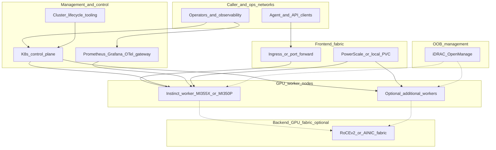
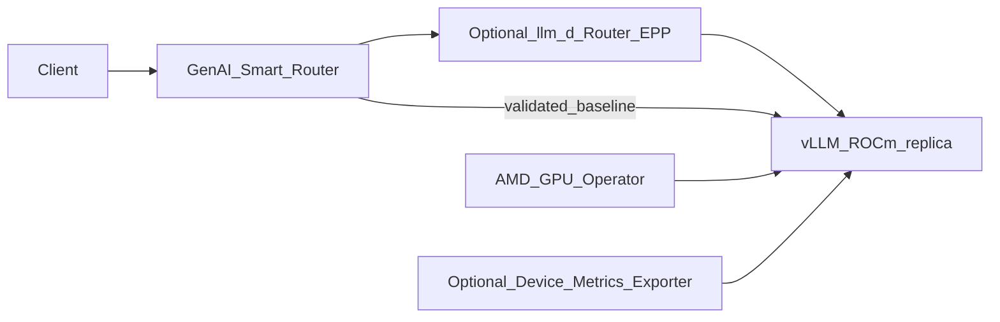
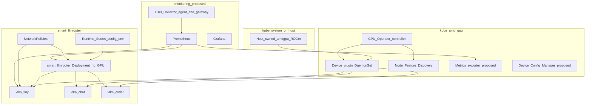
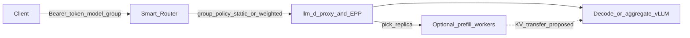
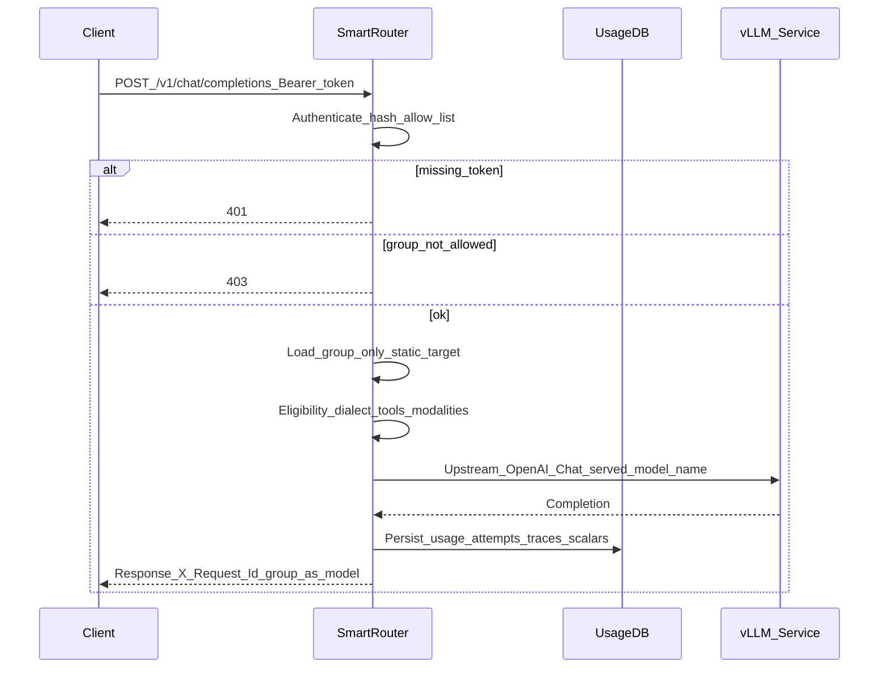
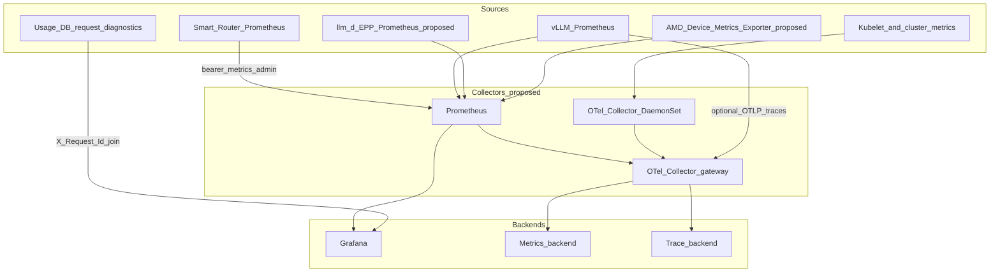

# AMD Instinct Local Serving Reference Architecture

**Status:** Internal operator reference  
**Date:** 2026-09-02  
**Primary evidence:** Merged [PR #954](https://github.com/metrum-ai/router/pull/954) (`2cf5a319`), issue #952  
**Companion runbook:** [K3S_AMD_INSTINCT_LOCAL_SERVING_E2E.md](K3S_AMD_INSTINCT_LOCAL_SERVING_E2E.md)  
**Overlay:** [deploy/kubernetes/overlays/k3s-amd-instinct-local-serving/](../deploy/kubernetes/overlays/k3s-amd-instinct-local-serving/)

This document is a detailed, renderable architecture for Metrum AI Router in
front of local AMD Instinct serving (vLLM/ROCm today; optional llm-d scale-out as
a proposed target). It is aligned with publicly shared AMD and Dell AI Platform
topologies, but **every claim is labeled by evidence status**. No AMD or Dell
primary source names Metrum AI Router. Placing Metrum AI Router as the
governed northbound OpenAI-compatible proxy is this repository’s proposed
integration, not a vendor-mandated RA requirement.

Do not put caller tokens, provider keys, token hashes, licenses, full
configs, private hostnames, or SSH details in tickets, PRs, or diagrams.

---

## 1. Evidence legend

| Status | Meaning |
|---|---|
| **Validated (PR #954)** | Exercised or recorded as safe scalars in the merged AMD k3s overlay/runbook path. |
| **Repo-supported** | Implemented in Metrum AI Router / packaging in this repository, but **not** proven by the AMD #954 live matrix. |
| **Public reference** | Stated by AMD or Dell primary sources (or closely related project docs such as llm-d / vLLM / OpenTelemetry). Cite the source. |
| **Proposed** | Target-state design that fits those references and this product. **Not** claimed as validated. |

### 1.1 Evidence-status matrix

| Component / claim | Status | Notes |
|---|---|---|
| On-prem k3s + Metrum AI Router Helm | Validated (PR #954) | Manual overlay; NVIDIA blueprint used only as config/chart factory. License-wrapper install path removed in 3.0.0 — no longer a validated claim. |
| Instinct MI355X × 8, allocatable `amd.com/gpu=8` | Validated (PR #954) | Safe-scalar live note in the AMD E2E runbook |
| AMD GPU Operator `v1.5.1`, device-plugin mode, host-owned driver | Validated (PR #954) | `driver.enable: false`; DRA disabled |
| Metrics exporter / test runner / DCM / remediation | Proposed | Explicitly **disabled** in checked-in `gpu-operator-values.yaml` |
| Three one-GPU vLLM/ROCm Services (`local-tiny` / `local-small-chat` / `local-small-coder`) | Validated (PR #954) | Image `vllm/vllm-openai-rocm:v0.25.0`, `--max-model-len 8192` |
| Static model-group routing, Chat non-stream on three groups | Validated (PR #954) | Stream validated on `local-tiny` |
| Auth negatives (`401` / `403`), `/readyz` 200 | Validated (PR #954) | |
| NetworkPolicy manifests | Validated (PR #954) as manifests | Enforcement is **CNI-dependent** (proposed operational caveat) |
| Custom `nodeSelector` `accelerator=amd` / `vendor=amd` | Validated (PR #954) as YAML | Labels are deployment-owned, not guaranteed by NFD alone |
| Codex CLI / OpenAI Responses / Anthropic Messages / tools / images | Repo-supported product surfaces | **Not** validated on this AMD matrix; Codex deferred in runbook |
| Weighted / failover / dynamic_score / script / external strategies | Repo-supported | AMD overlay uses **static** only |
| `/metrics` families and metrics-admin isolation | Repo-supported | Not exercised as an AMD live gate in #954 |
| MI350P 144 GB HBM3E PCIe (4 TB/s) | Public reference | AMD product page; Dell announced XE7745/R7725 support |
| MI350X / MI355X 288 GB HBM3E, 8 TB/s, CDNA 4 | Public reference | AMD Instinct MI350 series materials |
| Dell XE9785 / XE9785L with 8× MI355X OAM | Public reference | Dell shop / AI Platform with AMD GPUs |
| Dell management plane, frontend/backend/OOB fabrics, PowerScale | Public reference | Dell AI Platform design principles |
| llm-d Router/EPP + InferencePool + ROCm vLLM | Proposed | Out of scope for #954; NVIDIA llm-d compat is a separate path |
| OpenTelemetry Collector ingest of Prometheus + OTLP | Proposed | Metrum AI Router has **no** native OTLP exporter today |
| End-to-end `traceparent` through Metrum AI Router | Proposed gap | Correlate via `X-Request-Id` + usage diagnostics |

### 1.2 Version scopes (do not conflate)

| Scope | Pins / versions |
|---|---|
| **PR #954 reproducible baseline** | AMD GPU Operator `v1.5.1`; `vllm/vllm-openai-rocm:v0.25.0`; k3s live note `v1.36.3+k3s1`; three Qwen text models above |
| **Public reference (retrieved 2026-09-02)** | Operator docs list MI350P/X/MI355X; ROCm ecosystem docs also document newer vLLM/ROCm combinations; Dell InfoHub snippets cite cluster stacks such as Ubuntu 24.04 and Automation Platform 2.0 |
| **Proposed scale-out** | Upstream llm-d ROCm image tags and GAIE CRD versions chosen at install time; not pinned by #954 |

Newer public versions are **reference inputs**, not silent replacements for the
validated baseline.

---

## 2. Scope and non-goals

### In scope

- Enterprise self-hosted / on-prem pattern: Metrum AI Router as the governed API edge.
- AMD Instinct workers under Kubernetes (validated single-node k3s; multi-node as proposed).
- Dell-aligned physical modularity: management vs GPU workers, traffic separation, storage options.
- Routing policies, agentic workload contracts, metrics, and observability design.
- Clear boundary between validated vLLM static serving and proposed llm-d replica selection.

### Out of scope / non-goals

- Metrum EKS production cutover or Compose production.
- Shadeform NVIDIA SKUs as the AMD conformance matrix.
- Claiming Metrum AI Router schedules GPUs, owns ROCm drivers, or performs KV-aware replica pick.
- Claiming Codex, tools, vision, or llm-d as AMD-validated without new evidence.
- Publishing private hostnames, SSH, tokens, or full production configs.

---

## 3. Hardware profiles (public reference + validated)

### 3.1 AMD Instinct SKUs

| SKU | Form | Memory / bandwidth (AMD) | Typical role |
|---|---|---|---|
| **MI350P** | Dual-slot **PCIe** | **144 GB** HBM3E, up to **4 TB/s**, CDNA 4 | Air-cooled enterprise inference / RAG |
| **MI350X** | **OAM** on 8-GPU UBB platforms | **288 GB** HBM3E, **8 TB/s** | Large platform training/inference |
| **MI355X** | **OAM** | **288 GB** HBM3E, **8 TB/s** (higher TBP / denser platforms) | High-end 8-GPU nodes |

Sources: AMD Instinct MI350 Series product pages and CDNA 4 materials (retrieved
2026-09-02). Do not treat MI350P as identical to MI350X/MI355X.

### 3.2 Dell mapping

| Dell platform | Accelerator in public Dell/AMD material | Notes |
|---|---|---|
| PowerEdge **XE9785** (air) / **XE9785L** (DLC) | **8× MI355X** 288 GB OAM + Infinity Fabric | Dell AI Platform with AMD GPUs RA compute class |
| PowerEdge **XE7745** / **R7725** | **MI350P** PCIe announced for air-cooled on-prem (Dell blogs May 2026; support window cited from July 2026) | Shop pages may still show generic PCIe GPU options; treat orderable MI350P configs as operator-verified |
| Older XE9680 + MI300X materials | Prior generation | Useful historical patterns; not the MI350 RA |

Validated live evidence in this repository is **MI355X × 8** on a single k3s
node (PR #954 runbook safe scalars). That is a single-node conformance sample,
not a full Dell rack BOM validation.

### 3.3 Power, cooling, and failure domains (public + design)

- MI355X OAM platforms are high-TBP liquid- or high-capacity air-cooled systems
  (Dell XE9785 vs XE9785L). Treat power and CDU failure as node-level domains.
- MI350P PCIe cards communicate GPU-to-GPU over the host PCIe fabric, not an
  8-GPU UBB Infinity Fabric mesh. Multi-GPU tensor parallel on MI350P is a
  different engineering problem than on MI355X OAM.
- Inference-only Dell designs may omit a dedicated backend GPU fabric; training
  and multi-node collective communication typically require it (Dell design
  principles: backend optional for inference-only).

---

## 4. Dell-aligned physical and network topology

Dell’s published AI Platform with AMD GPUs separates management, frontend
(north-south / storage / in-band ops), optional backend GPU fabric (east-west),
and OOB management. The diagram below is **aligned with that modularity**;
component counts are illustrative. Label: **Public reference + Proposed
integration**.



**Does**

- Keep control-plane and GPU workers separable.
- Carry monitoring and API traffic on the frontend/in-band path.
- Treat backend fabric as optional for single-node inference.

**Does not**

- Require DriveNets/AINIC for the PR #954 single-node baseline.
- Claim Dell Automation Platform or Omnia as the only cluster installer for this
  repository’s overlay (k3s was the validated path).

---

## 5. Kubernetes control plane and data plane

### 5.1 Layer boundary (repo convention)



| Layer | Owns | Does not own |
|---|---|---|
| Metrum AI Router | Auth, allow lists, model-group policy, request-shape eligibility, usage, `/metrics` isolation | GPU scheduling, ROCm drivers, replica KV pick |
| Optional llm-d | InferencePool discovery, EPP Filter→Score→Pick, optional P/D, pool autoscaling signals | Caller tokens, enterprise model-group contracts |
| vLLM/ROCm | Model weights, batching, KV cache inside the engine, `/v1` and `/metrics` | Caller governance |
| AMD GPU Operator | Device plugin / optional DRA, labels, optional exporter/test runner/DCM | HTTP inference |

### 5.2 Namespaces and components



### 5.3 AMD GPU Operator choices (validated vs proposed)

Checked-in values
([gpu-operator-values.yaml](../deploy/kubernetes/overlays/k3s-amd-instinct-local-serving/gpu-operator-values.yaml)):

| Setting | PR #954 value | Rationale |
|---|---|---|
| Chart / version | `rocm/gpu-operator-charts` `v1.5.1` | Validated |
| `driver.enable` | `false` | Host image owns amdgpu/ROCm |
| `devicePlugin.enableDevicePlugin` | `true` | Advertises `amd.com/gpu` |
| `draDriver.enable` | `false` | Never enable DRA and device plugin together |
| `metricsExporter.enable` | `false` | Proposed enablement later |
| `testRunner.enable` | `false` | Proposed |
| `configManager.enable` | `false` | DCM partitioning proposed only when profiles are defined |
| `remediationWorkflow.enable` | `false` | Proposed |

AMD Operator docs (public reference) support MI355X, MI350X, and MI350P on the
stated OS/K8s matrices. Device Metrics Exporter integration with Prometheus
ServiceMonitor is documented separately; enabling it is **Proposed** relative to
#954.

---

## 6. Serving modes

### 6.1 Mode A — Validated baseline (PR #954)

Three Deployments/Services, each requesting `amd.com/gpu: "1"`, image
`vllm/vllm-openai-rocm:v0.25.0`, `/dev/shm` emptyDir, HTTP `/health` probes.

| Router group | Service DNS | Weights | GPU |
|---|---|---|---|
| `local-tiny` | `http://vllm-tiny.smart-llmrouter.svc.cluster.local:8000/v1` | `Qwen/Qwen3-1.7B` | 1 |
| `local-small-chat` | `http://vllm-chat.smart-llmrouter.svc.cluster.local:8000/v1` | `Qwen/Qwen3.5-4B` | 1 |
| `local-small-coder` | `http://vllm-coder.smart-llmrouter.svc.cluster.local:8000/v1` | `Qwen/Qwen3-8B` | 1 |

Metrum AI Router `config.yaml` (generated via NVIDIA local-serving blueprint as a
**factory only**) uses `strategy: static` and in-cluster `*.svc.cluster.local`
provider URLs. The router Pod must not request `amd.com/gpu`.

**Operational caveats (validated as caveats):**

1. Default `kubectl apply -k` deploys **all three** GPU workloads; Milestone-1
   one-GPU nodes should apply only `vllm-tiny`.
2. NetworkPolicy enforcement depends on CNI (Flannel often does not enforce).
3. `nodeSelector` `accelerator=amd` / `vendor=amd` must exist on the node.
4. Serving pods may need HTTPS egress while downloading Hugging Face weights;
   remove that rule once weights are local.
5. KV cache products (LMCache / Mooncake) and llm-d are **out of scope** for this
   baseline.

### 6.2 Mode B — Proposed llm-d scale-out

When a pool needs KV-aware load balancing, flow control, or prefill/decode
disaggregation, add llm-d **behind** Metrum AI Router:

| Responsibility | Owner |
|---|---|
| Caller auth, allow list, model-group contract, enterprise policy | Metrum AI Router |
| Select OpenAI-compatible pool URL for the group | Metrum AI Router (static or weighted to `llm-d-…` Service) |
| Replica Filter → Score → Pick, queue depth, optional P/D | llm-d EPP |
| Execute model on Instinct | vLLM ROCm (or SGLang where separately validated) |

Do **not** run two competing “semantic routers” that both rewrite model identity
for the same hop. Metrum AI Router exposes **deployment-defined group names** to
callers; llm-d sees the served model ID inside its InferencePool.

NVIDIA llm-d compatibility evidence in this repository is a separate profile
(`nvidia-llmd-compat`). AMD llm-d remains **Proposed** until an Instinct matrix
passes.



---

## 7. Metrum AI Router routing policies and agentic workloads

### 7.1 Request path (validated baseline)



Validated behaviors: Chat completions, streaming on `local-tiny`, `/v1/models`
catalog limited to allowed local groups, static not content-based routing.

### 7.2 Policy stack (repo-supported; mostly unproven on AMD)

Order of enforcement (product behavior):

1. Authenticate caller.
2. Allow-list the requested **model group**.
3. Load only that group’s targets.
4. Apply dialect / tool / modality / structured-output / reasoning / output-cap
   eligibility and optional `request_shape_support` gates.
5. Apply optional group `contract` quality floors.
6. Run strategy: `static` | `weighted` | `failover` | `dynamic_score` | `script` |
   `external`.
7. Attempt upstreams with timeouts, traffic shaping, adaptive backoff, fallbacks.
8. Persist sanitized diagnostics; emit Prometheus series for metrics-admin.

AMD #954 uses **static** only. Promoting a group for agents requires the usual
request-shape gates (Chat, Responses, Messages, tools, large payloads) with
direct + router evidence — see [SMOKE_TEST_MATRIX.md](SMOKE_TEST_MATRIX.md) and
[MODEL_GROUP_CONTRACTS.md](MODEL_GROUP_CONTRACTS.md).

### 7.3 Agentic workload contracts

| Workload | Minimum proof before claiming | AMD #954 |
|---|---|---|
| Simple Chat / SDK | Non-stream + stream Chat | Validated (stream on tiny) |
| Coding agent OpenAI Chat tools | Tool-shaped SSE / finish_reason | Not validated |
| Codex CLI | Responses wire + `/v1` base URL | Not required for API M1 |
| Claude Code | Anthropic Messages + tools | Not validated |
| Vision / mixed image+tools | Direct + router image smokes, realistic max tokens | Not validated |
| Large IDE payloads | Byte / tool-schema buckets | Not validated |

Group names remain deployment-defined (`local-*` here). Do not treat reference
names such as `default` / `fast` / `big-coder` as product constants.

---

## 8. Security, NetworkPolicy, and secrets

### Secrets (validated workflow)

| Secret | Consumer | Purpose |
|---|---|---|
| Router caller token | Clients | Downstream auth; SHA-256 stored in `callers[]` |
| `LOCAL_VLLM_API_KEY` | Router → vLLM | Upstream placeholder; overlay vLLM may not require `--api-key` |
| Runtime Secret | Router Pod | `config.yaml`, `env.json` (leftover `license.json` mounts are unused in 3.0.0) |

### NetworkPolicy (manifests validated; enforcement CNI-dependent)

- Serving: ingress only from pods labeled `app.kubernetes.io/name: smart-llmrouter`
  on TCP 8000; egress DNS + temporary HTTPS for weight download.
- Router: egress DNS + TCP 8000 to `app.kubernetes.io/component: local-serving`.

Test deny/allow before treating policies as a hard boundary.

### Metrics isolation (repo-supported)

`/metrics` is global operational telemetry. Only subjects with
`metrics_admin: true` (or equivalent Casbin metrics read) may scrape. Ordinary
callers receive `403 metrics-forbidden`. Do **not** expose `/metrics` without
auth to the cluster, and do **not** feed caller/`token_id` labeled series into
unauthenticated HPA adapters.

---

## 9. Observability: metrics, logs, traces, OpenTelemetry

### 9.1 Signal map



### 9.2 Metrum AI Router Prometheus families (repo-supported)

From [internal/router/metrics.go](../internal/router/metrics.go):

| Family | Use |
|---|---|
| `smart_llmrouter_requests_total` / `_errors_total` | Demand and error rate |
| `smart_llmrouter_input_tokens_total` / `_output_tokens_total` / `_tokens_total` | Token volume |
| `smart_llmrouter_latency_ms_sum` | Latency sums (derive averages with care) |
| `smart_llmrouter_cache_hits_total` / `_misses_total` / `_bypass_total` | Cache behavior |
| `smart_llmrouter_upstream_attempts_total` / `_fallbacks_total` | Reliability / failover pressure |
| `smart_llmrouter_*_output_tokens_per_second_*` | Upstream vs downstream throughput |
| `smart_llmrouter_cache_entries` / `_bytes` / `_max_bytes` / `_occupancy_ratio` | Cache gauges |
| `smart_llmrouter_build_info` | Release identity |
| `smart_llmrouter_traffic_shape_queue_depth` | Shaping saturation |
| `smart_llmrouter_migration_*` | Migration ledger health |

Common labels include `caller_id`, `caller_user`, `caller_project`,
`caller_environment`, `token_id`, `model_group`, `target_provider`,
`target_model`, `status`. Treat `token_id` as sensitive operational metadata:
scrape only with metrics-admin credentials; prefer recording rules that drop
identity labels before wide sharing.

Join key for request forensics: **`X-Request-Id`** → `request_usage`,
`request_attempts`, `request_trace_events`, `request_errors` (relational scalars,
not OTLP spans).

### 9.3 Serving and GPU metrics (public / proposed)

| Source | Example signals | Status |
|---|---|---|
| vLLM `/metrics` | `vllm:num_requests_running`, `vllm:num_requests_waiting`, `vllm:kv_cache_usage_perc`, token counters, latency histograms | Public vLLM; enable ServiceMonitor as Proposed |
| llm-d EPP | Queue depth, scheduler latency, request totals | Proposed with llm-d |
| AMD Device Metrics Exporter | GPU temperature, power, ECC, utilization (Prometheus) | Public AMD; disabled in #954 values |
| Kubernetes | Pod CPU/memory, GPU allocatable/capacity, node conditions | Public |

**Autoscaling:** Prefer vLLM waiting-queue / KV utilization or llm-d EPP flow-control
metrics for HPA/KEDA. Do not scale from Metrum AI Router `/metrics` series that carry
caller or token identity.

### 9.4 OpenTelemetry reality check

| Capability | Status |
|---|---|
| OTel Collector scrape Prometheus and export OTLP/remote_write | Proposed pattern (OTel docs) |
| vLLM `--otlp-traces-endpoint` / detailed traces | Public vLLM; optional overhead |
| Metrum AI Router native OTLP spans / `traceparent` propagation | **Not implemented** (repo search empty) |
| Correlate Router ↔ upstream with one distributed trace ID | Proposed gap; use `X-Request-Id` today |

Authenticated scrape sketch (secrets via mounted file; do not commit tokens):

```yaml
# Proposed Collector fragment — not part of PR #954 overlay
receivers:
  prometheus:
    config:
      scrape_configs:
        - job_name: smart-llmrouter
          metrics_path: /metrics
          scheme: http
          authorization:
            type: Bearer
            credentials_file: /var/run/secrets/metrics-admin/token
          static_configs:
            - targets: ["smart-llmrouter.smart-llmrouter.svc:80"]
        - job_name: vllm-local
          metrics_path: /metrics
          static_configs:
            - targets:
                - "vllm-tiny.smart-llmrouter.svc:8000"
                - "vllm-chat.smart-llmrouter.svc:8000"
                - "vllm-coder.smart-llmrouter.svc:8000"
```

### 9.5 SLO and alert categories (proposed thresholds; tune per workload)

| Category | Example condition |
|---|---|
| Availability | `/readyz` failing; elevated 5xx |
| Auth / abuse | Spike in 401/403; security access events |
| Latency | Downstream p95 above group contract |
| Saturation | vLLM `num_requests_waiting` > 0 sustained; KV cache > 0.9 |
| Reliability | Fallback rate above baseline; upstream 429/5xx |
| GPU health | Exporter thresholds / NPD when exporter enabled |
| License | Grace / invalid / expiry gauges |
| Metrics pipeline | Scrape failures for metrics-admin job |

---

## 10. Sizing, HA, and capacity notes

| Topic | Guidance | Status |
|---|---|---|
| Single-node M1 | ≥1 allocatable `amd.com/gpu`; deploy only tiny | Validated pattern |
| Three-group matrix | ≥3 GPUs; one GPU per Deployment | Validated target |
| Remaining GPUs on 8× MI355X | Leave idle, add staging groups, or propose TP/llm-d pools | Design choice |
| Metrum AI Router replicas | SQLite usage → single writer / Recreate; Postgres for multi-replica | Repo-supported |
| Image pull | ROCm vLLM image is large; long startupFailure thresholds intentional | Validated |
| Model cache | Prefer PVC/local cache after first download; tighten NetworkPolicy | Proposed hardening |

---

## 11. Rollout, promotion, and rollback

1. Offline: `make test-k8s-amd-instinct-local-serving`, secret-check, docs QA as
   needed.
2. Install AMD GPU Operator with checked-in values; confirm allocatable
   `amd.com/gpu` and node labels.
3. Deploy serving (tiny-only or full matrix); direct `/v1/models` + Chat smokes.
4. Install Metrum AI Router with the checked-in Helm chart / overlay; assert **no**
   GPU request on the router Pod.
5. Router smokes: `/readyz`, `/v1/models`, Chat, stream, 401/403.
6. Optional promotion: enable metrics exporter, OTel collectors, llm-d, agent
   dialects — each with its own evidence.
7. Rollback: Helm uninstall router; delete overlay; restore previous device
   plugin if needed; keep host ROCm intact when operator driver is disabled.

---

## 12. Validation matrix

| Surface | Direct upstream | Through Metrum AI Router | AMD #954 |
|---|---|---|---|
| `/readyz` | n/a | Required | Validated |
| `/v1/models` allow list | Served IDs | Group names only | Validated |
| Chat non-stream | Required | Required | Validated (3 groups) |
| Chat stream | Recommended | Required for claim | Validated (`local-tiny`) |
| 401 / 403 | n/a | Required | Validated |
| `/metrics` 403 ordinary / 200 metrics-admin | n/a | Repo-supported | Not AMD-gated |
| OpenAI tools | Required before claim | Required | Not validated |
| Responses / Codex | Required before claim | Required | Not validated |
| Anthropic Messages | Required before claim | Required | Not validated |
| Image / VLM | Required (≥512 token budgets for OCR acceptance) | Required | Not validated |
| Large coding-agent payload | Required before broad coding groups | Required | Not validated |
| llm-d pool | Required | Required | Proposed |
| GPU exporter / OTel | Optional | Optional | Proposed |

---

## 13. Repository map

| Path | Role |
|---|---|
| `deploy/kubernetes/overlays/k3s-amd-instinct-local-serving/` | Manual AMD overlay |
| `docs/K3S_AMD_INSTINCT_LOCAL_SERVING_E2E.md` | Operator install/usage runbook |
| `docs/amd-instinct-local-serving-reference-architecture.md` | This architecture |
| `docs/SELF_HOSTED_UPSTREAMS.md` | Provider catalog pattern for private `/v1` |
| `docs/SHADEFORM_NVIDIA_LOCAL_SERVING_E2E.md` | NVIDIA analog |
| `docs/SHADEFORM_NVIDIA_LLMD_COMPAT_E2E.md` | llm-d analog (NVIDIA); AMD non-goal there |
| `docs-site/docs/installation/kubernetes.md` | Public pointer to AMD overlay |
| `scripts/test_k8s_amd_instinct_local_serving.sh` | Offline gate |

There is **no** `amd-instinct-local-serving` blueprint profile in
`metrum-ai-routerctl` yet. Do not invent one without a dedicated CLI
change.

---

## 14. Bibliography (retrieved 2026-09-02)

Label each use as **Public reference** unless independently re-measured.

### AMD

- [AMD GPU Operator](https://instinct.docs.amd.com/projects/gpu-operator/en/latest/) (v1.5.1 hardware matrix includes MI355X / MI350X / MI350P)
- [Device Config Manager](https://instinct.docs.amd.com/projects/gpu-operator/en/latest/dcm/device-config-manager.html)
- [Device Metrics Exporter](https://instinct.docs.amd.com/projects/device-metrics-exporter/en/latest/)
- [Kubernetes Reference Architectures for AMD AI Infrastructure](https://instinct.docs.amd.com/projects/advanced-micro-devices-k8s-reference-arch/en/latest/index.html)
- [AMD Instinct MI350 Series](https://www.amd.com/en/products/accelerators/instinct/mi350.html), [MI350X](https://www.amd.com/en/products/accelerators/instinct/mi350/mi350x.html), [MI355X](https://www.amd.com/en/products/accelerators/instinct/mi350/mi355x.html), [MI350P](https://www.amd.com/en/products/accelerators/instinct/mi350/mi350p.html)
- [ROCm vLLM optimization](https://rocm.docs.amd.com/projects/ai-ecosystem/en/latest/optimization/vllm-v1-optimization.html)
- [AMD Enterprise AI on-prem install](https://enterprise-ai.docs.amd.com/en/latest/platform-infrastructure/on-premises-installation.html)

### Dell

- [Dell AI Platform with AMD GPUs — reference architecture](https://infohub.delltechnologies.com/en-us/l/dell-ai-platform-with-amd-gpus/reference-architecture-170/)
- [System configuration](https://infohub.delltechnologies.com/en-us/l/dell-ai-platform-with-amd-gpus/system-configuration-145/)
- [Design principles](https://infohub.delltechnologies.com/en-us/l/dell-ai-platform-with-amd-gpus/design-principles-35/)
- [Networking / traffic types](https://infohub.delltechnologies.com/en-us/l/dell-ai-platform-with-amd-gpus/traffic-types-9/)
- [PowerEdge XE9785 overview](https://www.dell.com/en-us/shop/ipovw/poweredge-xe9785)
- Dell blogs on MI350P for XE7745/R7725 (May 2026 announcements)

### llm-d / vLLM / OpenTelemetry

- [llm-d architecture](https://llm-d.ai/docs/dev/architecture)
- [llm-d observability / metrics](https://llm-d.ai/docs/dev/operations/observability/metrics)
- [vLLM metrics / OTLP](https://docs.vllm.ai/en/latest/design/metrics/)
- [vLLM Kubernetes](https://docs.vllm.ai/en/stable/deployment/k8s/)
- [OpenTelemetry Collector on Kubernetes](https://opentelemetry.io/docs/platforms/kubernetes/getting-started/)
- [Prometheus receiver](https://opentelemetry.io/docs/platforms/kubernetes/collector/components/)

### This repository

- PR #954 merge commit `2cf5a319`
- Issue #952 (AMD k3s E2E tracking)
- [docs-site observability](../docs-site/docs/operations/observability.md)

---

## 15. Document maintenance

When behavior, pins, or evidence change:

1. Update the evidence matrix first.
2. Keep PR #954 pins and newer public versions in separate rows.
3. Re-run `make test-k8s-amd-instinct-local-serving` after overlay edits.
4. Cross-check `docs/K3S_AMD_INSTINCT_LOCAL_SERVING_E2E.md` and public
   `docs-site/docs/installation/kubernetes.md` for drift.
5. Never claim OTel end-to-end tracing through Metrum AI Router until the code
   emits and propagates it.
