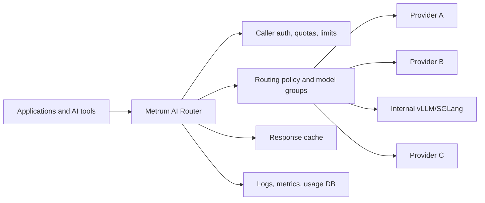
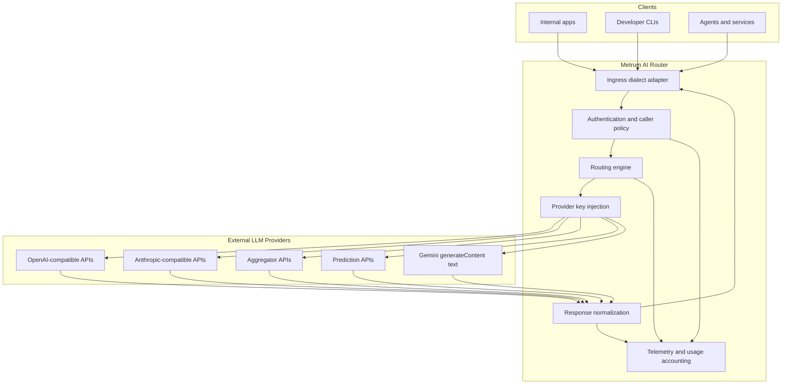
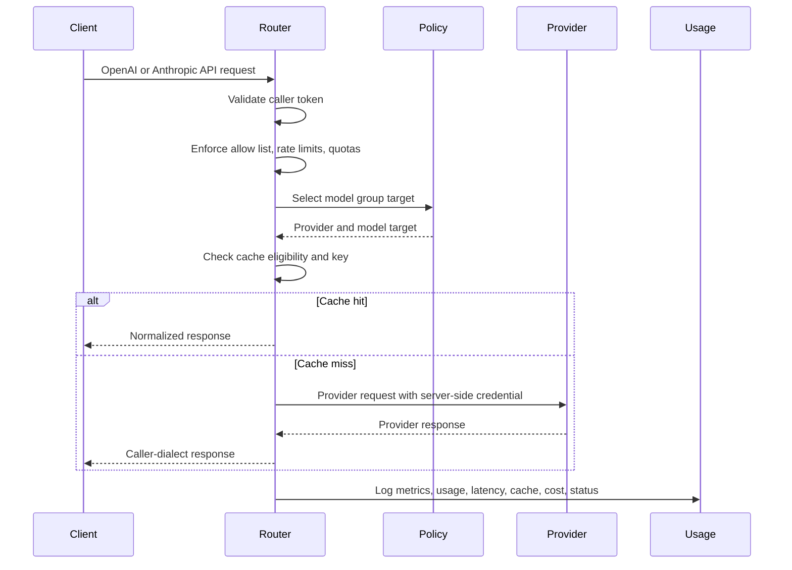
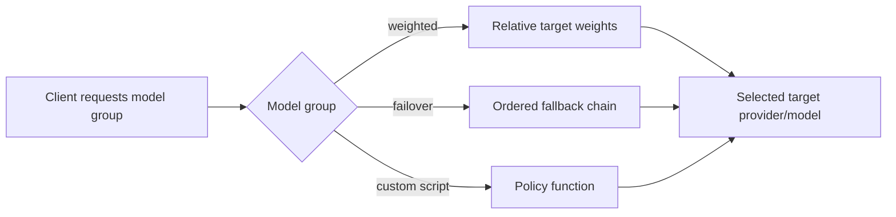
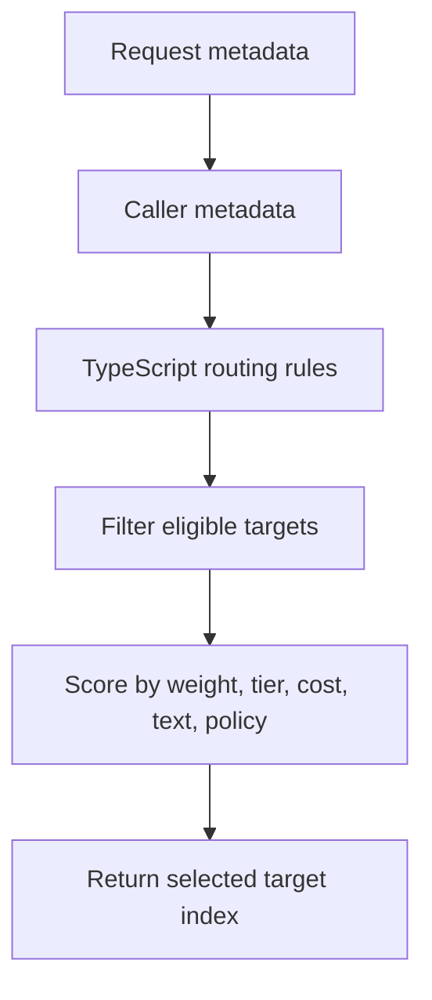
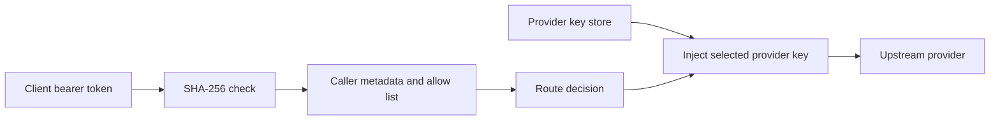
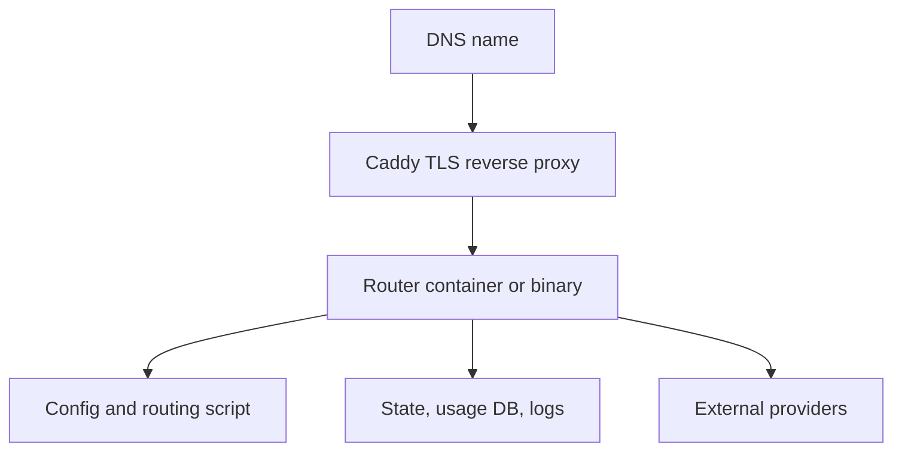

# Metrum AI Router Solution Brief

Agent workloads make dozens of upstream model calls per user task. Paying
frontier list price on every call is the default when applications hard-code
one premium model. Token spend then shows up on the invoice after the monthly
budget is already gone. EY describes token costs as a visible signal of
changing agentic AI economics and argues that leaders need Agent FinOps
discipline to manage total cost, value, and risk. See EY,
["Unlocking agentic value: a new investment discipline for the agentic era"](https://www.ey.com/en_us/insights/ai/agentic-ai-token-costs),
June 1, 2026.

One deterministic Harbor run on the reference `big-coder` group used 48,470
Harbor input tokens through Codex CLI for a single
`aider/polyglot_python_two-bucket` task. That is one agent, one task, one
group. Concurrent agents multiply that pattern into monthly spend.
([harbor-case-study.md](harbor-case-study.md), June 29, 2026 Codex
`big-coder` row: Harbor input 48,470; Harbor cache 31,744; Harbor output
2,598.)

Metrum AI Router is a provider-neutral, self-managed LLM gateway and governance
layer. It selects an upstream model per request from a deployment-owned policy,
then records why. Teams expose one controlled API endpoint to applications and
developer tools while routing across multiple upstream providers using policy,
cost, availability, observed performance, caller identity, and workload-specific
rules. Applications integrate once. Operators keep provider keys and routing
policy server-side. Platform teams get consistent authentication, quotas, cache
behavior, audit logs, metrics, and usage reports across heterogeneous LLM
backends.

## Executive Summary

Platform teams that run agents need more than one model provider. Different
models fit coding, summarization, extraction, low-latency chat, or
high-reasoning work. Provider availability, pricing, rate limits, and
entitlements change. Hard-coding provider endpoints into each application pins
throughput to one upstream limit and makes migration expensive. An agent coding
task that burns 48,470 Harbor input tokens on one `big-coder` run still needs a
cheaper eligible target when quality evidence allows it. Without a group
contract, every call stays on the premium default and the invoice arrives
after the budget is spent
([harbor-case-study.md](harbor-case-study.md)).

Mental model for the first screen of every request: a model group is a quality
and cost contract callers request by name; routing picks the cheapest candidate
that has evidence of meeting that contract; contract validation evidence
expires through optional `contract.quality_floor.max_eval_age_days` so stale
`validated_at` values remove a target from eligibility; Learned Routing Policy
can abstain under calibrated uncertainty when `uncertainty_abstention` is
enabled, then fall back to `abstention_anchor` or the first fallback; allow
lists, rate limits, quotas, and lifetime token budgets run before any upstream
provider call.

```yaml
models:
  support-chat:
    strategy: weighted
    contract:
      quality_floor:
        require_tags: [validated]
        min_eval_quality_score: 0.90
        min_eval_pass_rate: 0.95
        max_eval_age_days: 30
        allowed_validation_status: [passed]
```

Metrum AI Router centralizes that complexity behind one internal API surface.
Clients can speak OpenAI-style or Anthropic-style APIs. The router authenticates
the caller, selects an allowed model group, chooses an upstream target, injects
the provider credential, normalizes responses, records usage, and returns the
response in the caller's expected dialect.

Quality decisions should be evidence-first. For router-versus-fixed-model
complaints or buyer evaluations, use
[Evaluation Evidence Playbook](EVALUATION_EVIDENCE_PLAYBOOK.md) to compare a
routed group, fixed model, or previous policy with workload, client, tools,
versions, token caps, and scoring held constant.

## Learned Routing Policy

Static weights and fixed premium defaults leave spend on the table when a
cheaper eligible target would meet the quality floor. Selectors without a
measured floor or abstention send uncertain traffic to the wrong target.
Learned Routing Policy (LRP) is an optional `strategy: external` service. It
predicts per-target quality and output tokens with LightGBM and isotonic
calibration, then selects the cheapest eligible target above an operator
quality floor. The router still authenticates the caller and filters request
shape before LRP sees targets. Operator runbook:
[LEARNED_ROUTING_POLICY.md](LEARNED_ROUTING_POLICY.md). Public pages: hosted
`/docs/routing/learned-routing-policy`.

### Synthetic worked example

Figures below are synthetic repository artifacts from seed 42 and 800
generated requests (train 569, valid 118, test 113). They demonstrate wiring
and promotion-gate behavior. They do not authorize live promotion.

**Synthetic holdout: anchor vs routed (n=113)**

| Policy | Cost (USD) | Quality mean | Floor violation rate | Abstention rate | n |
|---|---|---|---|---|---|
| always_anchor | 0.151829 | 1.0 | 0.0 | not measured | 113 |
| lrp | 0.1507895 | 1.0 | 0.0 | not measured | 113 |
| always_cheapest | 0.0151829 | 0.48672566371681414 | 0.5132743362831859 | not measured | 113 |

Arithmetic on the holdout: LRP cost / always_anchor cost = 0.1507895 /
0.151829 ≈ 0.99315. Quality means match at 1.0. Floor violations stay at 0.0
for both. `promotable` is false because gates `cost_vs_anchor` and
`real_data_and_embedding` failed. The gates blocked promotion as designed for
synthetic embeddings and mock outcomes
([evidence/learned-routing-policy/public-training.json](evidence/learned-routing-policy/public-training.json)).
A live promotion still needs real embeddings and real outcomes; this artifact
stays non-promotable until those gates pass.

Promotion uses `external_policy.mode`: `baseline` (no policy call), `shadow`
(record recommendation, serve first eligible), `enforce` (serve
recommendation). Rollback is `mode: baseline` or restoring prior config.
Feedback posts status, usage, cost, and latency. Quality labels arrive
offline from sandboxed verifiers or separate LLM/human judging.

Synthetic demos (`make lrp-synthetic-demo`) do not authorize live promotion.



## Buyer Value

Organizations that need multiple LLM providers still have to keep credentials
off client machines, avoid rewriting every application, and retain cost and
usage visibility. Metrum AI Router is the control point for that combination.

1. A coding caller with `allow: [default, fast, small, medium, high, big-coder]`
   and `rate: { rpm: 120, tpm: 200000, concurrent: 8 }` (see Configuration
   Overview below) can use agent CLIs against stable group names while provider
   keys stay server-side. A disallowed group returns `403 model-not-allowed`
   before any upstream credential is used.

Technical buyers typically evaluate it for:

- **Provider optionality:** adopt new models or aggregators centrally while applications keep using stable internal model names.
- **Enterprise model control:** route to internally hosted vLLM or SGLang services through OpenAI-compatible upstream APIs while callers keep using router model groups.
- **Cost control:** steer routine traffic to lower-cost targets, reserve premium models for approved keys or workloads, and report usage by person, project, provider, and model.
- **Capacity pooling:** distribute compatible traffic across separately rate-limited upstream providers, accounts, models, and private endpoints while preserving caller-side limits.
- **Security:** keep upstream provider keys server-side, authenticate callers with revocable router tokens, and restrict each token to approved model groups.
- **Reliability:** use weighted routing, ordered fallback, and provider abstraction to reduce blast radius from model outages or entitlement changes.
- **Developer productivity:** support Codex CLI, Claude Code CLI, OpenAI-compatible clients, and Anthropic-compatible clients through one managed endpoint.
- **Operational visibility:** expose request logs, metrics, per-request throughput, cache effectiveness, latency, and hourly/daily usage reports.

## Cost Governance Context

Agentic workflows turn one user action into planning, retrieval, tool calls,
retries, subagents, and many model invocations. Variable inference spend
replaces predictable license line items. The opening section cites EY's June 1,
2026 Agent FinOps framing and the Harbor `big-coder` 48,470-input-token Codex
example for that pressure.

1. Illustrative arithmetic: if 20 concurrent agents each repeat a 48,470-input
   Harbor-scale task once per day, daily Harbor-scale input demand is
   20 × 48,470 = 969,400 tokens before retries or tool loops. Budgets that
   count only after completion miss concurrent overshoot. Source numbers:
   [harbor-case-study.md](harbor-case-study.md); multiplier labeled
   illustrative.

Metrum AI Router addresses the controllable layer of that problem:

- Route routine traffic toward lower-cost model groups while reserving premium routes for approved users, projects, or workloads.
- Apply per-caller allow lists, rate limits, quotas, and lifetime token budgets before any upstream provider call is made.
- Use weighted routing and fallback to balance cost, latency, quality, provider availability, and separately rate-limited upstream capacity without client changes.
- Cache eligible deterministic responses so repeated requests do not create repeated provider charges.
- Produce usage reports by internal key, user, project, caller IP, provider, model, hour, day, status, cache behavior, request-time USD cost, and token throughput.
- Give platform and finance teams the evidence needed to compare spend against adoption, workload class, and business value.

## What It Provides

Metrum AI Router is designed for platform teams that need a controlled, observable, multi-provider LLM layer.

Core capabilities:

- One gateway endpoint for OpenAI-compatible and Anthropic-compatible clients.
- Provider abstraction for OpenAI-style providers, Anthropic-style providers, Groq/OpenRouter-compatible routing, Replicate-style prediction APIs, evidence-gated unary-text Gemini `generateContent`, enterprise-hosted vLLM/SGLang services, and other compatible upstreams.
- Server-side provider key injection, keeping upstream credentials out of client machines and application code.
- Caller API tokens with traceable public prefixes, hashed token storage, per-caller allow lists, rate limits, quotas, and lifetime token budgets.
- Configurable deployment-defined model groups. Names such as `small`, `medium`, `high`, `default`, `fast`, `big-coder`, or `vision` are example/reference deployment names, not product-required names.
- Routing strategies including static, weighted, failover, dynamic_score observed-performance policy, TypeScript-driven custom policy, and external policy services. Dynamic score includes caller-isolated, TTL-bounded, process-local conversation affinity. External policy supports baseline, shadow, and enforce promotion states without bypassing eligibility. Legacy `latency`/`cost`/`semantic` selectors remain compatibility stubs; `strategy: intelligent` is baseline-only licensed config, not an active decision-model picker.
- Same-dialect OpenAI Chat and Anthropic Messages native SSE with incremental tool/usage events, cancellation propagation, and no replay or fallback after response commitment. Same-dialect OpenAI Responses streaming and explicitly enabled Responses-to-Chat streaming are also incremental; the latter translates Chat SSE into Responses lifecycle events. Set `server.streaming.translator: synthesized` to retain unary upstream synthesis.
- In-process LRU plus TTL cache for eligible unary responses.
- Structured request logs, Prometheus-compatible metrics, and durable relational usage reporting with request-time pricing/cost fields.
- Markdown usage reports by time period with per-key, per-model, hourly, daily, throughput, cost, and cache summaries.
- Docker Compose and binary packaging for controlled deployment without shipping the source tree.

## High-Level Architecture

The router separates caller-facing contracts from provider-facing contracts. A caller can use an OpenAI Responses request while the selected target is an Anthropic-compatible provider, or use an Anthropic-style request while the router selects an OpenAI-compatible backend, subject to configured adapter support.



## Request Lifecycle

Each request follows a consistent control path:



## Routing Model

Applications request a deployment-defined router model group, not necessarily a concrete provider model. For example, a hosted deployment might expose a coding-oriented group name, while the router decides which configured upstream model should satisfy that request.

Model groups decouple client intent from provider implementation:

- Example low-cost and low-latency group for routine requests.
- Example balanced group for everyday development tasks.
- Example heavier group for complex work.
- Example lower-latency group.
- Example coding-oriented weighted path for agentic coding tools.
- Example general-purpose routing policy for common workloads.

In the reference deployment, active groups are deliberately limited to models that have passed live validation for their request shapes. General groups currently use Baseten GPT OSS 120B, MiniMax-M3, OpenRouter Gemma 4 26B Nitro capped at low ordinary-text weight, direct Moonshot Kimi K2.7 Code, low-weight Baseten Nemotron and GLM paths, Crusoe GLM 5.2 ordinary-text routing, and a 1% non-tool original OpenAI fallback. The reference `high` group keeps ordinary non-MiniMax targets capped at 1 MiB request bytes until gt-1mb OpenAI Chat tool payloads pass target-specific validation, leaving MiniMax Chat eligible for that shape. The current hosted/reference `big-coder` example uses Fireworks GPT OSS 20B 25%, MiniMax M3 Responses 25%, xAI Grok 4.5 15%, Fireworks DeepSeek-V4-Flash 15%, MiniMax M3 Chat 5%, Kimi K2.7 Code 5%, Crusoe GLM 5.2 5%, and OpenAI GPT-5.4 Nano 5% for ordinary text and compatible Chat/Responses traffic. Fireworks GPT OSS 20B and xAI Grok 4.5 handle explicit OpenAI Chat reasoning and Anthropic-thinking translation to Chat reasoning, while MiniMax M3 Responses handles explicit OpenAI Responses reasoning. Fireworks DeepSeek, xAI Grok 4.5, MiniMax M3, and Kimi K2.7 Code remain OpenAI Chat tool-capable for validated shapes, but production-derived opencode/AI SDK Chat `stream_options` requests are gated away from incident-backed Chat targets until exact direct and router smokes pass; Fireworks Responses Kimi and direct MiniMax Responses cover Codex Responses traffic, and MiniMax/Kimi Anthropic-compatible targets remain available for tool-bearing Anthropic Messages traffic. Crusoe Gemma 4 31B-it and Crusoe Nemotron remain historical/catalog/smoke-only unless a deployment revalidates the exact route.



Routing targets can include metadata such as:

- Provider name.
- Concrete provider model.
- Provider-specific dialect.
- Group-local routing weight.
- Tier.
- Cost class.
- Rate hints.
- Provider key identifier.
- Tool-call eligibility.
- Optional deployment-declared region metadata for selected-target diagnostics;
  residency enforcement remains an operator policy and infrastructure
  responsibility.

For agentic developer tools, a model group can carry tool-only targets that are used only when the incoming request includes compatible tools. Ordinary text requests continue to use the group's normal weighted targets, while Codex and Claude Code tool-call requests can route to providers that preserve the required tool protocol. Tool-bearing requests bypass the response cache because their output depends on live filesystem, shell, and tool state.

## Configuration Overview

The router is configured with YAML plus environment-loaded provider keys. The typical deployment has:

- `config.yaml`: routing policy, providers, model groups, caller tokens, limits, cache, logs, and usage DB.
- `env.json`: provider API keys, kept outside source control.
- `router.ts`: optional TypeScript policy script for advanced routing.

Minimal shape:

```yaml
server:
  listen: :8080
  cache:
    enabled: true
    max_bytes: 134217728
    default_ttl: 15m
  logging:
    path: /app/logs/requests.jsonl
  usage_db:
    enabled: true
    driver: sqlite
    path: /app/state/usage.sqlite
    migration_policy: deployment-job

providers:
  minimax:
    base_url: https://api.minimax.io/v1
    dialect: openai-chat
    api_key: ${MINIMAX_API_KEY}
    api_key_env: MINIMAX_API_KEY
    key_id: minimax-primary
    models:
      m3:
        model: MiniMax-M3
        tier: heavy
  baseten:
    base_url: https://inference.baseten.co/v1
    dialect: openai-chat
    api_key: ${BASETEN_API_KEY}
    api_key_env: BASETEN_API_KEY
    key_id: baseten-primary
    models:
      gpt-oss-120b:
        model: openai/gpt-oss-120b
        tier: balanced
  kimi:
    base_url: https://api.moonshot.ai/v1
    dialect: openai-chat
    api_key: ${MOONSHOT_API_KEY}
    api_key_env: MOONSHOT_API_KEY
    key_id: kimi-primary
    models:
      kimi-k2.7-code:
        model: kimi-k2.7-code
        tier: heavy

models:
  default:
    strategy: weighted
    targets:
      - { provider: baseten, model_ref: gpt-oss-120b, weight: 60 }
      - { provider: minimax, model_ref: m3, weight: 30 }
      - { provider: kimi, model_ref: kimi-k2.7-code, weight: 10 }

users:
  - { id: example-standard, name: Example Standard Caller, type: service_account, status: active }
  - { id: example-coding, name: Example Coding Caller, type: service_account, status: active }
  - { id: metrics-admin, name: Metrics Admin, type: service_account, status: active }
  - { id: content-admin, name: Content Admin, type: service_account, status: active }

projects:
  - { id: example-project, name: Example Project, status: active }
  - { id: observability, name: Observability, status: active }
  - { id: compliance, name: Compliance, status: active }

project_memberships:
  - { user_id: example-standard, project: example-project, role: developer, status: active }
  - { user_id: example-coding, project: example-project, role: developer, status: active }
  - { user_id: metrics-admin, project: observability, role: operator, status: active }
  - { user_id: content-admin, project: compliance, role: operator, status: active }

callers:
  - id: example-standard-prod
    owner_user: example-standard
    project: example-project
    environment: prod
    status: active
    token_sha256: SHA256_HEX_OF_STANDARD_ROUTER_TOKEN
    token_id: rtr_metrum_example-standard_example-project_prod_k20260614
    metrics_admin: false
    content_admin: false
    allow: [default, fast, small]
    rate: { rpm: 120, tpm: 200000, concurrent: 8 }
  - id: example-coding-prod
    owner_user: example-coding
    project: example-project
    environment: prod
    status: active
    token_sha256: SHA256_HEX_OF_CODING_ROUTER_TOKEN
    token_id: rtr_metrum_example-coding_example-project_prod_k20260614
    metrics_admin: false
    content_admin: false
    allow: [default, fast, small, medium, high, big-coder]
    rate: { rpm: 120, tpm: 200000, concurrent: 8 }
  - id: example-metrics-prod
    owner_user: metrics-admin
    project: observability
    environment: prod
    status: active
    token_sha256: SHA256_HEX_OF_METRICS_ROUTER_TOKEN
    token_id: rtr_metrum_metrics-admin_observability_prod_k20260614
    metrics_admin: true
    content_admin: false
    allow: []
    rate: { rpm: 60, tpm: 0, concurrent: 2 }
  - id: example-content-admin-prod
    owner_user: content-admin
    project: compliance
    environment: prod
    status: active
    token_sha256: SHA256_HEX_OF_CONTENT_ADMIN_ROUTER_TOKEN
    token_id: rtr_metrum_content-admin_compliance_prod_k20260614
    metrics_admin: false
    content_admin: true
    allow: []
    rate: { rpm: 60, tpm: 0, concurrent: 2 }
```

The `allow` list is the model-group authorization boundary for each router key. Each key references an active `owner_user`, project, and project membership. User ids, project ids, caller `id`, `token_sha256`, and non-empty `token_id` values must be unique after normalization; token hashes are checked case-insensitively. A disallowed request is rejected with `403 model-not-allowed` before provider routing and before any upstream provider key is used. Global `/metrics` access is a separate Casbin-authorized `metrics` `read` action; existing `metrics_admin: true` callers remain compatible and should not be application keys. Governed content-capture maintenance uses separate Casbin-authorized `content:capture` `delete`/`purge` actions; delete-by-request is scoped to the captured row's caller project/environment domain, and existing `content_admin: true` callers remain compatible for their own domain.

## Custom TypeScript Routing

For advanced policy, a model group can delegate selection to a TypeScript script evaluated inside the router process. The script receives safe request metadata, caller metadata, and target metadata. It does not receive raw caller tokens or raw provider API keys.

Admins configure this with `strategy: script` on a model group and a script path such as `scripts/router.ts`. Proxy users still request the model group name; the script chooses one configured backing target internally.

Script policy can be split across local TypeScript helper files and bundled at router startup. Each decision runs in a fresh isolated VM; `script_max_concurrent` bounds concurrent VMs per model group (default `16`, maximum `256`) without pooling mutable script state, and queued decisions honor caller cancellation. Deployments that need third-party helpers package locked dependencies or a pre-bundled artifact with the routing script. External policy-service calls are available only when the model group enables `script_http` with deployment-owned allowed hosts, timeouts, and response-size limits.

For teams that want policy to live outside the router process, a model group can use `strategy: external`. The router sends normalized request context, safe caller metadata, eligible target metadata, pricing, tools, and modalities to a standalone external routing policy service. The service returns a target decision, and the router validates that decision against the configured eligible targets before calling any provider.

Example use cases:

- Route a specific owner user or project to a dedicated model group.
- Bias smaller models for short prompts and larger models for complex prompts.
- Prefer a provider during business hours and another provider after hours.
- Exclude targets when the caller is not allowed to use premium models.
- Implement staged rollouts by traffic percentage.

Conceptual policy flow:



A documented and regression-tested pattern uses `ctx.text.length` to keep short prompts on a `cheap` tier target and send larger prompts to a `heavy` tier target, while returning fallback indexes for the remaining configured targets. The full customer-facing example is in the hosted Docusaurus TypeScript routing policy page.

## Authentication And Key Handling

The router uses two separate credential classes:

- Caller tokens: authenticate applications and users that call the router.
- Provider keys: authenticate the router to upstream model providers.

Caller tokens are generated with a structured public prefix for traceability and a random secret suffix. The router stores and checks only SHA-256 hashes. Identity is validated through explicit `users`, `projects`, and `project_memberships` config sections; caller keys reference those records with `owner_user` and `project`. Config validation rejects duplicate account IDs, caller IDs, duplicate token hashes case-insensitively, and duplicate non-empty public token IDs before startup. Logs, metrics-admin metrics, scripts, and usage reports use public token identifiers and safe owner/project metadata only. Global `/metrics` access is restricted to caller subjects authorized for `metrics` `read`; normal application keys use `/v1/usage` and reports for scoped usage visibility. Content-capture maintenance access is restricted separately with `content:capture` `delete`/`purge` authorization, and delete-by-request is scoped to the captured row's caller project/environment domain.

Provider keys are loaded from environment variables or an `env.json` file on the deployment host. They are injected only into outbound provider calls and are not sent to routing scripts, responses, logs, metrics, or usage reports.



## Caching

The cache is designed to reduce repeated provider calls without coupling cache entries to volatile request IDs or provider response IDs.

Cache keys are based on normalized request semantics and the selected target, including:

- Requested model group.
- Normalized prompt/messages/input.
- Generation controls such as max tokens, temperature, and stop sequences.
- Selected provider and target model.

Cache keys intentionally exclude:

- Raw request IDs.
- Router response IDs.
- Caller tokens.
- Caller user/project fields.
- Provider response IDs.
- Raw provider payload metadata.

Cache hits return a fresh router-owned response ID and do not consume provider credits or persisted caller token quota.

For cache misses and cache-bypassed requests, token-budget admission reserves estimated input tokens plus the requested output cap before calling an upstream provider. Chat Completions caps include `max_tokens` and `max_completion_tokens`; Responses uses `max_output_tokens`; Messages uses `max_tokens` or the router's injected default cap when the caller omits one. In-flight reservations count toward TPM, daily token, monthly token, and lifetime key admission, then reconcile to actual upstream-reported usage on completion.

## Observability And Usage Reporting

Metrum AI Router produces operational data at three levels:

- Structured JSONL request logs for audit/debugging.
- Metrics-admin-only Prometheus-compatible `/metrics` for dashboards and alerting.
- Build version visibility through CLI `--version`, `/version`, health/readiness responses, docs page badges, docs response headers, and the `smart_llmrouter_build_info` metric.
- Durable relational usage store for periodic reporting.

The `router-usage-report` tool generates markdown reports for a selected time period:

```bash
router-usage-report \
  --driver postgres \
  --dsn "$ROUTER_USAGE_DB_DSN" \
  --since 24h \
  --out /app/logs/usage-24h.md
```

Reports can also be filtered to one benchmark, caller cohort, model group, or client:

```bash
router-usage-report \
  --driver postgres \
  --dsn "$ROUTER_USAGE_DB_DSN" \
  --caller-project harbor-algotune-pca \
  --caller-environment case-current-policy-20260615t004637z \
  --resolved-group <model-group> \
  --client codex \
  --out /app/logs/harbor-agentic-codex.md
```

Reports include:

- Total calls, errors, input tokens, output tokens, and total tokens.
- Usage by internal router API key public ID, user, project, and environment.
- Usage by external provider/model.
- Usage by router model group.
- Usage by client type.
- Usage by caller IP, including hourly activity by IP.
- Request-time input/output token price and calculated input/output/total cost.
- Status-code distribution.
- Cache hit, miss, and bypass counts.
- Cache occupancy snapshots, hit rate, and bypass rate.
- Upstream attempts and fallback counts.
- Upstream and downstream output-token/sec and total-token/sec, including per-request rows.
- Average and maximum latency.
- Hourly and daily usage tables.

For model-group evaluation, the Harbor agentic coding case study runs Harbor's `aider/polyglot_python_two-bucket` task through Codex CLI and Claude Code. Current production practice uses one reusable Harbor caller token that can access every deployed model group, then separates results by run matrix, client, model group, timestamps, and usage-report filters. The resulting report compares task reward, provider input/output/cache tokens, chosen upstream provider models, cache behavior, latency, caller IP, and token throughput. The current published production evidence is the June 29, 2026 `big-coder` run in `docs/harbor-case-study.md`: Codex CLI completed the task with reward `1.0`, while Claude Code completed without transport errors but did not satisfy the verifier and recorded reward `0.0`. Treat that page as a model-group sufficiency record, not a blanket claim that every client and group is green.

## Deployment Options

The router can be deployed as:

- A Linux binary package with systemd and an external reverse proxy.
- A Docker Compose package with the router container plus Caddy for TLS termination.

The packaged deployment contains binaries, example config, docs, Caddy config, and routing script templates. The deployment host does not need the source repository.



## Hosted Developer CLI Examples

For a hosted deployment, developers use a router-issued caller token and request one of the exposed router model groups. The hosted endpoint below is an example deployment:

```bash
export ROUTER_TOKEN="rtr_metrum_<user>_<project>_<env>_<key>_<secret>"
export ROUTER_BASE_URL="https://your-router.example.com"
export ROUTER_MODEL="<allowed-model-group>"
```

Example hosted deployment model groups for CLI use:

```text
big-coder  Coding-oriented route for agentic development tools.
high       Stronger route for complex work.
medium     Balanced route for everyday development tasks.
small      Lower-cost route for quick edits and simple questions.
```

### Claude Code

Claude Code uses Anthropic-style requests. For router traffic, set `ANTHROPIC_BASE_URL` and `ANTHROPIC_AUTH_TOKEN`. Do not set `ANTHROPIC_API_KEY` for this gateway path; that variable is for direct Anthropic API keys, while the router expects a bearer token.

One-shot check:

```bash
unset ANTHROPIC_API_KEY
export ANTHROPIC_BASE_URL="$ROUTER_BASE_URL/anthropic"
export ANTHROPIC_AUTH_TOKEN="$ROUTER_TOKEN"

claude --bare --print --model "$ROUTER_MODEL" \
  "Reply with exactly: router claude ok"
```

Expected output:

```text
router claude ok
```

Interactive usage:

```bash
unset ANTHROPIC_API_KEY
export ANTHROPIC_BASE_URL="$ROUTER_BASE_URL/anthropic"
export ANTHROPIC_AUTH_TOKEN="$ROUTER_TOKEN"

claude --model "$ROUTER_MODEL"
```

### Codex CLI

Codex can use the router through the OpenAI Responses wire API. Keep the router token in an environment variable and configure a provider entry for the current invocation.

One-shot check:

```bash
export METRUM_ROUTER_KEY="$ROUTER_TOKEN"

codex exec --ignore-user-config --ephemeral \
  --ignore-rules \
  --skip-git-repo-check \
  -c "model=\"$ROUTER_MODEL\"" \
  -c 'model_provider="metrum-ai-router"' \
  -c 'model_providers.metrum-ai-router.name="Metrum AI Router"' \
  -c 'model_providers.metrum-ai-router.base_url="'"$ROUTER_BASE_URL"'/v1"' \
  -c 'model_providers.metrum-ai-router.env_key="METRUM_ROUTER_KEY"' \
  -c 'model_providers.metrum-ai-router.wire_api="responses"' \
  "Reply with exactly: router codex ok" </dev/null
```

The `exec` subcommand is required for `--ignore-user-config`, `--ephemeral`, `--ignore-rules`, and `--skip-git-repo-check`. Those flags are not accepted by the top-level interactive `codex` command.

Interactive usage:

```bash
export METRUM_ROUTER_KEY="$ROUTER_TOKEN"

codex \
  -c "model=\"$ROUTER_MODEL\"" \
  -c 'model_provider="metrum-ai-router"' \
  -c 'model_providers.metrum-ai-router.name="Metrum AI Router"' \
  -c 'model_providers.metrum-ai-router.base_url="'"$ROUTER_BASE_URL"'/v1"' \
  -c 'model_providers.metrum-ai-router.env_key="METRUM_ROUTER_KEY"' \
  -c 'model_providers.metrum-ai-router.wire_api="responses"'
```

For a different route, change `ROUTER_MODEL` to another allowed deployment-defined model group. The router decides the concrete upstream provider and model behind that group.

Agentic tool validation should include real file and shell activity, but tool-client smokes should run inside a disposable container or equivalent sandbox. The sandbox should receive only the router base URL and a scoped router token, and it should bind-mount only a scratch work directory. The hosted deployment exposes dedicated smoke groups for that purpose:

```bash
# Claude Code uses the Anthropic Messages API contract.
unset ANTHROPIC_API_KEY
export ANTHROPIC_BASE_URL="$ROUTER_BASE_URL/anthropic"
export ANTHROPIC_AUTH_TOKEN="$ROUTER_TOKEN"
mkdir -p "$PWD/claude-tool-smoke"
docker run --rm --network host --cap-drop ALL --security-opt no-new-privileges \
  --cpus 1 --memory 1g --pids-limit 256 --read-only \
  --tmpfs /tmp:rw,nosuid,nodev,size=256m \
  --mount type=bind,source="$PWD/claude-tool-smoke",target=/workspace \
  -e "ANTHROPIC_BASE_URL=$ANTHROPIC_BASE_URL" \
  -e "ANTHROPIC_AUTH_TOKEN=$ANTHROPIC_AUTH_TOKEN" \
  -w /workspace "$TOOL_SMOKE_IMAGE" \
  claude --bare --print --model claude-tools-smoke \
    --permission-mode bypassPermissions \
    --allowedTools "Write,Bash" \
    "Create claude_tool_smoke.txt containing exactly claude-tool-ok, run cat claude_tool_smoke.txt, then finish with claude-tool-ok."
```

```bash
# Codex uses the OpenAI Responses contract.
export METRUM_ROUTER_KEY="$ROUTER_TOKEN"
mkdir -p "$PWD/codex-tool-smoke"
docker run --rm --network host --cap-drop ALL --security-opt no-new-privileges \
  --cpus 1 --memory 1g --pids-limit 256 --read-only \
  --tmpfs /tmp:rw,nosuid,nodev,size=256m \
  --mount type=bind,source="$PWD/codex-tool-smoke",target=/workspace \
  -e "METRUM_ROUTER_KEY=$METRUM_ROUTER_KEY" \
  -e "ROUTER_BASE_URL=$ROUTER_BASE_URL" \
  -w /workspace "$TOOL_SMOKE_IMAGE" \
  codex exec --ignore-user-config --ephemeral \
    --ignore-rules \
    --skip-git-repo-check \
    --dangerously-bypass-approvals-and-sandbox \
    -C /workspace \
    -c 'model="agent-tools-smoke"' \
    -c 'model_provider="metrum-ai-router"' \
    -c 'model_providers.metrum-ai-router.name="Metrum AI Router"' \
    -c "model_providers.metrum-ai-router.base_url=\"${ROUTER_BASE_URL}/v1\"" \
    -c 'model_providers.metrum-ai-router.env_key="METRUM_ROUTER_KEY"' \
    -c 'model_providers.metrum-ai-router.wire_api="responses"' \
    "Create codex_tool_smoke.txt containing exactly codex-tool-ok, run cat codex_tool_smoke.txt, then finish with codex-tool-ok." </dev/null
```

Requests that include agent tools bypass the response cache so the router never replays stale filesystem, shell, or tool-call outcomes.

The caller token must allow the selected `ROUTER_MODEL`. Deployment admins decide which model groups each key can use. Hosted `/v1/models` responses are filtered to the model groups allowed for the caller token.

## Security And Governance Posture

Metrum AI Router is intended to support enterprise control over LLM access:

- Centralized provider credential management.
- Per-caller token issuance and revocation.
- Allow lists by model group.
- Rate limits, concurrency limits, daily/monthly quotas, and lifetime budgets.
- Sanitized logs and usage reports.
- No raw provider keys in reports or routing scripts.
- No raw caller tokens in persisted telemetry.
- Public token IDs for traceability without exposing the secret suffix.

## Example Use Cases

- Give every engineering team one stable LLM endpoint while platform owners manage provider selection.
- Route coding tools to a coding-specific model group without embedding provider keys on developer machines.
- Shift traffic away from a provider when a model is unavailable or access changes.
- Run controlled model migrations behind a stable client-facing model name.
- Produce weekly usage reports by team, project, token, provider, and model.
- Keep low-risk traffic on smaller models while reserving premium models for complex workloads.

## Evaluation Checklist

When evaluating the router for a deployment, confirm:

- Which client dialects must be supported.
- Which upstream providers and models are approved.
- Which model groups should be exposed to callers.
- How caller tokens map to users, teams, projects, and environments.
- What rate limits and quota policies are required.
- Whether response caching should be enabled for the workload.
- Where logs, usage DB, and metrics will be retained.
- Which reverse proxy and TLS termination model will be used.
- How provider key rotation and caller token rotation will be handled.
