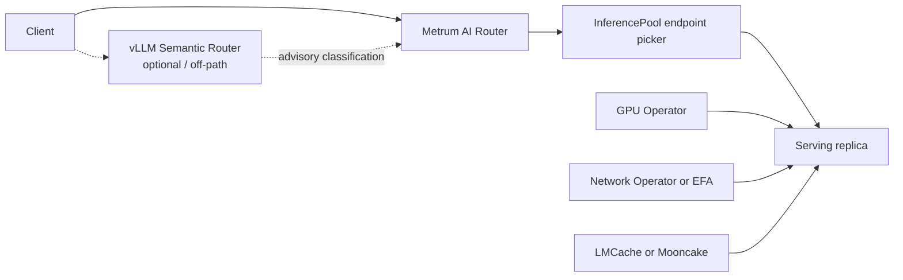

# Kubernetes deployment specification

**Status:** Historical proposed interim; package boundaries updated 2026-09-09
**Date:** 2026-08-31  
**Applies to:** Metrum AI Router release builds\
**Supersedes for review:** `docs/specs/kubernetes-deployment.md` dated 2026-08-28  

This document is a historical interim design artifact. Current installation
docs and repository packaging take precedence over aspirational text in this
file. The dependency wording below was corrected after Fleet moved out of the
request-path package; the remaining proposal is retained for design history.

Layer-boundary diagrams below use the public Client → Metrum AI Router →
upstream path. vLLM Semantic Router is optional/off-path. See
[Competitive Landscape](../../docs-site/docs/evaluation/competitive-landscape.md)
and the related website tracking issue
[#211](https://github.com/metrum-ai/router/issues/211).

## Scope and non-goals

This specification defines Kubernetes packaging and a constrained optional operator.
It preserves the router as a standalone product across every first-class deployment target.

### Governing constraints

1. This work MUST NOT add a router Kubernetes dependency. Zero core changes.
2. The configuration file is the contract. An operator's only outputs are that
   configuration plus standard Kubernetes objects.
3. Every CRD field MUST map to an existing configuration field. No Kubernetes-only
   semantics.
4. New capability MUST land in the router and its configuration schema first, then in a
   CRD. Never the reverse.
5. Deleting the operator MUST leave the running router able to serve from its mounted
   ConfigMap or Secret.
6. A feature that cannot be expressed on one air-gapped node MUST NOT ship as a Level 0
   product requirement.

### Non-goals

- Redesigning the router as an Envoy `ext_proc` filter.
- Requiring Istio, Linkerd, or any other service mesh for generic install profiles.
  Mesh injection and mesh policy CRDs are outside the product packaging contract.
  Private Metrum staging Linkerd use is not a Level 0 to Level 2 requirement.
- Inventing an `Upstream` CRD for in-cluster serving.
- Making Kueue admit HTTP requests.
- Replacing Fleet lifecycle tooling with a CRD operator in this interim document.
- Claiming Helm, OpenShift qualification, OEM VM images, or a CRD operator as shipped
  artifacts when the repository does not contain them.

The preferred caller-facing edge is Caddy. The chart MUST NOT redesign around a mesh
or Envoy filter for ordinary TLS termination and reverse proxy.

This document does not define a multi-tenant hosted control plane. Hosted deployments
use the same router configuration contract. Provider custody, tenancy, and operating
model are commercial and operational choices outside this document.

## Repository findings that control this specification

The following facts were verified against the repository on 2026-08-31. The
configuration schema wins over any brief assumption that differs.

### Runtime contract

The serving process starts from:

- a YAML configuration file;
- optional adjacent `env.json`, then working-directory `env.json` when that differs;
- an issued `license.json` at `server.license.path`;
- durable state under `state_path` and related license or usage paths.

`LoadConfig` expands `${NAME}` and `$NAME` before YAML decode. Existing process
environment values take precedence over `env.json`. Environment names match
`[A-Z_][A-Z0-9_]*`.

Unknown YAML keys are currently ignored by the serving loader. CRD admission MUST
reject unknown fields so operator-generated configuration cannot rely on silent ignore.

The checked-in Kubernetes ConfigMap still contains `server.env_file`. That field is
absent from `ServerConfig`. Go YAML decoding ignores it. Adjacent `env.json` remains
the valid environment-file contract.

### Provider credentials

On the YAML serving path, upstream authentication uses `providers.<name>.api_key` after
expansion. A working provider entry MUST set:

```yaml
api_key: "${PROVIDER_API_KEY}"
api_key_env: PROVIDER_API_KEY
```

`api_key_env` alone does not populate runtime Authorization on the YAML serving path.
`api_key_env` remains useful metadata and is used by control-plane paths that look up
environment names. CRD examples MUST include the `${ENV}` expression in `api_key`.

### Usage store

`server.usage_db` is the only usage-store contract:

| Field | Meaning |
|---|---|
| `enabled` | Pointer. Nil means enabled. Explicit `false` disables. |
| `driver` | `sqlite` or `postgres` |
| `path` | Required for SQLite at open time |
| `dsn` | Required for PostgreSQL at open time; production uses `${ROUTER_USAGE_DB_DSN}` |
| `migration_policy` | `validate`, `auto-safe`, or `deployment-job`; default `deployment-job` |

SQLite uses one active writer. PostgreSQL permits concurrent writers and multi-replica
router Deployments. There is no Kubernetes-native `usageStore` configuration field.

### License entitlement

License entitlement is not a caller CRD field. A normal release build validates a signed
`license.json` locally with embedded Ed25519 public keys. Offline validation needs no
Metrum network call. Optional signed revocation uses a local file when
`server.license.revocation.mode: file`. `fail_open_for_dev` is forbidden in normal
builds.

### Caller and account directory

`Config` contains top-level `users`, `projects`, `project_memberships`, and `callers`.
Callers use `allow`, `rate`, `traffic_shape`, `quota`, and `key`. There is no caller
`entitlement` or `contention_class` field.

Under a three-resource CRD surface, account-directory fields belong on
`SmartRouter.spec`. Model groups belong on `ModelGroup`. Callers belong on
`CallerToken`.

`contract.quality_floor.allowed_validation_status` accepts `passed`, `failed`,
`pending`, `stale`, `expired`, and `skipped`. It does not accept `validated`.

### Packaging that exists today

| Asset | State on 2026-08-31 |
|---|---|
| Dockerfile `scratch` image, UID/GID `65532`, port `8080` | Shipped |
| Compose and Compose PostgreSQL overlay | Shipped |
| Compose Caddy TLS terminator to `router:8080` | Shipped (`deploy/Caddyfile.compose`) |
| Kustomize under `deploy/kubernetes/` | Shipped. Generic base includes Ingress, not Caddy. |
| Helm chart with Caddy edge | Not present. Proposed Level 1 launch deliverable. |
| Router CRDs / controller-runtime operator | Not present |
| Terraform module for the router | Not present |
| Fleet EKS lifecycle CLI | Shipped as packaging, not as the CRD operator |
| Linkerd in Metrum staging overlay | Private deployment path. Not a product packaging requirement. |

Image entrypoint:

```text
/app/bin/metrum-ai-router --config /app/config/config.yaml
```

Generic Kustomize uses name `smart-llmrouter`, one replica, `Recreate`, RWO PVC,
probes on `/readyz` and `/healthz`, PDB `minAvailable: 1`, NetworkPolicy egress for DNS
and TCP/443, and Ingress included in the base render. Production docs require
`config.yaml`, `env.json`, and `license.json` under Secret controls when they contain
sensitive material. The generic base still mounts example `config.yaml` from a
ConfigMap. Staging and Fleet place runtime configuration in a Secret.

### Kubernetes dependency wording

The serving router (`cmd/router`) is a standalone process. It does not read kubeconfig,
in-cluster service-account tokens, or cluster credentials. It does not call the
Kubernetes API at runtime.

Kubernetes client libraries exist in this Go module because Fleet EKS adapters
live in `internal/fleet`. Only `metrum-ai-router-fleetctl` and its
package-only support commands import that package. Architecture tests enforce
that `cmd/router` and `internal/router` do not import `internal/fleet`.
This specification MUST NOT add a serving-router
Kubernetes dependency, `controller-runtime` import, CRD, or in-process cluster
client.

### Brief assumptions that were wrong

| Brief or prior draft assumption | Repository fact |
|---|---|
| Level 1 Helm chart exists | Only Kustomize exists |
| `telemetry_sinks` config field | Absent. Use `logging`, `decision_telemetry`, `diagnostics` |
| Caller `entitlement` / `contention_class` | Absent |
| `licenseSecretRef` in config | Chart or Secret mount only; config keeps filesystem paths |
| `replicas` / `ingress` in config | Packaging topology only |
| Provider needs only `api_key_env` | YAML serving needs `api_key: ${ENV}` |
| `allowed_validation_status: validated` | Illegal; use `passed` |
| Serving binary imports no Kubernetes client | Correct after the package split: Fleet owns Kubernetes adapters; the serving request path does not import Fleet |
| Resource name `smart-router` | Shipped objects use `smart-llmrouter` |
| Mooncake has a first-party CRD | Current docs use Deployment and Service |
| LMCache is the only cache product | Mooncake Store is a peer Level 3 option |

## Deployment targets, side by side

Every target below is first-class. Kubernetes is optional.

| Target | Runtime contract | State and secrets | Scale boundary | Status in this repo |
|---|---|---|---|---|
| Single binary on bare metal | `router --config <path>` under the local supervisor | Local protected config directory, `env.json`, issued license, durable state | One process with SQLite. Use PostgreSQL for concurrent writers. | Supported |
| Docker and Compose | Packaged image, Compose command, and Caddy reverse proxy to `router:8080` | Read-only config mount, writable state and log mounts, Caddy data volume | One Compose router with SQLite. Use explicit PostgreSQL for scale-out. | Supported |
| Single-node air-gapped appliance | Binary or image with no required outbound license call | Secure offline transfer of issued license and optional revocation bundle | One local router. No feature depends on a cluster. | Supported as a packaging profile |
| VM image for OEM bundling | Same binary or container contract | OEM-owned secret injection and durable state disk | OEM selects SQLite or PostgreSQL. | Design target. Not a shipped artifact. |
| Kubernetes and OpenShift | Image, Secret, ConfigMap where safe, Service, Caddy reverse proxy by default, or alternate Ingress/HTTPRoute, PVC or PostgreSQL | Namespace-scoped Secret plus PVC or database Secret | SQLite uses one active writer. PostgreSQL permits replicas. | Kubernetes Kustomize shipped. Helm with Caddy edge and OpenShift qualification proposed. |
| Hosted multi-tenant | Same router process and YAML schema per deployment scope | Managed secret and database controls | Tenant isolation is an operating-model decision. | Commercial path. Same config contract. |

A feature that cannot run on the air-gapped single node MUST NOT ship as a Level 0
requirement.

## Layer boundary

The default request path matches public diagrams: Client → Metrum AI Router →
upstream or inference pool. vLLM Semantic Router is optional and off-path; it is
not a mandatory inbound hop. Complement-versus-compete framing lives in
[Competitive Landscape](../../docs-site/docs/evaluation/competitive-landscape.md).



| Layer | Does | Does not do |
|---|---|---|
| vLLM Semantic Router (optional / off-path) | Classifies a request and advises a routing choice when operators enable it. | It does not enforce caller quotas, choose a model group, own provider credentials, or choose a serving replica. It is not required on the inbound path. |
| Metrum AI Router | Authenticates the caller, enforces caller limits, selects a model group and target, records usage, and calls the selected upstream. | It does not schedule GPUs, tune replica topology, select a replica inside an inference pool, or own node drivers. |
| llm-d or Gateway API Inference Extension endpoint picker | Selects a replica inside an `InferencePool`. | It does not choose the caller's model group or enforce router caller contracts. |
| GPU and Network Operators | Own node drivers, devices, RDMA, and network operands. | They do not make model-routing decisions or own router configuration. |
| LMCache or Mooncake | Provide optional KV-cache tiers or transfer for serving stacks. | They do not authenticate callers or select router model groups. |

This boundary makes llm-d complementary. Metrum AI Router selects the target pool or
external provider URL. llm-d or the Inference Extension endpoint picker selects a
healthy replica in that pool.

## Level 0: the router

Level 0 is unchanged. The router accepts YAML configuration and uses ordinary network
endpoints. Kubernetes resources are never required for startup.

The default `server.usage_db.migration_policy` is `deployment-job`. A serving router
validates database compatibility. A separate reviewed `router-migrate` job applies
migration work. `auto-safe` is limited to a reviewed small or single-node SQLite
deployment.

Accelerator hardware is outside Level 0. The router talks to OpenAI-compatible,
Anthropic, Responses, or other configured dialects over TCP or TLS. NVIDIA-backed and
AMD Instinct-backed serving endpoints are both valid upstreams once their URLs and
credentials exist in configuration.

## Level 1: container image and Helm chart

Level 1 is a complete deployment product. It does not need an operator.

### Current state versus launch deliverable

| Item | Current | Level 1 launch deliverable |
|---|---|---|
| Image | Shipped | Unchanged image contract |
| Generic manifests | Kustomize with Ingress in base | Helm chart that packages the same router contract |
| Caller-facing edge | Compose uses Caddy. Kustomize uses Ingress. | Caddy enabled by default. Ingress and HTTPRoute are alternate. |
| GPU profile | Not charted | First GPU-oriented Helm profile for AMD Instinct plus ROCm |
| NVIDIA serving | Supported as ordinary upstream URLs | Table stakes. Chart values and docs MUST support NVIDIA-backed endpoints. |

The chart specified here does not exist in this repository on 2026-08-31. It MUST
package the existing image contract without changing router code.

### Chart objects

The chart MUST render a Deployment, Service, ConfigMap, Secret reference, readiness,
liveness, and startup probes, a PodDisruptionBudget, and an optional
HorizontalPodAutoscaler.

When `caddy.enabled` is true, the chart MUST render a Caddy Deployment, a Caddy
Service as the public listener, and a Caddyfile ConfigMap or mounted configuration.
Caddy MUST terminate TLS and reverse-proxy to the router ClusterIP on container port
8080. The Caddyfile MUST forward `X-Forwarded-For`, `X-Forwarded-Proto`, and
`X-Forwarded-Host`, and MUST preserve caller `X-Request-Id`, matching
`deploy/Caddyfile.compose`. Router `server.client_ip.trusted_proxy_cidrs` MUST include
the Caddy Pod or Service CIDR.

The chart MAY render `networking.k8s.io/v1` `Ingress` or
`gateway.networking.k8s.io/v1` `HTTPRoute` when those values are enabled. It MUST NOT
require either resource. Chart validation MUST reject enabling more than one of
`caddy.enabled`, `ingress.enabled`, and `gateway.httpRoute.enabled`.

The chart MUST use `Recreate`, one replica, `ReadWriteOnce`, and a single active writer
when `server.usage_db.driver: sqlite`. It MUST reject `replicaCount > 1` with SQLite.
It MUST select PostgreSQL before it renders an HPA or more than one replica.

The chart MUST mount the runtime Secret read-only. It MUST mount a writable state path
and a writable `/tmp` because the image has a read-only root filesystem. It MUST set
`automountServiceAccountToken: false` unless a separately enabled integration requires
the projected token. The chart MUST NOT require Istio, Linkerd, or other mesh
injection annotations.

Resource names and labels MUST use `smart-llmrouter` unless a documented rename ships
in the router packaging.

### Chart values

| Value | Default | Effect |
|---|---:|---|
| `image.repository` | required | Router image repository. |
| `image.digest` | required for production | Immutable image selection. |
| `replicaCount` | `1` | Standard Deployment scale. Requires PostgreSQL above one. |
| `runtimeSecret.name` | required | Secret containing `env.json`, `license.json`, and any sensitive full config. |
| `config.existingConfigMap` | empty | Non-sensitive generated `config.yaml` ConfigMap. |
| `config.existingSecretKey` | empty | Secret key containing the full production `config.yaml`. |
| `persistence.state` | enabled | State path, SQLite file, and license state. |
| `usageDatabase.mode` | `sqlite` | Must match `server.usage_db.driver`. |
| `usageDatabase.existingSecret` | empty | PostgreSQL DSN source. It becomes `${ROUTER_USAGE_DB_DSN}` in `config.yaml`. |
| `service` | enabled | ClusterIP Service on port 80 to container port 8080. Not the public listener when Caddy is enabled. |
| `caddy.enabled` | `true` | Default caller-facing reverse proxy. Renders Caddy Deployment and Service. |
| `caddy.image.repository` | required when Caddy enabled | Caddy image repository. |
| `caddy.image.digest` | required for production | Immutable Caddy image selection. |
| `caddy.existingConfigMap` | empty | Optional ConfigMap that supplies the Caddyfile. |
| `caddy.tls.mode` | `acme` | `acme` for connected profiles. `secret` for air-gapped or operator-managed certificates. |
| `caddy.tls.existingSecret` | empty | TLS certificate Secret when `caddy.tls.mode` is `secret`. |
| `gateway.httpRoute.enabled` | `false` | Alternate `HTTPRoute`. Mutually exclusive with Caddy and Ingress. |
| `ingress.enabled` | `false` | Alternate conventional `Ingress`. Mutually exclusive with Caddy and HTTPRoute. |
| `probes` | enabled | `/readyz`, `/healthz`, and `/readyz` startup probe. |
| `pdb.minAvailable` | `1` | Pod disruption budget. |
| `hpa.enabled` | `false` | Standard HPA. Requires PostgreSQL and a metrics source. |
| `networkPolicy` | enabled | Client to Caddy, Caddy to router:8080, plus DNS, provider, and database egress. |
| `gpuProfile` | `none` | `none`, `amd-instinct`, or `nvidia-compatible`. Does not request GPUs for the router Pod. |
| `serving.assumeNvidiaAvailable` | `true` | Documents that NVIDIA-backed serving endpoints are table stakes for most AI deployments. |

### Accelerator profiles for Level 1

The router Pod MUST NOT request `nvidia.com/gpu`, `amd.com/gpu`, or DRA claims. Serving
workloads own those requests.

NVIDIA is table stakes. Most AI deployments use NVIDIA GPUs. Chart documentation and
values MUST treat NVIDIA-backed OpenAI-compatible or Responses endpoints as a required
product capability. Setting NVIDIA GPU Operator off on EKS accelerated AMIs is a
driver-ownership rule. It is not a statement that NVIDIA support is optional.

The first GPU-oriented Helm profile to release is AMD Instinct plus ROCm. As of
2026-08-31:

| Pin | Value |
|---|---|
| AMD GPU Operator | `v1.5.1` |
| Helm chart | `rocm/gpu-operator-charts` |
| ROCm for Instinct MI350P | `7.13+` (`amdgpu` `6.19+`) |
| Kubernetes matrix | `1.29`–`1.36` |
| OpenShift matrix | `4.21`–`4.22` |

On one `DeviceConfig`, `draDriver.enable: true` and `devicePlugin.enableDevicePlugin:
true` are mutually exclusive. The chart profile MUST NOT flip either setting for the
operator. Serving workloads MAY use DRA `DeviceClass` and `ResourceClaimTemplate` once
the cluster provides `resource.k8s.io/v1`.

### Example projected configuration

The following valid runtime configuration is the contract that the chart projects. The
values in `api_key` and `token_sha256` expand from `env.json`. The Secret contains the
real values. The example is intentionally non-production.

```yaml
apiVersion: v1
kind: ConfigMap
metadata:
  name: smart-llmrouter-config
  labels:
    app.kubernetes.io/name: smart-llmrouter
data:
  config.yaml: |
    server:
      listen: ":8080"
      default_model_group: local-chat
      logging:
        path: /app/logs/requests.jsonl
      usage_db:
        enabled: true
        driver: sqlite
        path: /app/state/usage.sqlite
        migration_policy: deployment-job
      license:
        enabled: true
        path: /app/config/license.json
        state_path: /app/state/license-state.json
        recheck_interval: 1h
        grace_period_on_validation_error: 24h
        revocation:
          mode: off
        fail_open_for_dev: false
      client_ip:
        trusted_proxy_cidrs: []
        header_order:
          - X-Forwarded-For
          - X-Real-IP
        store_ip: true
      decision_telemetry:
        enabled: false
    state_path: /app/state/router-state.json
    providers:
      local-vllm:
        base_url: http://vllm.default.svc.cluster.local:8000/v1
        dialect: openai-chat
        api_key: "${LOCAL_VLLM_API_KEY}"
        api_key_env: LOCAL_VLLM_API_KEY
        models:
          qwen:
            model: Qwen/Qwen3-32B
    models:
      local-chat:
        strategy: static
        targets:
          - provider: local-vllm
            model_ref: qwen
            weight: 100
    users:
      - id: example
        name: Example API Caller
        type: service_account
        status: active
    projects:
      - id: example
        name: Example
        status: active
    project_memberships:
      - user_id: example
        project: example
        role: member
        status: active
    callers:
      - id: example
        owner_user: example
        project: example
        environment: production
        status: active
        token_sha256: "${ROUTER_CALLER_EXAMPLE_SHA256}"
        token_id: rtr_example
        allow:
          - local-chat
        rate:
          rpm: 60
          tpm: 100000
          concurrent: 2
```

The chart MUST validate the rendered configuration with the packaged router before
rollout. It MUST run `router-migrate` as a non-serving Job before a fresh SQLite
router starts or before a reviewed upgrade that needs migration work.

## Level 2: optional operator

### Why not just a chart

An optional operator is justified only where a chart cannot keep configuration current
without human edits:

1. Upstream discovery for in-cluster vLLM and SGLang Services, `InferencePool` objects,
   and Dynamo `DynamoGraphDeployment` frontends. Generate ordinary provider entries and
   keep them current as pools scale. This is the main reason the operator exists.
2. Provider keys via External Secrets or the Secrets Store CSI driver. Never in a CRD.
3. Offline license entitlement as a Secret. No phone-home.
4. Rolling upgrades, HA topology hooks that remain chart-owned for objects, drift
   correction of generated configuration, and status conditions.

No CRD operator exists today. A current, compliant operator can generate only existing
configuration fields. It can also create standard objects that mount that
configuration.

The requested fields `replicas`, `ingress`, license Secret reference,
`telemetry_sinks`, usage-store Kubernetes backing, discovered target references, and
caller `contention_class` are absent from the router schema. They MUST NOT enter a CRD
now.

Until a portable discovery field exists in router configuration, Level 1 owns
Deployment, Service, HPA, PDB, Caddy edge objects, alternate Ingress or HTTPRoute when
selected, PVC, and Secret mounting. Fleet lifecycle tooling remains a separate
packaging authority and MUST NOT be confused with this CRD operator.

### Proposed CRD identity and current-safe shapes

The proposed API group is `router.metrum.ai/v1alpha1`. It is a design identity. It is
not installed by this repository.

`SmartRouter.spec` serializes to `server`, `providers`, `state_path`, `users`,
`projects`, and `project_memberships`. `ModelGroup.metadata.name` becomes the
`models.<name>` map key. `CallerToken.spec` serializes to one item of `callers`. The
examples below use only fields present in the current router schema.

```yaml
apiVersion: router.metrum.ai/v1alpha1
kind: SmartRouter
metadata:
  name: example
spec:
  server:
    listen: ":8080"
    default_model_group: local-chat
    logging:
      path: /app/logs/requests.jsonl
    usage_db:
      enabled: true
      driver: sqlite
      path: /app/state/usage.sqlite
      migration_policy: deployment-job
    license:
      enabled: true
      path: /app/config/license.json
      state_path: /app/state/license-state.json
      recheck_interval: 1h
      grace_period_on_validation_error: 24h
      revocation:
        mode: off
      fail_open_for_dev: false
    client_ip:
      trusted_proxy_cidrs: []
      header_order:
        - X-Forwarded-For
        - X-Real-IP
      store_ip: true
    decision_telemetry:
      enabled: false
  state_path: /app/state/router-state.json
  providers:
    local-vllm:
      base_url: http://vllm.default.svc.cluster.local:8000/v1
      dialect: openai-chat
      api_key: "${LOCAL_VLLM_API_KEY}"
      api_key_env: LOCAL_VLLM_API_KEY
      models:
        qwen:
          model: Qwen/Qwen3-32B
  users:
    - id: example
      name: Example API Caller
      type: service_account
      status: active
  projects:
    - id: example
      name: Example
      status: active
  project_memberships:
    - user_id: example
      project: example
      role: member
      status: active
```

```yaml
apiVersion: router.metrum.ai/v1alpha1
kind: ModelGroup
metadata:
  name: local-chat
spec:
  strategy: static
  attempt_timeout_ms: 120000
  contract:
    display_name: Local chat
    intended_workloads:
      - general-chat
    supported_api_shapes:
      - openai-chat
    required_capabilities:
      input_modalities:
        - text
  targets:
    - provider: local-vllm
      model_ref: qwen
      weight: 100
```

`contract.quality_floor.allowed_validation_status` accepts `passed`, `failed`,
`pending`, `stale`, `expired`, and `skipped`. Do not use `validated`. Setting a
non-empty `allowed_validation_status` list requires matching target validation
metadata so the contract remains satisfiable.

```yaml
apiVersion: router.metrum.ai/v1alpha1
kind: CallerToken
metadata:
  name: example
spec:
  id: example
  owner_user: example
  project: example
  environment: production
  status: active
  token_sha256: "${ROUTER_CALLER_EXAMPLE_SHA256}"
  token_id: rtr_example
  allow:
    - local-chat
  rate:
    rpm: 60
    tpm: 100000
    concurrent: 2
  traffic_shape:
    enabled: true
    request_start_per_sec: 1
    request_burst: 4
    input_tokens_per_sec: 10000
    input_token_burst: 40000
    output_reservation_tokens_per_sec: 10000
    output_reservation_token_burst: 40000
  quota:
    day:
      requests: 1000
      tokens: 1000000
    month:
      requests: 10000
      tokens: 10000000
    soft_pct: 80
  key:
    lifetime_tokens: 100000000
    soft_pct: 90
    on_exhaust: disable
```

`token_sha256` is a configuration field. The CRD MUST contain the environment
expression only. A Secret-backed `env.json` supplies the value. The CRD MUST NOT carry
a raw router token or a token hash.

`CallerToken` maps burst controls to `traffic_shape.*_burst`. It maps caller limits to
`rate`, `quota`, and `key`. The terms `entitlement` and `contention_class` are deferred.
The router has no matching fields. Kueue vocabulary can inform future naming. Kueue
MUST NOT admit HTTP requests.

`ModelGroup.routing_policy` maps only to the current built-in
`routing_policy.dynamic_score` configuration. An external service maps to
`external_policy.url` only when `strategy: external`. It also requires `allow_hosts`.
A ConfigMap reference has no current router configuration field. A separate
`RoutingPolicy` CRD is deferred.

Operator merge order:

1. SmartRouter supplies `server`, `providers`, `state_path`, `users`, `projects`, and
   `project_memberships`.
2. Each ModelGroup becomes `models.<metadata.name>`.
3. Each CallerToken becomes one `callers[]` item.

Do not also put `callers` on SmartRouter. `metadata.name` for CallerToken MUST equal
`spec.id`.

### Future discovery contract

After a router configuration field exists, an operator MAY watch these sources:

- `inference.networking.k8s.io/v1` `InferencePool` for in-cluster vLLM and SGLang
  pools. The stable API includes `targetPorts` and `endpointPickerRef`.
  `InferenceModel` is removed from the stable surface.
- A Kubernetes Service for a static in-cluster OpenAI-compatible endpoint.
- `nvidia.com/v1beta1` `DynamoGraphDeployment` for a Dynamo frontend.

The operator MUST generate ordinary `providers.<name>` and `models.<group>.targets[]`
entries. It MUST use the endpoint picker as the replica selector. It MUST NOT enumerate
replica Pods as router targets. It MUST remove generated entries when the source is
deleted. It MUST preserve hand-authored external provider entries.

The missing router source field is an explicit prerequisite. No discovery CRD YAML is
shown because it would violate current config parity.

### Reconciliation and ownership

The future operator has one required output: a syntactically valid configuration file.
It MAY create the ConfigMap or Secret that stores that file. The Level 1 chart remains
usable without it.

| Object | Owner | Field manager | Boundary |
|---|---|---|---|
| `config.yaml` ConfigMap or Secret key | Operator after it exists | `smartrouter-operator-config` | Operator owns only generated configuration content. |
| Runtime Secret and `env.json` | Deployment secret system | External Secrets, CSI provider, or human operator | Router operator has no Secret read permission. |
| `license.json` Secret key | License delivery process | License delivery field manager | Router operator only consumes the mounted file path already in config. |
| Deployment, Service, PDB, HPA, Caddy Deployment/Service/ConfigMap, alternate Ingress or HTTPRoute, PVC | Helm chart | `smartrouter-helm` | Chart owns topology and the caller-facing edge. |
| Provider Services, pools, GPU resources, and cache engines | Their installed controllers | Upstream controller manager | Router operator reads discovery sources only after schema support exists. |
| Fleet lifecycle objects | Fleet CLI | Fleet field manager | Separate packaging authority. Do not dual-own the same fields. |

The operator MUST use Server-Side Apply. It MUST use one stable field manager per object
class. It MUST NOT force ownership of fields owned by Helm, a Secret controller, a
Gateway controller when an alternate HTTPRoute is selected, Fleet, or an add-on
controller. A field conflict MUST set a status condition and leave the last known valid
configuration mounted.

A future operator finalizer MAY remove only its generated ConfigMap or its own labels
and owner references. It MUST NOT delete a Secret, PVC, database, `InferencePool`,
Dynamo resource, GPU resource, Mooncake Service, LMCacheEngine, or customer-managed
Service. The finalizer MUST complete without cluster egress.

### Status conditions

The CRDs MUST expose these conditions when implemented:

| Condition | True means | False behavior |
|---|---|---|
| `Accepted` | The object passed schema and admission checks. | No generated configuration changes. |
| `ConfigValid` | The aggregate generated YAML passed the router validator. | Keep the prior valid mounted configuration. |
| `DependenciesResolved` | Required existing providers and referenced model groups resolve. | Keep the prior valid mounted configuration. |
| `Ready` | The projected router reports `/readyz` and the observed config revision matches. | Report safe reason and object generation. |
| `Degraded` | A non-required optional integration is absent or stale. | Continue with the configured static targets. |
| `Conflict` | Another field manager owns a required field. | Do not force apply. |

No status condition may include a provider key, router token, token hash, DSN, full
license payload, or configuration body.

### Admission and validation

CRD OpenAPI schemas SHOULD use structural schemas, list-map keys, CEL
`x-kubernetes-validations`, and defaults only where they exactly match router defaults.
They MUST reject unknown fields. This closes the silent-unknown-field gap in the current
YAML loader.

CEL validations SHOULD cover current router invariants such as these:

- `usage_db.driver` is `sqlite` or `postgres`.
- `sqlite` uses a non-empty `path`; `postgres` uses a non-empty `dsn` expression.
- a ModelGroup has a strategy and at least one target.
- every target has a provider and either `model` or `model_ref`.
- a caller has an ID, a non-empty `token_sha256` expression, and `metadata.name == id`.
- each positive traffic rate has its required burst field.
- external strategy has `external_policy.url` and `external_policy.allow_hosts`.
- provider entries that require auth include `api_key` with an environment expression.
- `quality_floor.allowed_validation_status` values are from the router allow-list.

Cluster policy SHOULD use `ValidatingAdmissionPolicy` for namespace, image provenance,
secret-mount, and topology rules that do not need router-specific data. Admission MUST
fail closed when the aggregate router config cannot validate.

`MutatingAdmissionPolicy` is GA and always enabled only on Kubernetes 1.36 or later.
On the conservative 1.35 integrated profile it remains beta and opt-in. Mutation
therefore ships as a narrowly scoped admission webhook for now. The webhook MUST add
only deterministic defaults that have an exact router-schema equivalent. It MUST fail
closed on its own unavailable or invalid response. It MUST NOT read Secrets.

## Level 3: optional integrations

Every integration is off by default. The router MUST continue with static URLs and the
Level 1 chart when an integration is absent.

### NVIDIA GPU Operator

NVIDIA is table stakes for most AI deployments. Serving stacks on NVIDIA GPUs are a
required product capability.

Use NVIDIA GPU Operator `v26.7.0` or later only on nodes selected for NVIDIA workloads
that do not already own the driver. `ClusterPolicy` and `NVIDIADriver` remain add-on
resources. Default them off on EKS accelerated AMIs that already include the driver and
toolkit. On AL2023 NVIDIA AMIs set `driver.enabled=false` and `toolkit.enabled=false`.
On Bottlerocket NVIDIA AMIs disable driver, toolkit, and device plugin when the AMI
already provides them.

Do not run DRA and a device plugin for the same device on the same node. The router
neither requests `nvidia.com/gpu` nor manages drivers.

### AMD GPU Operator with DRA

The first GPU-oriented Helm profile releases against AMD Instinct plus ROCm. Use AMD
GPU Operator `v1.5.1` or later from `rocm/gpu-operator-charts`. Instinct MI350P requires
ROCm `7.13+` (`amdgpu` `6.19+`) and is documented for Kubernetes `1.29`–`1.36` and
OpenShift `4.21`–`4.22`.

In a `DeviceConfig`, `draDriver.enable: true` and
`devicePlugin.enableDevicePlugin: true` are mutually exclusive. The operator MUST NOT
flip either setting.

The router owns no device request. A serving workload may use Kubernetes DRA once the
cluster provides `resource.k8s.io/v1` `DeviceClass` and `ResourceClaimTemplate`.

### NVIDIA Network Operator and AWS EFA

Use NVIDIA Network Operator `v26.4.0` or later for supported RDMA fabrics. Its
published matrix covers Kubernetes `1.31`–`1.35`. Use AWS EFA on AWS where it is the
selected network mechanism. They are separate mechanisms. Neither is a default.

The router uses ordinary TCP or TLS endpoints. It does not configure RDMA, SR-IOV,
NetworkAttachmentDefinitions, EFA, or node networking.

### LMCacheEngine

Use LMCache Operator when the cluster serves `lmcache.lmcache.ai/v1alpha1`
`LMCacheEngine`. Pin an operator release rather than `latest`. Current docs list
operator `v0.1.1` as the first release and later operator tags in the release feed.

A future cache binding belongs on a ModelGroup only after a router configuration field
exists. It MUST NOT become its own router CRD. Without LMCache, the selected serving
target continues without the cache integration.

LMCache MAY use Mooncake Store as a remote storage backend. That composition remains a
serving-stack concern, not a Metrum AI Router CRD.

### Mooncake

Mooncake Store and Transfer Engine are peer Level 3 options beside LMCache. Current
Mooncake Kubernetes docs stand up a shareable Store with ordinary `Deployment` and
`Service` objects: one `mooncake-master` plus replicated `mooncake-store` nodes. The
Store needs no GPUs. Prefill and decode services use Transfer Engine over RDMA or TCP.

Mooncake has no first-party CRD in current upstream docs. Do not invent a Metrum AI Router
Mooncake CRD. Do not treat OME `KVCachePool` as a Metrum AI Router resource.

llm-d MAY use Mooncake Store as a vLLM KV offload tier and `MooncakeConnector` for
prefill/decode transfer. Metrum AI Router still selects the model group and target URL or
pool. Mooncake remains under the serving layer.

Without Mooncake, static provider URLs and Level 1 packaging continue unchanged.

### llm-d

Use llm-d `v0.9` or later for disaggregated serving. Install its Helm charts and
documented overlays as the llm-d project documents. Do not add a Metrum AI Router controller
for llm-d. llm-d is a CNCF Sandbox project and remains pre-1.0.

Metrum AI Router selects the model group and pool. llm-d selects the replica within the
pool. llm-d topology and disaggregation policies remain llm-d concerns.

### NVIDIA Dynamo

Use Dynamo `v1.4.2` or later. New Dynamo graph resources use `nvidia.com/v1beta1`
`DynamoGraphDeployment`. `DynamoGraphDeploymentRequest` is the recommended intent and
profiling API. DGDR already performs profiling-driven topology tuning. Metrum AI Router
MUST NOT duplicate that tuning.

A future discovery adapter may use the Dynamo frontend endpoint after router config
supports discovery references. Without that adapter, configure the frontend as a normal
external provider URL.

### KServe

Use KServe `v0.20.0` or later when KServe is the selected serving system. Gateway API
`HTTPRoute` uses `gateway.networking.k8s.io/v1`. KServe owns its serving resources.
Metrum AI Router treats the exposed endpoint as a normal upstream after the configuration
is written.

### Kueue

Use current Kueue for accelerator workload admission. Current API is
`kueue.x-k8s.io/v1beta2`. Its terms `nominalQuota`, `borrowingLimit`, `lendingLimit`,
`cohort`, and `preemption` can guide future caller contention design. Kueue does not
admit router HTTP requests. Metrum AI Router continues to enforce `callers[].rate`,
`traffic_shape`, `quota`, and `key`.

### External Metrics adapter

An external metrics adapter is optional. An HPA MAY consume a safe queue-depth,
request-rate, or resource metric through `external.metrics.k8s.io/v1beta1`. It MUST use
PostgreSQL-backed multi-replica mode. It MUST NOT expose caller identity, token
identifiers, raw request content, or provider credentials through metric labels.

### Gateway `ext_proc` footnote

Organizations with an existing Envoy gateway MAY add an `ext_proc` bridge as a local
Level 3 integration. Envoy marks the filter API as work-in-progress and outside its
security threat model. It is outside router architecture. It is not the Metrum AI Router
caller-facing edge. The product default edge remains Caddy. This footnote MUST preserve
the standalone router API and the Level 0 to Level 2 deployment paths.

## Install profiles

| Profile | Required components | Storage and scale | Optional additions |
|---|---|---|---|
| Minimal | Router image, ConfigMap or runtime Secret, Service, one PVC, probes, PDB, Caddy edge | SQLite, one replica, `Recreate` | Disable Caddy for ClusterIP-only. Ingress or HTTPRoute as alternate edge. |
| EKS | Minimal profile, EKS-compatible registry and storage class, Caddy by default | SQLite for one writer. PostgreSQL for HPA or replicas. | Keep NVIDIA GPU Operator off when an accelerated AMI owns the driver. Use EFA only when selected. NVIDIA-backed upstreams remain supported. Do not require Linkerd. |
| AMD Instinct reference | Minimal or PostgreSQL profile plus AMD GPU Operator `v1.5.1` and ROCm `7.13+` for Instinct nodes | SQLite for one writer. PostgreSQL for multi-replica router. | DRA or device plugin, exclusive per DeviceConfig. Serving claims Instinct devices. |
| On-prem reference stack | PostgreSQL, Caddy edge, private DNS, and NetworkPolicy | PostgreSQL and at least two router replicas through the chart | Gateway API and `InferencePool` only when llm-d or Inference Extension serving is selected. GPU Operator for NVIDIA or AMD, Network Operator, llm-d, Dynamo, LMCache, Mooncake, KServe, Kueue. |
| Air-gapped | Binary or loaded router and Caddy images, local config, Secret or protected files, durable state | SQLite, one router | Signed offline license and optional signed revocation file. Caddy uses `tls.mode: secret` with a mounted certificate. ACME off. No external control-plane dependency. No mesh. |

The EKS and on-prem profiles require a reviewed database migration job before serving.
The air-gapped profile validates license state locally and requires no phone-home path.

Conservative integrated Kubernetes profile for this document: Kubernetes `1.35` with
DRA GA, ValidatingAdmissionPolicy GA, and NVIDIA Network Operator inside its published
matrix. Gateway API Standard Channel is required only when an alternate HTTPRoute or
InferencePool path is selected. Treat MutatingAdmissionPolicy as webhook-backed until a
Network Operator release validates Kubernetes `1.36`.

## Configuration parity

The table maps CRD fields to existing router YAML. A missing mapping is a blocker.

| Proposed resource field | Router YAML field | State on 2026-08-31 |
|---|---|---|
| `SmartRouter.spec.server` | `server` | Direct map. |
| `SmartRouter.spec.state_path` | `state_path` | Direct map. |
| `SmartRouter.spec.providers` | `providers` | Direct map. `api_key` uses `${ENV}`. `api_key_env` is the env name. |
| `SmartRouter.spec.users` | `users` | Direct map. Required for a complete account directory. |
| `SmartRouter.spec.projects` | `projects` | Direct map. |
| `SmartRouter.spec.project_memberships` | `project_memberships` | Direct map. |
| `SmartRouter.spec.server.license.path` | `server.license.path` | Direct map. Secret mounting is chart behavior. |
| `SmartRouter.spec.server.license.state_path` | `server.license.state_path` | Direct map. |
| `SmartRouter.spec.server.usage_db` | `server.usage_db` | Direct map. SQLite path or PostgreSQL DSN expression. |
| `SmartRouter.spec.server.logging` | `server.logging` | Direct map. |
| `SmartRouter.spec.server.decision_telemetry` | `server.decision_telemetry` | Direct map. |
| `ModelGroup.metadata.name` | `models.<name>` | Map-key identity. |
| `ModelGroup.spec` | `models.<name>` value | Direct map for current ModelGroup fields. |
| `ModelGroup.spec.targets[]` | `models.<name>.targets[]` | Direct map. Supports configured URLs through providers. |
| `ModelGroup.spec.external_policy` | `models.<name>.external_policy` | Direct map when `strategy: external`. |
| `ModelGroup.spec.routing_policy` | `models.<name>.routing_policy` | Direct map for `dynamic_score` only. |
| `CallerToken.metadata.name` | `callers[].id` | Identity MUST equal `spec.id`. |
| `CallerToken.spec` | `callers[]` item | Direct map for current CallerConfig fields. |
| Caller burst controls | `callers[].traffic_shape.*_burst` | Direct map. |
| Caller allowed groups | `callers[].allow` | Direct map. |
| `SmartRouter.spec.replicas` | none | Prohibited. Chart value only. |
| `SmartRouter.spec.ingress` | none | Prohibited. Chart edge uses Caddy by default, or alternate Ingress/HTTPRoute objects. |
| `SmartRouter.spec.licenseSecretRef` | none | Prohibited. Chart mounting convention only. |
| `SmartRouter.spec.telemetry_sinks` | none | Prohibited. There is no router field. |
| `SmartRouter.spec.usageStore` Kubernetes reference | none | Prohibited. Only `server.usage_db` exists. |
| discovered `InferencePool` target reference | none | Deferred pending router schema. |
| `ModelGroup.spec.cacheBinding` for LMCache or Mooncake | none | Deferred pending router schema. |
| `CallerToken.spec.entitlement` | none | Deferred. Entitlement is license payload, not caller YAML. |
| `CallerToken.spec.contention_class` | none | Deferred pending router schema. |
| RoutingPolicy ConfigMap reference | none | Deferred pending router schema. |

## Conformance and test strategy

One conformance suite MUST run against every deployment target. The suite uses the same
sanitized configuration fixture and expected behaviors. The repository currently has
the pieces, not one harness. Packaging-layer work MAY add a runner without changing
router core.

1. Parse the YAML with the packaged router. Confirm that unsupported fields fail at CRD
   admission and do not enter generated YAML.
2. Start the target runtime. Check `/healthz`, `/readyz`, `/version`, and `/docs/`.
3. Authenticate a caller. Check `/v1/models` contains only that caller's allowed groups.
4. Run one accepted request for every enabled caller API shape. Include Chat, Responses,
   Anthropic Messages, streaming, tools, images, and structured output only when the
   fixture advertises each shape.
5. Check caller rate, traffic-shape burst, quota, and license enforcement boundaries.
6. Stop and restart the runtime. Verify durable router state, license state, and usage
   data according to the selected storage design.
7. For SQLite, assert one writer and no overlapping router Pods. For PostgreSQL, run two
   replicas and verify concurrent usage recording.
8. Rotate a test Secret value. Verify a reviewed restart or config revision. Do not
   print the Secret.
9. In Kubernetes, use server-side dry-run, render the chart or Kustomize overlay, and
   test allowed and denied NetworkPolicy paths.
10. In air-gapped mode, block all Metrum egress and verify a valid offline license still
    reaches ready state.

Existing commands that feed the suite include `make test`, `make secret-check`,
`make docs-qa`, `make release-validation-matrix`, `make test-tenant-deploy-all`,
`make api-compat-mock`, gated PostgreSQL scripts, and
`kubectl kustomize deploy/kubernetes/overlays/example`.

The Level 2 conformance extension MUST delete the operator after it has projected a
valid configuration. The router MUST continue serving until a normal configuration
change or restart requires another projection.

## Security

The router Pod MUST run non-root. It MUST drop all Linux capabilities. It MUST use
`RuntimeDefault` seccomp, a read-only root filesystem, a writable state volume, and a
writable `/tmp` volume.

When Caddy is enabled, Caddy is the only public listener. The router Service MUST remain
ClusterIP. NetworkPolicy MUST allow client traffic to the Caddy Service, allow Caddy to
reach router TCP 8080, and allow reviewed DNS, provider, and database egress. Product
install docs MUST NOT require Linkerd `policy.linkerd.io` resources, Istio
AuthorizationPolicy, mesh injection annotations, or mesh identity policies.

The chart ServiceAccount MUST have no Kubernetes API permissions and no automatically
mounted token. The future operator ServiceAccount MUST use namespace-scoped list and
watch permissions only for the CRDs and discovery sources enabled by profile. It MUST
have no Secret `get`, `list`, `watch`, `create`, `update`, `patch`, or `delete`
permission.

External Secrets Operator `external-secrets.io/v1` MAY write a Kubernetes Secret.
Secrets Store CSI Driver `secrets-store.csi.x-k8s.io/v1` MAY mount provider-backed
secret material. The router operator never reads either source. Both integrations are
optional.

A Secret contains provider credentials, DSNs, license payloads, caller token hashes,
and admin credentials. Do not place these values in a CRD, ConfigMap, status condition,
Event, metric label, log, test fixture, or screenshot.

Add-on controllers run in their own namespaces and ServiceAccounts. Each add-on MUST
have image provenance, pinned version, least-privilege RBAC, a NetworkPolicy, and a
removal procedure. The chart MUST remain deployable when every add-on is absent.

## Upgrade and API deprecation policy

The chart MUST pin production router images by digest. It MUST keep the prior image,
runtime configuration, license state, and usage-store backup until post-upgrade smoke
passes.

A database migration MUST finish before new serving Pods start. Roll back image and
configuration only when the prior application version is compatible with the current
database state. Restore the database from the pre-upgrade backup when it is not.

The proposed CRD starts at `v1alpha1`. It MUST retain conversion and validation tests
before any later version is served. A field removal requires:

1. a replacement router configuration field;
2. a lossless CRD conversion path;
3. at least one released deprecation period;
4. documentation and conformance coverage for upgrade and rollback; and
5. removal only after all supported chart and operator versions stop emitting it.

No CRD version may add a field before the router accepts and validates the equivalent
YAML field. Unknown fields MUST fail admission.

## Reuse map

| Concern | Reuse | Notes as of 2026-08-31 |
|---|---|---|
| Caller-facing reverse proxy | Caddy Deployment and Service | Product default edge. Align with Compose `deploy/Caddyfile.compose`. |
| Serving target contract | InferencePool `inference.networking.k8s.io/v1` | `InferenceModel` removed from stable surface. Use `targetPorts` and `endpointPickerRef`. |
| Alternate gateway plumbing | Gateway API HTTPRoute `gateway.networking.k8s.io/v1` | Alternate edge only when a gateway is already present. Not the product default. |
| Alternate Ingress plumbing | `networking.k8s.io/v1` Ingress | Alternate edge only. Mutually exclusive with Caddy and HTTPRoute. |
| Service mesh | none | Istio, Linkerd, and similar are non-goals for product packaging. |
| Disaggregated serving | llm-d `v0.9+` | Helm charts and overlays, not a Metrum AI Router operator. CNCF Sandbox. |
| Alternative serving | Dynamo DGD / DGDR `nvidia.com/v1beta1` | DGDR already does profiling-driven topology tuning. Pin Dynamo `v1.4.2+`. |
| NVIDIA nodes | GPU Operator `ClusterPolicy`, `NVIDIADriver` | Table stakes for serving. Default operator OFF when AMI owns drivers. |
| AMD nodes | GPU Operator `DeviceConfig`, `draDriver` | First GPU Helm profile. Pin operator `v1.5.1`, ROCm `7.13+`. DRA and device plugin are mutually exclusive per DeviceConfig. |
| RDMA | Network Operator, or EFA on AWS | Two different mechanisms, neither default. Network Operator matrix currently through Kubernetes 1.35. |
| Accelerators | DRA `DeviceClass` / `ResourceClaimTemplate` | Express requirements, not vendor resource names. GA since Kubernetes 1.34. |
| KV cache | LMCacheEngine `lmcache.lmcache.ai/v1alpha1` | Optional. Future ModelGroup field only after router schema exists. |
| KV cache | Mooncake Store Deployment/Service | Peer optional cache. No first-party CRD. May back LMCache or llm-d connectors. |
| Quota vocabulary | Kueue `nominalQuota`, `borrowingLimit`, `lendingLimit`, `cohort`, `preemption` | Borrow the words for future CallerToken design. Do not make Kueue admit HTTP requests. |

## Open questions

1. Which router configuration field will represent an `InferencePool`, Service, or
   Dynamo frontend discovery source while preserving non-Kubernetes deployment parity?
2. Does the router need a configuration field for ModelGroup cache binding before an
   `LMCacheEngine` or Mooncake Store reference can exist? If yes, what is the
   bare-metal representation for both products?
3. Does the router need explicit caller entitlement and contention-class fields? If so,
   what are their bare-metal semantics and enforcement behavior?
4. Does the router need a portable telemetry-sink schema beyond logging, usage storage,
   diagnostics, and decision telemetry?
5. Should production charts always store the whole generated `config.yaml` in a Secret,
   or can a schema-defined non-sensitive subset safely live in a ConfigMap?
6. Which current Deployment topology should the optional operator own without adding
   Kubernetes-only CRD fields? Until this is resolved, Helm owns topology and Fleet
   remains a separate packaging authority.
7. What safe router-schema representation should express a policy ConfigMap reference?
   The existing external policy contract accepts a URL and host allow-list only.
8. When should the AMD Instinct Helm profile graduate from proposed packaging to a
   released chart artifact, and which Instinct SKUs form the first conformance matrix?
9. When a Network Operator release validates Kubernetes 1.36, should mutation move from
   webhook to `MutatingAdmissionPolicy` in the same release train?
10. Connected profiles use Caddy ACME by default. Air-gapped profiles MUST use a mounted
    TLS Secret (`caddy.tls.mode: secret`). Should OEM images pin one mode only, or keep
    both as chart values with air-gap defaulting to `secret`?

## Upstream version and API references

The following sources were checked on 2026-09-19 for competitive and Semantic Router
layer framing (Kubernetes floor versions below retain the 2026-08-31 packaging
baseline unless revalidated elsewhere):

- [vLLM Semantic Router documentation](https://vllm-sr.ai/docs/intro/) and [GitHub repository](https://github.com/vllm-project/semantic-router): optional Mixture-of-Models routing layer; complement, not a mandatory Client hop.
- [NVIDIA NeMo Switchyard documentation](https://nvidia-nemo.github.io/Switchyard/) and [GitHub repository](https://github.com/NVIDIA-NeMo/Switchyard): open-source agent model-routing library; pre-alpha (experimental, not for production) as of 2026-09-19.
- Public product comparison: [Competitive Landscape](../../docs-site/docs/evaluation/competitive-landscape.md).
- Website matrix follow-up: [issue #211](https://github.com/metrum-ai/router/issues/211).
- Compose Caddy edge: `deploy/Caddyfile.compose` and `deploy/docker-compose.yml`.
- [Gateway API Inference Extension InferencePool](https://gateway-api-inference-extension.sigs.k8s.io/api-types/inferencepool/): `inference.networking.k8s.io/v1`.
- [Gateway API HTTPRoute](https://gateway-api.sigs.k8s.io/reference/api-types/httproute/): `gateway.networking.k8s.io/v1`. Alternate edge only.
- [Kubernetes DRA DeviceClass](https://kubernetes.io/docs/reference/kubernetes-api/resource/device-class-v1/) and [ResourceClaimTemplate](https://kubernetes.io/docs/reference/kubernetes-api/resource/resource-claim-template-v1/): `resource.k8s.io/v1`; use Kubernetes 1.34 or later for the GA DRA baseline.
- [NVIDIA GPU Operator platform support](https://docs.nvidia.com/datacenter/cloud-native/gpu-operator/26.7/platform-support.html): GPU Operator 26.7.0 floor for this document.
- [AWS EKS accelerated AMIs](https://docs.aws.amazon.com/eks/latest/userguide/ml-eks-optimized-ami.html): disable conflicting operator-managed drivers.
- [AMD GPU Operator Helm install](https://instinct.docs.amd.com/projects/gpu-operator/en/latest/installation/kubernetes-helm.html): operator `v1.5.1`, chart `rocm/gpu-operator-charts`.
- [AMD GPU Operator release notes](https://instinct.docs.amd.com/projects/gpu-operator/en/latest/releasenotes.html): Instinct MI350P with ROCm 7.13+.
- [NVIDIA Network Operator 26.4.0](https://docs.nvidia.com/networking/display/kubernetes2640/overview.html): optional RDMA floor; Kubernetes matrix through 1.35.
- [LMCache Operator](https://docs.lmcache.ai/mp/operator.html): `lmcache.lmcache.ai/v1alpha1`.
- [Mooncake Kubernetes deployment](https://kvcache-ai.github.io/Mooncake/deployment/kubernetes-deployment-guide/index.html): Deployment and Service Store cluster; Transfer Engine for P/D.
- [llm-d](https://llm-d.ai/docs/architecture): llm-d 0.9 floor.
- [NVIDIA Dynamo releases](https://github.com/ai-dynamo/dynamo/releases): Dynamo 1.4.2 floor and `nvidia.com/v1beta1` DynamoGraphDeployment.
- [KServe 0.20 release](https://kserve.github.io/website/blog/kserve-0.20-release): optional KServe 0.20 floor.
- [Kueue concepts](https://kueue.sigs.k8s.io/docs/concepts/): quota vocabulary only; API `kueue.x-k8s.io/v1beta2`.
- [ValidatingAdmissionPolicy](https://kubernetes.io/docs/reference/access-authn-authz/validating-admission-policy/): GA since Kubernetes 1.30.
- [MutatingAdmissionPolicy](https://kubernetes.io/docs/reference/access-authn-authz/mutating-admission-policy/): GA in Kubernetes 1.36; webhook remains the portable mutation path.
- [External Secrets Operator ExternalSecret](https://external-secrets.io/main/api/externalsecret/): `external-secrets.io/v1`.
- [Secrets Store CSI Driver concepts](https://secrets-store-csi-driver.sigs.k8s.io/concepts.html): `secrets-store.csi.x-k8s.io/v1`.
