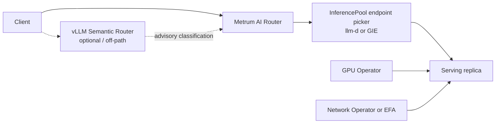

# Kubernetes deployment specification

**Status:** Proposed  
**Date:** 2026-08-28  
**Applies to:** Metrum AI Router release builds

## Scope and non-goals

This specification defines Kubernetes packaging and a constrained optional operator.
It preserves the router as a standalone product.

The router has no Kubernetes dependency. The router imports no Kubernetes client,
Kubernetes API type, controller-runtime package, or cluster credential. The router
starts from a YAML configuration file, an optional adjacent `env.json`, an issued
`license.json`, and durable state.

The configuration file is the contract. A controller MAY produce that file and
standard Kubernetes objects. It MUST NOT require router code changes. Deleting the
controller MUST leave the running router able to serve from its mounted configuration
and Secret.

All new capabilities MUST first exist in `internal/router/config.go` and in the
router's validated YAML schema. A CRD MUST follow that schema. A CRD MUST NOT create
a Kubernetes-only router capability.

This document does not define an Envoy `ext_proc` design. An organization that already
runs a gateway MAY use `ext_proc` as an optional Level 3 integration. The router
remains a standalone service.

This document does not define a multi-tenant hosted control plane. Hosted deployments
use the same router configuration contract. Their provider custody, tenancy, and
operating model are commercial and operational choices outside this document.

## Repository facts that control this specification

The current router configuration is defined in `internal/router/config.go`.
`LoadConfig` reads the YAML file, loads `env.json` beside it, loads `env.json` in the
working directory when that differs, and expands `${NAME}` values. Existing process
environment values take precedence over `env.json` values.

The relevant current fields are:

- `server.license.path`, `server.license.state_path`, and optional file-based
  `server.license.revocation`.
- `server.usage_db.driver`, `server.usage_db.path`, `server.usage_db.dsn`, and
  `server.usage_db.migration_policy`.
- `server.logging`, `server.decision_telemetry`, and `server.diagnostics`. There is
  no `telemetry_sinks` field.
- `providers.<name>.base_url`, `dialect`, `api_key_env`, and `models`.
- `models.<name>.strategy`, `external_policy`, `routing_policy.dynamic_score`,
  `contract`, `targets`, and other model-group fields.
- `callers[].allow`, `rate`, `traffic_shape`, `quota`, and `key`. There is no
  caller `entitlement` or `contention_class` field.

The current package contains a Dockerfile and Kustomize assets. It contains no Helm
chart, router operator, Terraform module, or router support for `InferencePool`,
Dynamo, llm-d, KServe, LMCache, or Kueue references.

The checked-in Kubernetes ConfigMap currently includes `server.env_file`. That field
is absent from `ServerConfig`. Go YAML decoding ignores it. The loader behavior above
is the valid environment-file contract.

The public Kubernetes installation page requires production `config.yaml`, `env.json`,
and `license.json` to stay under Secret controls. This protects provider credentials,
caller token hashes, DSNs, and admin credentials. A chart MAY use a ConfigMap only for
a reviewed configuration that contains no such material. It MUST use a Secret for a
full production runtime configuration.

## Deployment targets

Every target below is first-class. Kubernetes is optional.

| Target | Runtime contract | State and secrets | Scale boundary |
|---|---|---|---|
| Single binary on bare metal | `router --config <path>` under the local supervisor | Local protected config directory, `env.json`, issued license, durable state | One process with SQLite. Use PostgreSQL for concurrent writers. |
| Docker and Compose | Packaged image and Compose command | Read-only config mount, writable state/log mounts | One Compose router with SQLite. Use explicit PostgreSQL for scale-out. |
| Single-node air-gapped appliance | Binary or image with no required outbound licence call | Secure offline transfer of issued license and optional revocation bundle | One local router. No feature depends on a cluster. |
| VM image for OEM bundling | Same binary or container contract | OEM-owned secret injection and durable state disk | OEM selects SQLite or PostgreSQL. |
| Kubernetes and OpenShift | Image, Secret, ConfigMap where safe, Service, Gateway or Ingress, PVC or PostgreSQL | Namespace-scoped Secret plus PVC or database Secret | SQLite uses one active writer. PostgreSQL permits replicas. |
| Hosted multi-tenant | Same router process and YAML schema per deployment scope | Managed secret and database controls | Tenant isolation is an operating-model decision. |

A feature that cannot run on the air-gapped single node MUST NOT ship.

## Layer boundary

The default request path matches public diagrams: Client → Metrum AI Router →
upstream or inference pool. vLLM Semantic Router is optional and off-path; it is
not a mandatory inbound hop. See the public
[Competitive Landscape](../../docs-site/docs/evaluation/competitive-landscape.md)
entry for complement-versus-compete framing.



| Layer | Does | Does not do |
|---|---|---|
| vLLM Semantic Router (optional / off-path) | Classifies a request and advises a routing choice when operators enable it. | It does not enforce caller quotas, choose a model group, own provider credentials, or choose a serving replica. It is not required on the inbound path. |
| Metrum AI Router | Authenticates the caller, enforces caller limits, selects a model group and target, records usage, and calls the selected upstream. | It does not schedule GPUs, tune replica topology, or select a replica inside an inference pool. |
| llm-d or Gateway API Inference Extension endpoint picker | Selects a replica inside an `InferencePool`. | It does not choose the caller's model group or enforce router caller contracts. |
| GPU and Network Operators | Own node drivers, devices, RDMA, and network operands. | They do not make model-routing decisions or own router configuration. |

This boundary makes llm-d complementary. Metrum AI Router selects the target pool. llm-d
selects a healthy replica in that pool.

## Level 0: router

Level 0 is unchanged. The router accepts YAML configuration and uses ordinary network
endpoints. Kubernetes resources are never required for startup.

The default `server.usage_db.migration_policy` is `deployment-job`. A serving router
validates database compatibility. A separate reviewed `router-migrate` job applies
migration work. `auto-safe` is limited to a reviewed small or single-node SQLite
deployment.

The router validates signed licences locally with embedded Ed25519 public keys. A
normal release build requires a valid issued `license.json`. It does not need a private
signing key or a Metrum network call. A signed revocation bundle is optional and uses a
local file when enabled.

## Level 1: container image and Helm chart

Level 1 is a complete deployment product. It does not need an operator.

The existing image runs as UID and GID `65532`, uses a `scratch` runtime image, exposes
port `8080`, and executes:

```text
/app/bin/metrum-ai-router --config /app/config/config.yaml
```

The chart specified here is a launch deliverable. It does not exist in this repository
on 2026-08-28. It MUST package the existing image contract without changing router
code.

### Chart objects

The chart MUST render a Deployment, Service, ConfigMap, Secret reference, readiness,
liveness, and startup probes, a PodDisruptionBudget, and an optional HorizontalPodAutoscaler.
It MUST render either `gateway.networking.k8s.io/v1` `HTTPRoute` or
`networking.k8s.io/v1` `Ingress` when enabled. It MUST NOT require either resource.

The chart MUST use `Recreate`, one replica, `ReadWriteOnce`, and a single active writer
when `server.usage_db.driver: sqlite`. It MUST reject `replicaCount > 1` with SQLite.
It MUST select PostgreSQL before it renders an HPA or more than one replica.

The chart MUST mount the runtime Secret read-only. It MUST mount a writable state path
and a writable `/tmp` because the image has a read-only root filesystem. It MUST set
`automountServiceAccountToken: false` unless a separately enabled integration requires
the projected token.

### Chart values

| Value | Default | Effect |
|---|---:|---|
| `image.repository` | required | Router image repository. |
| `image.digest` | required for production | Immutable image selection. |
| `replicaCount` | `1` | Standard Deployment scale. Requires PostgreSQL above one. |
| `runtimeSecret.name` | required | Secret containing `env.json`, `license.json`, and any sensitive full config. |
| `config.existingConfigMap` | empty | Non-sensitive generated `config.yaml` ConfigMap. |
| `config.existingSecretKey` | empty | Secret key containing the full production `config.yaml`. |
| `persistence.state` | enabled | State path, SQLite file, and licence state. |
| `usageDatabase.mode` | `sqlite` | Must match `server.usage_db.driver`. |
| `usageDatabase.existingSecret` | empty | PostgreSQL DSN source. It becomes `${ROUTER_USAGE_DB_DSN}` in `config.yaml`. |
| `service` | enabled | ClusterIP Service on port 80 to container port 8080. |
| `gateway.httpRoute` | disabled | Optional `HTTPRoute`. |
| `ingress` | disabled | Optional conventional `Ingress`. |
| `probes` | enabled | `/readyz`, `/healthz`, and `/readyz` startup probe. |
| `pdb.minAvailable` | `1` | Pod disruption budget. |
| `hpa.enabled` | `false` | Standard HPA. Requires PostgreSQL and a metrics source. |
| `networkPolicy` | enabled | Explicit client, DNS, provider, and database egress policy. |

The following valid runtime configuration is the contract that the chart projects. The
values in `api_key_env` and `token_sha256` expand from `env.json`. The Secret contains
the real values. The example is intentionally non-production.

```yaml
apiVersion: v1
kind: ConfigMap
metadata:
  name: smart-router-config
  labels:
    app.kubernetes.io/name: smart-router
data:
  config.yaml: |
    server:
      listen: ":8080"
      default_model_group: local-chat
      logging:
        path: /app/logs/requests.jsonl
      usage_db:
        enabled: true
        driver: sqlite
        path: /app/state/usage.sqlite
        migration_policy: deployment-job
      license:
        enabled: true
        path: /app/config/license.json
        state_path: /app/state/license-state.json
        recheck_interval: 1h
        grace_period_on_validation_error: 24h
        revocation:
          mode: off
        fail_open_for_dev: false
    state_path: /app/state/router-state.json
    providers:
      local-vllm:
        base_url: http://vllm.default.svc.cluster.local:8000/v1
        dialect: openai-chat
        api_key_env: LOCAL_VLLM_API_KEY
        models:
          qwen:
            model: Qwen/Qwen3-32B
    models:
      local-chat:
        strategy: static
        targets:
          - provider: local-vllm
            model_ref: qwen
            weight: 100
    callers:
      - id: example
        owner_user: example
        project: example
        environment: production
        status: active
        token_sha256: "${ROUTER_CALLER_EXAMPLE_SHA256}"
        token_id: rtr_example
        allow:
          - local-chat
        rate:
          rpm: 60
          tpm: 100000
          concurrent: 2
```

The chart MUST validate the rendered configuration with the packaged router before
rollout. It MUST run `router-migrate` as a non-serving Job before a fresh SQLite
router starts or before a reviewed upgrade that needs migration work.

## Level 2: optional operator

### Current boundary

No operator exists today. A current, compliant operator can generate only the existing
configuration fields shown in the parity table. It can also create standard objects
that mount that configuration.

The requested fields `replicas`, `ingress`, `licence Secret reference`, `telemetry
sinks`, usage-store Kubernetes backing, discovered target references, and caller
`contention_class` are absent from the router schema. They MUST NOT enter a CRD now.

This prevents a Level 2 operator from declaring a desired HA topology or upstream
discovery reference today. The Level 1 chart owns Deployment, Service, HPA, PDB,
Gateway, Ingress, PVC, and Secret mounting. This is an intentional current limit.

Upstream discovery is the main justification for a future operator. It becomes valid
only after the router gains a schema-validated source field for an `InferencePool`,
Service, or Dynamo frontend. That router change MUST include bare-metal and air-gapped
configuration semantics before a CRD adds the same field.

### Proposed CRD identity and current-safe shapes

The proposed API group is `router.metrum.ai/v1alpha1`. It is a design identity. It is
not installed by this repository.

`SmartRouter.spec` serializes to the top-level `server`, `providers`, and `state_path`
configuration fields. `ModelGroup.metadata.name` becomes the `models.<name>` map key.
`CallerToken.spec` serializes to one item of `callers`. The three examples below use
only fields present in the current router schema.

```yaml
apiVersion: router.metrum.ai/v1alpha1
kind: SmartRouter
metadata:
  name: example
spec:
  server:
    listen: ":8080"
    default_model_group: local-chat
    logging:
      path: /app/logs/requests.jsonl
    usage_db:
      enabled: true
      driver: sqlite
      path: /app/state/usage.sqlite
      migration_policy: deployment-job
    license:
      enabled: true
      path: /app/config/license.json
      state_path: /app/state/license-state.json
      recheck_interval: 1h
      grace_period_on_validation_error: 24h
      revocation:
        mode: off
      fail_open_for_dev: false
  state_path: /app/state/router-state.json
  providers:
    local-vllm:
      base_url: http://vllm.default.svc.cluster.local:8000/v1
      dialect: openai-chat
      api_key_env: LOCAL_VLLM_API_KEY
      models:
        qwen:
          model: Qwen/Qwen3-32B
```

```yaml
apiVersion: router.metrum.ai/v1alpha1
kind: ModelGroup
metadata:
  name: local-chat
spec:
  strategy: static
  attempt_timeout_ms: 120000
  contract:
    display_name: Local chat
    intended_workloads:
      - general-chat
    supported_api_shapes:
      - openai-chat
    required_capabilities:
      input_modalities:
        - text
    quality_floor:
      allowed_validation_status:
        - validated
  targets:
    - provider: local-vllm
      model_ref: qwen
      weight: 100
```

```yaml
apiVersion: router.metrum.ai/v1alpha1
kind: CallerToken
metadata:
  name: example
spec:
  id: example
  owner_user: example
  project: example
  environment: production
  status: active
  token_sha256: "${ROUTER_CALLER_EXAMPLE_SHA256}"
  token_id: rtr_example
  allow:
    - local-chat
  rate:
    rpm: 60
    tpm: 100000
    concurrent: 2
  traffic_shape:
    enabled: true
    request_start_per_sec: 1
    request_burst: 4
    input_tokens_per_sec: 10000
    input_token_burst: 40000
    output_reservation_tokens_per_sec: 10000
    output_reservation_token_burst: 40000
  quota:
    day:
      requests: 1000
      tokens: 1000000
    month:
      requests: 10000
      tokens: 10000000
    soft_pct: 80
  key:
    lifetime_tokens: 100000000
    soft_pct: 90
    on_exhaust: disable
```

`token_sha256` is a configuration field. The CRD MUST contain the environment
expression only. A Secret-backed `env.json` supplies the value. The CRD MUST NOT carry
a raw router token or a token hash.

`CallerToken` maps burst controls to `traffic_shape.*_burst`. It maps caller limits to
`rate`, `quota`, and `key`. The terms `entitlement` and `contention_class` are deferred.
The router has no matching fields. Kueue vocabulary can inform future naming. Kueue
MUST NOT admit HTTP requests.

`ModelGroup.routing_policy` maps only to the current built-in
`routing_policy.dynamic_score` configuration. An external service maps to
`external_policy.url` only when `strategy: external`; it also requires `allow_hosts`.
A ConfigMap reference has no current router configuration field. A separate
`RoutingPolicy` CRD is deferred.

### Future discovery contract

After a router configuration field exists, an operator MAY watch these sources:

- `inference.networking.k8s.io/v1` `InferencePool` for in-cluster vLLM and SGLang
  pools. The current stable API includes `targetPorts` and `endpointPickerRef`.
- A Kubernetes Service for a static in-cluster OpenAI-compatible endpoint.
- `nvidia.com/v1beta1` `DynamoGraphDeployment` for a Dynamo frontend.

The operator MUST generate ordinary `providers.<name>` and `models.<group>.targets[]`
entries. It MUST use the endpoint picker as the replica selector. It MUST NOT enumerate
replica Pods as router targets. It MUST remove generated entries when the source is
deleted. It MUST preserve hand-authored external provider entries.

The missing router source field is an explicit prerequisite. No discovery CRD YAML is
shown because it would violate current config parity.

### Reconciliation and ownership

The future operator has one required output: a syntactically valid configuration file.
It MAY create the ConfigMap or Secret that stores that file. The Level 1 chart remains
usable without it.

| Object | Owner | Field manager | Boundary |
|---|---|---|---|
| `config.yaml` ConfigMap key | Operator after it exists | `smartrouter-operator-config` | Operator owns only generated configuration content. |
| Runtime Secret and `env.json` | Deployment secret system | External Secrets, CSI provider, or human operator | Router operator has no Secret read permission. |
| `license.json` Secret key | License delivery process | License delivery field manager | Router operator only consumes the mounted file path already in config. |
| Deployment, Service, PDB, HPA, Gateway, Ingress, PVC | Helm chart | `smartrouter-helm` | Chart owns topology. |
| Provider Services, pools, GPU resources, and cache engines | Their installed controllers | Upstream controller manager | Router operator reads discovery sources only after schema support exists. |

The operator MUST use Server-Side Apply. It MUST use one stable field manager per object
class. It MUST NOT force ownership of fields owned by Helm, a Secret controller, a
Gateway controller, or an add-on controller. A field conflict MUST set a status condition
and leave the last known valid configuration mounted.

A future operator finalizer MAY remove only its generated ConfigMap or its own labels
and owner references. It MUST NOT delete a Secret, PVC, database, `InferencePool`,
Dynamo resource, GPU resource, or customer-managed Service. The finalizer MUST complete
without cluster egress.

### Status conditions

The CRDs MUST expose these conditions when implemented:

| Condition | True means | False behavior |
|---|---|---|
| `Accepted` | The object passed schema and admission checks. | No generated configuration changes. |
| `ConfigValid` | The aggregate generated YAML passed the router validator. | Keep the prior valid mounted configuration. |
| `DependenciesResolved` | Required existing providers and referenced model groups resolve. | Keep the prior valid mounted configuration. |
| `Ready` | The projected router reports `/readyz` and the observed config revision matches. | Report safe reason and object generation. |
| `Degraded` | A non-required optional integration is absent or stale. | Continue with the configured static targets. |
| `Conflict` | Another field manager owns a required field. | Do not force apply. |

No status condition may include a provider key, router token, token hash, DSN, full
licence payload, or configuration body.

### Admission and validation

CRD OpenAPI schemas SHOULD use structural schemas, list-map keys, CEL
`x-kubernetes-validations`, and defaults only where they exactly match router defaults.
They MUST reject unknown fields. This closes the silent-unknown-field gap in the current
YAML loader.

CEL validations SHOULD cover current router invariants such as these:

- `usage_db.driver` is `sqlite` or `postgres`.
- `sqlite` uses a non-empty `path`; `postgres` uses a non-empty `dsn` expression.
- a ModelGroup has a strategy and at least one target.
- every target has a provider and either `model` or `model_ref`.
- a caller has an ID, a non-empty `token_sha256` expression, and allowed groups.
- each positive traffic rate has its required burst field.
- external strategy has `external_policy.url` and `external_policy.allow_hosts`.

Cluster policy SHOULD use `ValidatingAdmissionPolicy` for namespace, image provenance,
secret-mount, and topology rules that do not need router-specific data. Admission MUST
fail closed when the aggregate router config cannot validate.

`MutatingAdmissionPolicy` availability and behavior vary by Kubernetes minor release.
Mutation therefore ships as a narrowly scoped admission webhook for now. The webhook
MUST add only deterministic defaults that have an exact router-schema equivalent. It
MUST fail closed on its own unavailable or invalid response. It MUST NOT read Secrets.

## Level 3: optional integrations

Every integration is off by default. The router MUST continue with static URLs and the
Level 1 chart when an integration is absent.

### NVIDIA GPU Operator

Use NVIDIA GPU Operator `v26.7.0` or later only on nodes selected for NVIDIA workloads.
`ClusterPolicy` and `NVIDIADriver` remain add-on resources. Default them off. EKS
accelerated AMIs can conflict with operator-managed drivers.

The router neither requests `nvidia.com/gpu` nor manages drivers. Serving workloads own
those requests. The future operator only discovers an endpoint after router config
supports it.

### AMD GPU Operator with DRA

Use AMD GPU Operator `1.5.0` or later for the documented DRA path. In a `DeviceConfig`,
`draDriver.enable: true` and `devicePlugin.enableDevicePlugin: true` are mutually
exclusive. The operator MUST NOT flip either setting.

The router owns no device request. A serving workload may use Kubernetes DRA once the
cluster provides `resource.k8s.io/v1` `DeviceClass` and `ResourceClaimTemplate`.

### NVIDIA Network Operator and AWS EFA

Use NVIDIA Network Operator `v26.4.0` or later for supported RDMA fabrics. Use AWS EFA
on AWS where it is the selected network mechanism. They are separate mechanisms. Neither
is a default.

The router uses ordinary TCP or TLS endpoints. It does not configure RDMA, SR-IOV,
NetworkAttachmentDefinitions, EFA, or node networking.

### LMCacheEngine

Use LMCache Operator `v0.1.1` or later when the cluster serves
`lmcache.lmcache.ai/v1alpha1` `LMCacheEngine`. A future cache binding belongs on a
ModelGroup only after a router configuration field exists. It MUST NOT become its own
router CRD.

Without LMCache, the selected serving target continues without the cache integration.

### llm-d

Use llm-d `v0.9` or later for disaggregated serving. Install its Helm charts as the
llm-d project documents. Do not add a Metrum AI Router controller for llm-d.

Metrum AI Router selects the model group and pool. llm-d selects the replica within the
pool. llm-d topology and disaggregation policies remain llm-d concerns.

### NVIDIA Dynamo

Use Dynamo `v1.4.1` or later. New Dynamo graph resources use
`nvidia.com/v1beta1` `DynamoGraphDeployment`. DynamoGraphDeploymentRouter may already
perform profiling-driven topology tuning. Metrum AI Router MUST NOT duplicate that tuning.

A future discovery adapter may use the Dynamo frontend endpoint after router config
supports discovery references. Without that adapter, configure the frontend as a normal
external provider URL.

### KServe

Use KServe `v0.20.0` or later when KServe is the selected serving system. Gateway API
`HTTPRoute` uses `gateway.networking.k8s.io/v1`. KServe owns its serving resources.
Metrum AI Router treats the exposed endpoint as a normal upstream after the configuration
is written.

### Kueue

Use current Kueue for accelerator workload admission. Its terms `nominalQuota`,
`borrowingLimit`, `lendingLimit`, `cohort`, and `preemption` can guide future caller
contention design. Kueue does not admit router HTTP requests. Metrum AI Router continues to
enforce `callers[].rate`, `traffic_shape`, `quota`, and `key`.

### External Metrics adapter

An external metrics adapter is optional. An HPA MAY consume a safe queue-depth,
request-rate, or resource metric. It MUST use PostgreSQL-backed multi-replica mode.
It MUST NOT expose caller identity, token identifiers, raw request content, or provider
credentials through metric labels.

### Gateway `ext_proc` footnote

Organizations with an existing Envoy gateway MAY add an `ext_proc` bridge as a local
Level 3 integration. It is outside router architecture. It MUST preserve the standalone
router API and the Level 0 to Level 2 deployment paths.

## Install profiles

| Profile | Required components | Storage and scale | Optional additions |
|---|---|---|---|
| Minimal | Router image, ConfigMap or runtime Secret, Service, one PVC, probes, PDB | SQLite, one replica, `Recreate` | Ingress or HTTPRoute. |
| EKS | Minimal profile, EKS-compatible registry and storage class | SQLite for one writer. PostgreSQL for HPA or replicas. | Keep NVIDIA GPU Operator off when an accelerated AMI owns the driver. Use EFA only when selected. |
| On-prem reference stack | PostgreSQL, Gateway API, `InferencePool` when installed, private DNS and NetworkPolicy | PostgreSQL and at least two router replicas through the chart | GPU Operator, Network Operator, llm-d, Dynamo, LMCache, KServe, Kueue. |
| Air-gapped | Binary or loaded image, local config, Secret or protected files, durable state | SQLite, one router | Signed offline license and optional signed revocation file. No external control-plane dependency. |

The EKS and on-prem profiles require a reviewed database migration job before serving.
The air-gapped profile validates licence state locally and requires no phone-home path.

## Configuration parity

The table maps CRD fields to existing router YAML. A missing mapping is a blocker.

| Proposed resource field | Router YAML field | State on 2026-08-28 |
|---|---|---|
| `SmartRouter.spec.server` | `server` | Direct map. |
| `SmartRouter.spec.state_path` | `state_path` | Direct map. |
| `SmartRouter.spec.providers` | `providers` | Direct map. `api_key_env` points to `env.json` or process environment. |
| `SmartRouter.spec.server.license.path` | `server.license.path` | Direct map. Secret mounting is chart behavior. |
| `SmartRouter.spec.server.license.state_path` | `server.license.state_path` | Direct map. |
| `SmartRouter.spec.server.usage_db` | `server.usage_db` | Direct map. SQLite path or PostgreSQL DSN expression. |
| `SmartRouter.spec.server.logging` | `server.logging` | Direct map. |
| `SmartRouter.spec.server.decision_telemetry` | `server.decision_telemetry` | Direct map. |
| `ModelGroup.metadata.name` | `models.<name>` | Map-key identity. |
| `ModelGroup.spec` | `models.<name>` value | Direct map for current ModelGroup fields. |
| `ModelGroup.spec.targets[]` | `models.<name>.targets[]` | Direct map. It supports configured URLs through providers. |
| `ModelGroup.spec.external_policy` | `models.<name>.external_policy` | Direct map when `strategy: external`. |
| `CallerToken.metadata.name` | `callers[].id` | Identity MUST equal `spec.id`. |
| `CallerToken.spec` | `callers[]` item | Direct map for current CallerConfig fields. |
| Caller burst controls | `callers[].traffic_shape.*_burst` | Direct map. |
| Caller allowed groups | `callers[].allow` | Direct map. |
| `SmartRouter.spec.replicas` | none | Prohibited. Chart value only. |
| `SmartRouter.spec.ingress` | none | Prohibited. Standard Gateway or Ingress object only. |
| `SmartRouter.spec.licenseSecretRef` | none | Prohibited. Chart mounting convention only. |
| `SmartRouter.spec.telemetry_sinks` | none | Prohibited. There is no router field. |
| `SmartRouter.spec.usageStore` Kubernetes reference | none | Prohibited. Only `server.usage_db` exists. |
| discovered `InferencePool` target reference | none | Deferred pending router schema. |
| `ModelGroup.spec.cacheBinding` | none | Deferred pending router schema. |
| `CallerToken.spec.entitlement` | none | Deferred pending router schema. |
| `CallerToken.spec.contention_class` | none | Deferred pending router schema. |
| RoutingPolicy ConfigMap reference | none | Deferred pending router schema. |

## Conformance and test strategy

One conformance suite MUST run against every deployment target. The suite uses the same
sanitized configuration fixture and expected behaviors.

1. Parse the YAML with the packaged router. Confirm that unsupported fields fail at CRD
   admission and do not enter generated YAML.
2. Start the target runtime. Check `/healthz`, `/readyz`, `/version`, and `/docs/`.
3. Authenticate a caller. Check `/v1/models` contains only that caller's allowed groups.
4. Run one accepted request for every enabled caller API shape. Include Chat, Responses,
   Anthropic Messages, streaming, tools, images, and structured output only when the
   fixture advertises each shape.
5. Check caller rate, traffic-shape burst, quota, and licence enforcement boundaries.
6. Stop and restart the runtime. Verify durable router state, licence state, and usage
   data according to the selected storage design.
7. For SQLite, assert one writer and no overlapping router Pods. For PostgreSQL, run two
   replicas and verify concurrent usage recording.
8. Rotate a test Secret value. Verify a reviewed restart or config revision. Do not
   print the Secret.
9. In Kubernetes, use server-side dry-run, render the chart, and test allowed and denied
   NetworkPolicy paths.
10. In air-gapped mode, block all Metrum egress and verify a valid offline licence still
    reaches ready state.

The Level 2 conformance extension MUST delete the operator after it has projected a
valid configuration. The router MUST continue serving until a normal configuration
change or restart requires another projection.

## Security

The router Pod MUST run non-root. It MUST drop all Linux capabilities. It MUST use
`RuntimeDefault` seccomp, a read-only root filesystem, a writable state volume, and a
writable `/tmp` volume.

The chart ServiceAccount MUST have no Kubernetes API permissions and no automatically
mounted token. The future operator ServiceAccount MUST use namespace-scoped list and
watch permissions only for the CRDs and discovery sources enabled by profile. It MUST
have no Secret `get`, `list`, `watch`, `create`, `update`, `patch`, or `delete` permission.

External Secrets Operator `external-secrets.io/v1` MAY write a Kubernetes Secret.
Secrets Store CSI Driver `secrets-store.csi.x-k8s.io/v1` MAY mount provider-backed
secret material. The router operator never reads either source. Both integrations are
optional.

A Secret contains provider credentials, DSNs, licence payloads, caller token hashes,
and admin credentials. Do not place these values in a CRD, ConfigMap, status condition,
Event, metric label, log, test fixture, or screenshot.

Add-on controllers run in their own namespaces and ServiceAccounts. Each add-on MUST
have image provenance, pinned version, least-privilege RBAC, a NetworkPolicy, and a
removal procedure. The chart MUST remain deployable when every add-on is absent.

## Upgrade and API deprecation policy

The chart MUST pin production router images by digest. It MUST keep the prior image,
runtime configuration, licence state, and usage-store backup until post-upgrade smoke
passes.

A database migration MUST finish before new serving Pods start. Roll back image and
configuration only when the prior application version is compatible with the current
database state. Restore the database from the pre-upgrade backup when it is not.

The proposed CRD starts at `v1alpha1`. It MUST retain conversion and validation tests
before any later version is served. A field removal requires:

1. a replacement router configuration field;
2. a lossless CRD conversion path;
3. at least one released deprecation period;
4. documentation and conformance coverage for upgrade and rollback; and
5. removal only after all supported chart and operator versions stop emitting it.

No CRD version may add a field before the router accepts and validates the equivalent
YAML field. Unknown fields MUST fail admission.

## Open questions

1. Which router configuration field will represent an `InferencePool`, Service, or
   Dynamo frontend discovery source while preserving non-Kubernetes deployment parity?
2. Does the router need a configuration field for ModelGroup cache binding before an
   `LMCacheEngine` reference can exist?
3. Does the router need explicit caller entitlement and contention-class fields? If so,
   what are their bare-metal semantics and enforcement behavior?
4. Does the router need a portable telemetry-sink schema beyond logging, usage storage,
   diagnostics, and decision telemetry?
5. Should production charts always store the whole generated `config.yaml` in a Secret,
   or can a schema-defined non-sensitive subset safely live in a ConfigMap?
6. Which current Deployment topology should the optional operator own without adding
   Kubernetes-only CRD fields? Until this is resolved, Helm owns topology.
7. What safe router-schema representation should express a policy ConfigMap reference?
   The existing external policy contract accepts a URL and host allow-list only.

## Upstream version and API references

The following sources were checked on 2026-09-19 for competitive and Semantic Router
layer framing (Kubernetes floor versions below retain the 2026-08-28 packaging
baseline unless revalidated elsewhere):

- [vLLM Semantic Router documentation](https://vllm-sr.ai/docs/intro/) and [GitHub repository](https://github.com/vllm-project/semantic-router): optional Mixture-of-Models routing layer; complement, not a mandatory Client hop.
- [NVIDIA NeMo Switchyard documentation](https://nvidia-nemo.github.io/Switchyard/) and [GitHub repository](https://github.com/NVIDIA-NeMo/Switchyard): open-source agent model-routing library; pre-alpha (experimental, not for production) as of 2026-09-19.
- Public product comparison: [Competitive Landscape](../../docs-site/docs/evaluation/competitive-landscape.md).
- [Gateway API Inference Extension InferencePool](https://gateway-api-inference-extension.sigs.k8s.io/api-types/inferencepool/): `inference.networking.k8s.io/v1`.
- [Gateway API HTTPRoute](https://gateway-api.sigs.k8s.io/reference/api-types/httproute/): `gateway.networking.k8s.io/v1`.
- [Kubernetes DRA DeviceClass](https://kubernetes.io/docs/reference/kubernetes-api/resource/device-class-v1/) and [ResourceClaimTemplate](https://kubernetes.io/docs/reference/kubernetes-api/resource/resource-claim-template-v1/): `resource.k8s.io/v1`; use Kubernetes 1.35 or later for the GA DRA baseline.
- [NVIDIA GPU Operator DRA installation](https://docs.nvidia.com/datacenter/cloud-native/gpu-operator/latest/dra-intro-install.html): GPU Operator 26.7.0 floor for this document.
- [AMD GPU Operator DRA Driver](https://instinct.docs.amd.com/projects/gpu-operator/en/main/dra/dra-driver.html): AMD GPU Operator 1.5.0 floor.
- [NVIDIA Network Operator 26.4.0](https://docs.nvidia.com/networking/display/kubernetes2640/overview.html): optional RDMA floor.
- [LMCache Operator](https://docs.lmcache.ai/mp/operator.html): `lmcache.lmcache.ai/v1alpha1`; pin operator 0.1.1 or later.
- [llm-d](https://llm-d.ai/docs/operations/disaggregation): llm-d 0.9 floor.
- [NVIDIA Dynamo release artifacts](https://docs.nvidia.com/dynamo/v1.4.1/reference/release-artifacts): Dynamo 1.4.1 floor and `nvidia.com/v1beta1` DynamoGraphDeployment.
- [KServe 0.20 release](https://kserve.github.io/website/blog/kserve-0.20-release): optional KServe 0.20 floor.
- [Kueue ClusterQueue](https://kueue.sigs.k8s.io/docs/concepts/cluster_queue/) and [preemption](https://kueue.sigs.k8s.io/docs/concepts/preemption/): quota vocabulary only.
- [External Secrets Operator ExternalSecret](https://external-secrets.io/main/api/externalsecret/): `external-secrets.io/v1`.
- [Secrets Store CSI Driver concepts](https://secrets-store-csi-driver.sigs.k8s.io/concepts.html): `secrets-store.csi.x-k8s.io/v1`.
